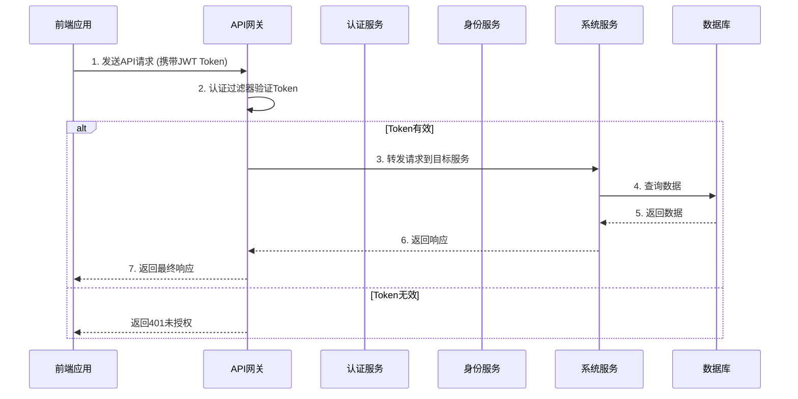
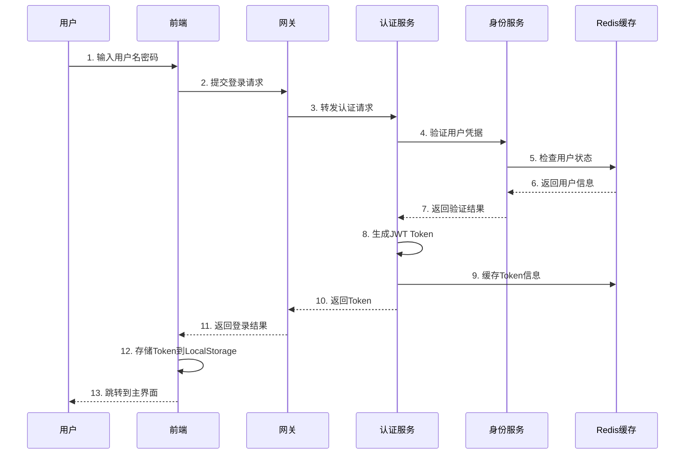

# XingChen Admin 架构设计文档

## 🏗️ 整体架构

XingChen Admin 采用现代化的微服务架构，前后端分离设计，支持高并发、高可用、易扩展的企业级应用场景。

## 📐 架构原则

### 设计原则
- **单一职责**: 每个微服务只负责一个业务领域
- **松耦合**: 服务之间通过标准接口通信
- **高内聚**: 相关功能集中在同一服务内
- **容错性**: 支持服务降级和熔断
- **可观测性**: 完整的监控和日志体系

### 技术选型原则
- **成熟稳定**: 选择经过生产验证的技术栈
- **社区活跃**: 有良好的社区支持和文档
- **可维护性**: 代码可读性和可维护性优先
- **性能优先**: 在满足功能的前提下追求高性能

## 🎯 分层架构

### 前端架构 (XingChen-Vue)

```
┌─────────────────────────────────────────────┐
│                表现层 (Presentation)          │
├─────────────────────────────────────────────┤
│  ┌─────────────┐  ┌─────────────────────────┐ │
│  │   页面组件   │  │      布局组件            │ │
│  │  (Views)    │  │    (Layouts)           │ │
│  └─────────────┘  └─────────────────────────┘ │
└─────────────────────────────────────────────┘
┌─────────────────────────────────────────────┐
│                业务层 (Business)              │
├─────────────────────────────────────────────┤
│  ┌─────────────┐  ┌─────────────────────────┐ │
│  │   状态管理   │  │      业务组件            │ │
│  │  (Stores)   │  │   (Components)         │ │
│  └─────────────┘  └─────────────────────────┘ │
└─────────────────────────────────────────────┘
┌─────────────────────────────────────────────┐
│                服务层 (Service)               │
├─────────────────────────────────────────────┤
│  ┌─────────────┐  ┌─────────────────────────┐ │
│  │   API服务   │  │      工具服务            │ │
│  │ (Services)  │  │     (Utils)            │ │
│  └─────────────┘  └─────────────────────────┘ │
└─────────────────────────────────────────────┘
┌─────────────────────────────────────────────┐
│               基础设施层 (Infrastructure)      │
├─────────────────────────────────────────────┤
│  ┌─────────────┐  ┌─────────────────────────┐ │
│  │   HTTP客户端 │  │      路由管理            │ │
│  │   (Axios)   │  │   (Vue Router)         │ │
│  └─────────────┘  └─────────────────────────┘ │
└─────────────────────────────────────────────┘
```

### 后端架构 (XingChen-admin)

```
┌─────────────────────────────────────────────┐
│                网关层 (Gateway)               │
├─────────────────────────────────────────────┤
│  ┌─────────────┐  ┌─────────────────────────┐ │
│  │   路由管理   │  │      认证过滤器          │ │
│  │  (Routing)  │  │  (Auth Filter)         │ │
│  └─────────────┘  └─────────────────────────┘ │
└─────────────────────────────────────────────┘
┌─────────────────────────────────────────────┐
│               应用层 (Application)            │
├─────────────────────────────────────────────┤
│  ┌─────────────┐  ┌─────────────┐  ┌─────────┐ │
│  │   认证服务   │  │   身份服务   │  │ 系统服务 │ │
│  │admin-auth  │  │admin-identity│  │admin-sys│ │
│  └─────────────┘  └─────────────┘  └─────────┘ │
└─────────────────────────────────────────────┘
┌─────────────────────────────────────────────┐
│                领域层 (Domain)                │
├─────────────────────────────────────────────┤
│  ┌─────────────┐  ┌─────────────────────────┐ │
│  │   业务实体   │  │      业务逻辑            │ │
│  │ (Entities)  │  │  (Business Logic)      │ │
│  └─────────────┘  └─────────────────────────┘ │
└─────────────────────────────────────────────┘
┌─────────────────────────────────────────────┐
│               基础设施层 (Infrastructure)      │
├─────────────────────────────────────────────┤
│  ┌─────────────┐  ┌─────────────┐  ┌─────────┐ │
│  │   数据访问   │  │    缓存     │  │  消息队列 │ │
│  │    (DAO)   │  │  (Redis)   │  │  (MQ)   │ │
│  └─────────────┘  └─────────────┘  └─────────┘ │
└─────────────────────────────────────────────┘
```

## 🔧 核心组件设计

### 认证授权架构

```
┌─────────────────────────────────────────────────────────────┐
│                        认证流程                              │
└─────────────────────────────────────────────────────────────┘
                              │
                              ▼
┌─────────────┐    1.登录请求    ┌─────────────────────────────┐
│   前端应用   │ ─────────────► │        admin-auth         │
│ (XingChen-  │               │       (认证服务)           │
│    Vue)     │               └─────────────────────────────┘
└─────────────┘                              │
       ▲                                     │ 2.验证用户
       │                                     ▼
       │                            ┌─────────────────────────────┐
       │                            │      admin-identity        │
       │                            │     (身份管理服务)         │
       │                            └─────────────────────────────┘
       │                                     │
       │ 3.返回JWT Token                      │ 用户数据
       │◄────────────────────────────────────┘
       │
       │    4.携带Token访问API
       ▼
┌─────────────────────────────────────────────────────────────┐
│                     admin-gateway                          │
│                     (网关服务)                              │
│  ┌─────────────────────────────────────────────────────┐   │
│  │              认证过滤器                              │   │
│  │  1. 提取JWT Token                                  │   │
│  │  2. 验证Token有效性                                 │   │
│  │  3. 解析用户信息                                    │   │
│  │  4. 设置请求头                                      │   │
│  └─────────────────────────────────────────────────────┘   │
└─────────────────────────────────────────────────────────────┘
                              │
                              │ 5.转发请求到具体服务
                              ▼
┌─────────────────────────────────────────────────────────────┐
│                      业务微服务                              │
│  ┌─────────────┐  ┌─────────────┐  ┌─────────────────────┐  │
│  │admin-identity│  │admin-system │  │    其他服务          │  │
│  │身份管理服务   │  │系统管理服务  │  │                    │  │
│  └─────────────┘  └─────────────┘  └─────────────────────┘  │
└─────────────────────────────────────────────────────────────┘
```

### 多租户数据隔离

```
┌─────────────────────────────────────────────────────────────┐
│                      租户隔离策略                            │
├─────────────────────────────────────────────────────────────┤
│                                                             │
│  ┌─────────────────────────────────────────────────────┐   │
│  │                数据库级隔离                          │   │
│  │  ┌─────────────┐  ┌─────────────┐  ┌─────────────┐  │   │
│  │  │  tenant_1   │  │  tenant_2   │  │  tenant_n   │  │   │
│  │  │     DB      │  │     DB      │  │     DB      │  │   │
│  │  └─────────────┘  └─────────────┘  └─────────────┘  │   │
│  └─────────────────────────────────────────────────────┘   │
│                                                             │
│  ┌─────────────────────────────────────────────────────┐   │
│  │                表级隔离                              │   │
│  │  ┌─────────────────────────────────────────────────┐ │   │
│  │  │    shared_database                            │ │   │
│  │  │  ┌─────────────┐  ┌─────────────────────────┐ │ │   │
│  │  │  │    users    │  │      tenant_id          │ │ │   │
│  │  │  │             │  │    (隔离字段)            │ │ │   │
│  │  │  └─────────────┘  └─────────────────────────┘ │ │   │
│  │  └─────────────────────────────────────────────────┘ │   │
│  └─────────────────────────────────────────────────────┘   │
└─────────────────────────────────────────────────────────────┘
```

## 🔄 数据流设计

### 请求响应流程



### 用户登录流程



## 📊 数据库设计

### 核心表结构

#### 用户相关表
```sql
-- 用户表
CREATE TABLE sys_user (
    id BIGINT PRIMARY KEY AUTO_INCREMENT,
    tenant_id BIGINT NOT NULL COMMENT '租户ID',
    username VARCHAR(50) NOT NULL COMMENT '用户名',
    password VARCHAR(255) NOT NULL COMMENT '密码',
    email VARCHAR(100) COMMENT '邮箱',
    phone VARCHAR(20) COMMENT '手机号',
    avatar VARCHAR(255) COMMENT '头像',
    status TINYINT DEFAULT 1 COMMENT '状态:1启用,0禁用',
    created_at TIMESTAMP DEFAULT CURRENT_TIMESTAMP,
    updated_at TIMESTAMP DEFAULT CURRENT_TIMESTAMP ON UPDATE CURRENT_TIMESTAMP,
    UNIQUE KEY uk_tenant_username (tenant_id, username)
);

-- 角色表
CREATE TABLE sys_role (
    id BIGINT PRIMARY KEY AUTO_INCREMENT,
    tenant_id BIGINT NOT NULL COMMENT '租户ID',
    name VARCHAR(50) NOT NULL COMMENT '角色名称',
    code VARCHAR(50) NOT NULL COMMENT '角色编码',
    description VARCHAR(255) COMMENT '描述',
    status TINYINT DEFAULT 1 COMMENT '状态',
    created_at TIMESTAMP DEFAULT CURRENT_TIMESTAMP,
    updated_at TIMESTAMP DEFAULT CURRENT_TIMESTAMP ON UPDATE CURRENT_TIMESTAMP,
    UNIQUE KEY uk_tenant_code (tenant_id, code)
);

-- 用户角色关联表
CREATE TABLE sys_user_role (
    id BIGINT PRIMARY KEY AUTO_INCREMENT,
    user_id BIGINT NOT NULL,
    role_id BIGINT NOT NULL,
    created_at TIMESTAMP DEFAULT CURRENT_TIMESTAMP,
    UNIQUE KEY uk_user_role (user_id, role_id)
);
```

#### 权限相关表
```sql
-- 菜单表
CREATE TABLE sys_menu (
    id BIGINT PRIMARY KEY AUTO_INCREMENT,
    parent_id BIGINT DEFAULT 0 COMMENT '父菜单ID',
    name VARCHAR(50) NOT NULL COMMENT '菜单名称',
    code VARCHAR(50) NOT NULL COMMENT '菜单编码',
    path VARCHAR(200) COMMENT '路由路径',
    component VARCHAR(255) COMMENT '组件路径',
    icon VARCHAR(100) COMMENT '图标',
    type TINYINT NOT NULL COMMENT '类型:1目录,2菜单,3按钮',
    sort_order INT DEFAULT 0 COMMENT '排序',
    status TINYINT DEFAULT 1 COMMENT '状态',
    created_at TIMESTAMP DEFAULT CURRENT_TIMESTAMP,
    updated_at TIMESTAMP DEFAULT CURRENT_TIMESTAMP ON UPDATE CURRENT_TIMESTAMP
);

-- 角色菜单关联表
CREATE TABLE sys_role_menu (
    id BIGINT PRIMARY KEY AUTO_INCREMENT,
    role_id BIGINT NOT NULL,
    menu_id BIGINT NOT NULL,
    created_at TIMESTAMP DEFAULT CURRENT_TIMESTAMP,
    UNIQUE KEY uk_role_menu (role_id, menu_id)
);
```

## 🚀 部署架构

### Docker容器化部署

```yaml
# docker-compose.yml
version: '3.8'
services:
  # 数据库服务
  mysql:
    image: mysql:8.0
    environment:
      MYSQL_ROOT_PASSWORD: root123
      MYSQL_DATABASE: xingchen_admin
    volumes:
      - mysql_data:/var/lib/mysql
      - ./sql:/docker-entrypoint-initdb.d
    ports:
      - "3306:3306"

  # Redis缓存
  redis:
    image: redis:7-alpine
    ports:
      - "6379:6379"
    volumes:
      - redis_data:/data

  # API网关
  gateway:
    build: ./XingChen-admin/admin-gateway
    ports:
      - "8080:8080"
    depends_on:
      - mysql
      - redis
    environment:
      - SPRING_PROFILES_ACTIVE=docker

  # 认证服务
  auth-service:
    build: ./XingChen-admin/admin-auth
    ports:
      - "8081:8081"
    depends_on:
      - mysql
      - redis

  # 身份管理服务
  identity-service:
    build: ./XingChen-admin/admin-identity
    ports:
      - "8082:8082"
    depends_on:
      - mysql
      - redis

  # 系统管理服务
  system-service:
    build: ./XingChen-admin/admin-system
    ports:
      - "8083:8083"
    depends_on:
      - mysql
      - redis

  # 前端应用
  frontend:
    build: ./XingChen-Vue
    ports:
      - "80:80"
    depends_on:
      - gateway

volumes:
  mysql_data:
  redis_data:
```

### Kubernetes部署

```yaml
# k8s-deployment.yaml
apiVersion: apps/v1
kind: Deployment
metadata:
  name: xingchen-admin-gateway
spec:
  replicas: 3
  selector:
    matchLabels:
      app: xingchen-admin-gateway
  template:
    metadata:
      labels:
        app: xingchen-admin-gateway
    spec:
      containers:
      - name: gateway
        image: xingchen-admin/gateway:latest
        ports:
        - containerPort: 8080
        env:
        - name: SPRING_PROFILES_ACTIVE
          value: "k8s"
        resources:
          requests:
            memory: "512Mi"
            cpu: "250m"
          limits:
            memory: "1Gi"
            cpu: "500m"
---
apiVersion: v1
kind: Service
metadata:
  name: gateway-service
spec:
  selector:
    app: xingchen-admin-gateway
  ports:
  - port: 8080
    targetPort: 8080
  type: LoadBalancer
```

## 📈 性能优化

### 缓存策略
- **Redis分布式缓存**: 用户会话、权限信息、字典数据
- **本地缓存**: 菜单配置、系统参数
- **数据库查询优化**: 索引优化、分页查询、读写分离

### 数据库优化
- **连接池配置**: HikariCP连接池优化
- **SQL优化**: 慢查询监控、执行计划分析
- **分库分表**: 大数据量场景下的水平拆分

### 前端性能优化
- **代码分割**: 路由级别的懒加载
- **资源压缩**: Gzip压缩、图片优化
- **CDN加速**: 静态资源CDN分发

## 🔒 安全设计

### 认证安全
- **JWT Token**: 无状态认证机制
- **Token刷新**: 自动刷新机制防止过期
- **多设备登录**: 支持单设备登录限制

### 数据安全
- **数据加密**: 敏感数据AES加密存储
- **传输安全**: HTTPS/TLS加密传输
- **SQL注入防护**: 参数化查询

### 权限安全
- **RBAC权限模型**: 基于角色的访问控制
- **接口权限**: 细粒度接口权限控制
- **数据权限**: 基于组织架构的数据权限

## 📊 监控运维

### 应用监控
- **健康检查**: Spring Boot Actuator
- **指标监控**: JVM监控、接口响应时间
- **日志聚合**: ELK Stack日志分析

### 业务监控
- **用户行为**: 登录统计、操作日志
- **系统性能**: 响应时间、吞吐量
- **错误监控**: 异常统计、错误告警

---

📚 **更多详细设计文档请参考项目docs目录**
