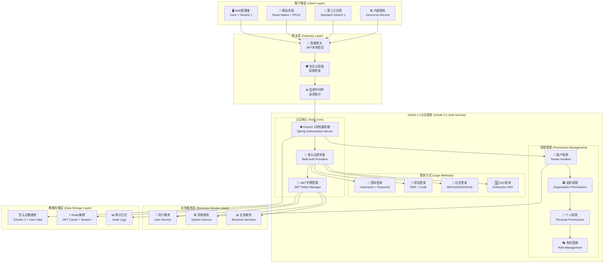
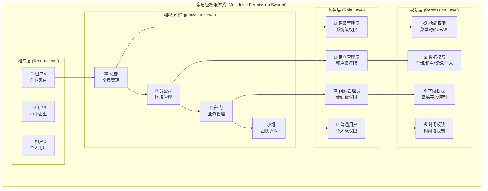

# 基于OAuth 2.1 + JWT的完整认证系统设计

## 🎯 系统概述

设计一个基于OAuth 2.1标准的现代化认证系统，支持多种登录方式、完善的权限体系和租户隔离，满足企业级应用的所有需求。

## 🏗️ 整体架构设计

### 系统架构图


## 🔧 核心组件设计

### 1. OAuth 2.1授权服务器配置

#### 主配置类
```java
@Configuration
@EnableWebSecurity
public class OAuth21AuthorizationServerConfig {
    
    @Bean
    @Order(1)
    public SecurityFilterChain authorizationServerSecurityFilterChain(HttpSecurity http) throws Exception {
        OAuth2AuthorizationServerConfiguration.applyDefaultSecurity(http);
        
        http.getConfigurer(OAuth2AuthorizationServerConfigurer.class)
            .oidc(oidc -> oidc
                .providerConfigurationEndpoint(Customizer.withDefaults())
                .userInfoEndpoint(Customizer.withDefaults())
            )
            .authorizationEndpoint(authz -> authz
                .consentPage("/oauth2/consent")
            )
            .tokenEndpoint(token -> token
                .accessTokenRequestConverter(new MultiAuthTokenRequestConverter())
                .accessTokenResponseHandler(new CustomTokenResponseHandler())
            );
        
        return http
            .exceptionHandling(exceptions -> 
                exceptions.defaultAuthenticationEntryPointFor(
                    new LoginUrlAuthenticationEntryPoint("/login"),
                    new MediaTypeRequestMatcher(MediaType.TEXT_HTML)
                )
            )
            .oauth2ResourceServer(oauth2 -> oauth2
                .jwt(jwt -> jwt
                    .decoder(jwtDecoder())
                    .jwtAuthenticationConverter(new CustomJwtAuthenticationConverter())
                )
            )
            .build();
    }
    
    @Bean
    @Order(2)
    public SecurityFilterChain defaultSecurityFilterChain(HttpSecurity http) throws Exception {
        return http
            .authorizeHttpRequests(authorize -> authorize
                .requestMatchers("/login", "/sms/**", "/captcha/**", "/social/**", "/actuator/**").permitAll()
                .anyRequest().authenticated()
            )
            .formLogin(form -> form
                .loginPage("/login")
                .successHandler(new CustomAuthenticationSuccessHandler())
                .failureHandler(new CustomAuthenticationFailureHandler())
            )
            .authenticationManager(authenticationManager())
            .build();
    }
    
    /**
     * 多认证提供者配置
     */
    @Bean
    public AuthenticationManager authenticationManager() {
        return new ProviderManager(Arrays.asList(
            passwordAuthenticationProvider(),
            smsAuthenticationProvider(),
            socialAuthenticationProvider()
        ));
    }
    
    /**
     * OAuth 2.1客户端注册
     */
    @Bean
    public RegisteredClientRepository registeredClientRepository() {
        // Web管理端客户端
        RegisteredClient webAdminClient = RegisteredClient.withId(UUID.randomUUID().toString())
            .clientId("web-admin-client")
            .clientSecret("{bcrypt}$2a$10$GRLdNijSQMUvl/au9ofL.eDwmoohzzS7.rmNSJZ.0FxO/BTk76klW")
            .clientAuthenticationMethod(ClientAuthenticationMethod.CLIENT_SECRET_BASIC)
            .authorizationGrantType(AuthorizationGrantType.AUTHORIZATION_CODE)
            .authorizationGrantType(AuthorizationGrantType.REFRESH_TOKEN)
            .authorizationGrantType(new AuthorizationGrantType("password"))        // 密码登录
            .authorizationGrantType(new AuthorizationGrantType("sms_code"))        // 短信登录
            .authorizationGrantType(new AuthorizationGrantType("social_login"))    // 社交登录
            .redirectUri("http://localhost:5666/auth/callback")
            .postLogoutRedirectUri("http://localhost:5666/logout")
            .scope(OidcScopes.OPENID)
            .scope(OidcScopes.PROFILE)
            .scope(OidcScopes.EMAIL)
            .scope("admin")
            .scope("user")
            .scope("tenant:read")
            .scope("tenant:write")
            .scope("org:read")
            .scope("org:write")
            .clientSettings(ClientSettings.builder()
                .requireAuthorizationConsent(false)
                .requireProofKey(true) // OAuth 2.1: 强制PKCE
                .build())
            .tokenSettings(TokenSettings.builder()
                .accessTokenTimeToLive(Duration.ofHours(2))
                .refreshTokenTimeToLive(Duration.ofDays(7))
                .reuseRefreshTokens(false) // OAuth 2.1: 刷新令牌轮换
                .idTokenSignatureAlgorithm(SignatureAlgorithm.RS256)
                .accessTokenFormat(OAuth2TokenFormat.SELF_CONTAINED) // JWT格式
                .build())
            .build();
        
        // 移动端客户端
        RegisteredClient mobileClient = RegisteredClient.withId(UUID.randomUUID().toString())
            .clientId("mobile-client")
            .clientAuthenticationMethod(ClientAuthenticationMethod.NONE) // 公共客户端
            .authorizationGrantType(AuthorizationGrantType.AUTHORIZATION_CODE)
            .authorizationGrantType(AuthorizationGrantType.REFRESH_TOKEN)
            .authorizationGrantType(new AuthorizationGrantType("sms_code"))
            .redirectUri("com.yourcompany.app://oauth/callback")
            .scope(OidcScopes.OPENID)
            .scope(OidcScopes.PROFILE)
            .scope("user")
            .scope("tenant:read")
            .clientSettings(ClientSettings.builder()
                .requireAuthorizationConsent(false)
                .requireProofKey(true) // 移动端强制PKCE
                .build())
            .build();
        
        // 第三方应用客户端
        RegisteredClient thirdPartyClient = RegisteredClient.withId(UUID.randomUUID().toString())
            .clientId("third-party-client")
            .clientSecret("{bcrypt}$2a$10$...")
            .clientAuthenticationMethod(ClientAuthenticationMethod.CLIENT_SECRET_BASIC)
            .authorizationGrantType(AuthorizationGrantType.AUTHORIZATION_CODE)
            .authorizationGrantType(AuthorizationGrantType.CLIENT_CREDENTIALS)
            .redirectUri("https://thirdparty.com/oauth/callback")
            .scope("api:read")
            .scope("api:write")
            .clientSettings(ClientSettings.builder()
                .requireAuthorizationConsent(true) // 第三方需要用户同意
                .requireProofKey(true)
                .build())
            .build();
        
        return new InMemoryRegisteredClientRepository(webAdminClient, mobileClient, thirdPartyClient);
    }
    
    @Bean
    public JWKSource<SecurityContext> jwkSource() {
        KeyPair keyPair = generateRsaKey();
        RSAKey rsaKey = new RSAKey.Builder((RSAPublicKey) keyPair.getPublic())
            .privateKey((RSAPrivateKey) keyPair.getPrivate())
            .keyID(UUID.randomUUID().toString())
            .algorithm(JWSAlgorithm.RS256)
            .build();
        JWKSet jwkSet = new JWKSet(rsaKey);
        return new ImmutableJWKSet<>(jwkSet);
    }
    
    @Bean
    public AuthorizationServerSettings authorizationServerSettings() {
        return AuthorizationServerSettings.builder()
            .issuer("http://localhost:8081")
            .authorizationEndpoint("/oauth2/authorize")
            .tokenEndpoint("/oauth2/token")
            .tokenIntrospectionEndpoint("/oauth2/introspect")
            .tokenRevocationEndpoint("/oauth2/revoke")
            .jwkSetEndpoint("/oauth2/jwks")
            .oidcProviderConfigurationEndpoint("/.well-known/openid_configuration")
            .oidcUserInfoEndpoint("/userinfo")
            .build();
    }
}
```

### 2. 多认证方式实现

#### 密码认证提供者
```java
@Component
public class PasswordAuthenticationProvider implements AuthenticationProvider {
    
    @Autowired
    private UserDetailsService userDetailsService;
    
    @Autowired
    private PasswordEncoder passwordEncoder;
    
    @Autowired
    private CaptchaService captchaService;
    
    @Autowired
    private LoginAttemptService loginAttemptService;
    
    @Override
    public Authentication authenticate(Authentication authentication) throws AuthenticationException {
        PasswordAuthenticationToken passwordToken = (PasswordAuthenticationToken) authentication;
        
        String username = passwordToken.getName();
        String password = (String) passwordToken.getCredentials();
        String captcha = passwordToken.getCaptcha();
        String captchaKey = passwordToken.getCaptchaKey();
        String clientIp = passwordToken.getClientIp();
        
        // 1. 验证码校验
        if (!captchaService.verifyCaptcha(captchaKey, captcha)) {
            throw new BadCredentialsException("验证码错误");
        }
        
        // 2. 检查登录尝试次数
        if (loginAttemptService.isBlocked(username, clientIp)) {
            throw new AccountLockedException("账户已被锁定，请稍后再试");
        }
        
        try {
            // 3. 加载用户信息
            UserDetails userDetails = userDetailsService.loadUserByUsername(username);
            
            // 4. 验证密码
            if (!passwordEncoder.matches(password, userDetails.getPassword())) {
                loginAttemptService.recordFailedAttempt(username, clientIp);
                throw new BadCredentialsException("用户名或密码错误");
            }
            
            // 5. 重置失败次数
            loginAttemptService.resetFailedAttempts(username, clientIp);
            
            // 6. 构建认证结果
            return new UsernamePasswordAuthenticationToken(
                userDetails, password, userDetails.getAuthorities());
                
        } catch (UsernameNotFoundException e) {
            loginAttemptService.recordFailedAttempt(username, clientIp);
            throw new BadCredentialsException("用户名或密码错误");
        }
    }
    
    @Override
    public boolean supports(Class<?> authentication) {
        return PasswordAuthenticationToken.class.isAssignableFrom(authentication);
    }
}
```

#### 短信认证提供者
```java
@Component
public class SmsAuthenticationProvider implements AuthenticationProvider {
    
    @Autowired
    private SmsService smsService;
    
    @Autowired
    private UserService userService;
    
    @Autowired
    private SmsCodeService smsCodeService;
    
    @Override
    public Authentication authenticate(Authentication authentication) throws AuthenticationException {
        SmsAuthenticationToken smsToken = (SmsAuthenticationToken) authentication;
        
        String mobile = smsToken.getMobile();
        String smsCode = smsToken.getSmsCode();
        
        // 1. 验证短信验证码
        if (!smsCodeService.verifySmsCode(mobile, smsCode)) {
            throw new BadCredentialsException("短信验证码错误或已过期");
        }
        
        // 2. 查询用户信息
        User user = userService.findByMobile(mobile);
        if (user == null) {
            // 自动注册新用户
            user = autoRegisterUserByMobile(mobile);
        }
        
        // 3. 检查用户状态
        if (!user.isEnabled()) {
            throw new DisabledException("用户已被禁用");
        }
        
        // 4. 构建用户详情
        UserDetails userDetails = buildUserDetails(user);
        
        // 5. 消费验证码
        smsCodeService.consumeSmsCode(mobile, smsCode);
        
        return new SmsAuthenticationToken(
            userDetails, mobile, smsCode, userDetails.getAuthorities());
    }
    
    @Override
    public boolean supports(Class<?> authentication) {
        return SmsAuthenticationToken.class.isAssignableFrom(authentication);
    }
    
    /**
     * 手机号自动注册用户
     */
    private User autoRegisterUserByMobile(String mobile) {
        User user = new User();
        user.setUsername("user_" + mobile.substring(mobile.length() - 4)); // 后4位作为用户名
        user.setMobile(mobile);
        user.setNickname("手机用户" + mobile.substring(mobile.length() - 4));
        user.setStatus(0); // 正常状态
        user.setUserType("MOBILE_USER");
        user.setTenantId(1L); // 默认租户
        user.setCreateTime(LocalDateTime.now());
        
        return userService.save(user);
    }
}
```

#### 社交登录认证提供者
```java
@Component
public class SocialAuthenticationProvider implements AuthenticationProvider {
    
    @Autowired
    private SocialLoginService socialLoginService;
    
    @Autowired
    private UserService userService;
    
    @Autowired
    private UserSocialAccountService userSocialAccountService;
    
    @Override
    public Authentication authenticate(Authentication authentication) throws AuthenticationException {
        SocialAuthenticationToken socialToken = (SocialAuthenticationToken) authentication;
        
        String socialType = socialToken.getSocialType();
        String code = socialToken.getCode();
        String state = socialToken.getState();
        
        try {
            // 1. 获取社交平台用户信息
            SocialUserInfo socialUserInfo = socialLoginService.getUserInfo(socialType, code, state);
            
            // 2. 查找已绑定的用户
            UserSocialAccount socialAccount = userSocialAccountService.findBySocialId(
                socialType, socialUserInfo.getSocialId());
            
            User user;
            if (socialAccount != null) {
                // 已绑定用户
                user = userService.getById(socialAccount.getUserId());
            } else {
                // 自动创建用户并绑定
                user = autoRegisterUserBySocial(socialUserInfo);
                bindSocialAccount(user.getId(), socialUserInfo);
            }
            
            // 3. 检查用户状态
            if (!user.isEnabled()) {
                throw new DisabledException("用户已被禁用");
            }
            
            // 4. 构建认证结果
            UserDetails userDetails = buildUserDetails(user);
            
            return new SocialAuthenticationToken(
                userDetails, socialType, socialUserInfo.getSocialId(), userDetails.getAuthorities());
                
        } catch (SocialLoginException e) {
            throw new BadCredentialsException("社交登录失败: " + e.getMessage());
        }
    }
    
    @Override
    public boolean supports(Class<?> authentication) {
        return SocialAuthenticationToken.class.isAssignableFrom(authentication);
    }
    
    /**
     * 社交账号自动注册用户
     */
    private User autoRegisterUserBySocial(SocialUserInfo socialUserInfo) {
        User user = new User();
        user.setUsername(generateUniqueUsername(socialUserInfo.getNickname()));
        user.setNickname(socialUserInfo.getNickname());
        user.setAvatar(socialUserInfo.getAvatar());
        user.setEmail(socialUserInfo.getEmail());
        user.setStatus(0);
        user.setUserType("SOCIAL_USER");
        user.setTenantId(1L); // 默认租户
        user.setCreateTime(LocalDateTime.now());
        
        return userService.save(user);
    }
    
    /**
     * 绑定社交账号
     */
    private void bindSocialAccount(Long userId, SocialUserInfo socialUserInfo) {
        UserSocialAccount socialAccount = new UserSocialAccount();
        socialAccount.setUserId(userId);
        socialAccount.setSocialType(socialUserInfo.getSocialType());
        socialAccount.setSocialId(socialUserInfo.getSocialId());
        socialAccount.setSocialNickname(socialUserInfo.getNickname());
        socialAccount.setSocialAvatar(socialUserInfo.getAvatar());
        socialAccount.setBindTime(LocalDateTime.now());
        socialAccount.setStatus("ACTIVE");
        
        userSocialAccountService.save(socialAccount);
    }
}
```

### 3. JWT令牌定制

#### JWT声明定制器
```java
@Component
public class TenantAwareJwtTokenCustomizer implements OAuth2TokenCustomizer<JwtEncodingContext> {
    
    @Autowired
    private UserService userService;
    
    @Autowired
    private TenantService tenantService;
    
    @Autowired
    private OrganizationService organizationService;
    
    @Autowired
    private RoleService roleService;
    
    @Override
    public void customize(JwtEncodingContext context) {
        if (OAuth2TokenType.ACCESS_TOKEN.equals(context.getTokenType())) {
            Authentication principal = context.getPrincipal();
            String username = principal.getName();
            
            // 获取用户完整信息
            User user = userService.findByUsername(username);
            if (user != null) {
                JwtClaimsSet.Builder claims = context.getClaims();
                
                // 基础用户信息
                claims.claim("user_id", user.getId())
                      .claim("username", user.getUsername())
                      .claim("nickname", user.getNickname())
                      .claim("email", user.getEmail())
                      .claim("mobile", user.getMobile())
                      .claim("avatar", user.getAvatar())
                      .claim("user_type", user.getUserType());
                
                // 租户信息
                if (user.getTenantId() != null) {
                    Tenant tenant = tenantService.getById(user.getTenantId());
                    if (tenant != null) {
                        claims.claim("tenant_id", tenant.getId())
                              .claim("tenant_code", tenant.getCode())
                              .claim("tenant_name", tenant.getName())
                              .claim("tenant_type", tenant.getType());
                    }
                }
                
                // 组织信息
                List<UserOrganization> userOrgs = organizationService.getUserOrganizations(user.getId());
                if (!userOrgs.isEmpty()) {
                    List<Map<String, Object>> orgInfo = userOrgs.stream()
                        .map(uo -> Map.of(
                            "org_id", uo.getOrgId(),
                            "org_name", uo.getOrgName(),
                            "position", uo.getPosition(),
                            "is_leader", uo.getIsLeader()
                        ))
                        .collect(Collectors.toList());
                    claims.claim("organizations", orgInfo);
                }
                
                // 角色权限信息
                List<String> roles = roleService.getUserRoles(user.getId());
                List<String> permissions = roleService.getUserPermissions(user.getId());
                
                claims.claim("roles", roles)
                      .claim("permissions", permissions);
                
                // 数据权限范围
                String dataScope = calculateUserDataScope(user, roles);
                claims.claim("data_scope", dataScope);
                
                // 登录上下文
                claims.claim("login_method", getLoginMethod(principal))
                      .claim("login_time", Instant.now())
                      .claim("client_ip", getClientIp(context));
            }
        }
    }
    
    /**
     * 计算用户数据权限范围
     */
    private String calculateUserDataScope(User user, List<String> roles) {
        // 超级管理员 - 全部数据权限
        if (roles.contains("SUPER_ADMIN")) {
            return "ALL";
        }
        
        // 租户管理员 - 租户数据权限
        if (roles.contains("TENANT_ADMIN")) {
            return "TENANT";
        }
        
        // 组织管理员 - 组织数据权限
        if (roles.contains("ORG_ADMIN")) {
            return "ORG";
        }
        
        // 部门管理员 - 部门数据权限
        if (roles.contains("DEPT_ADMIN")) {
            return "DEPT";
        }
        
        // 普通用户 - 个人数据权限
        return "SELF";
    }
}
```

### 4. 多登录方式控制器

#### 统一认证控制器
```java
@RestController
@RequestMapping("/auth")
@Slf4j
public class MultiAuthController {
    
    @Autowired
    private OAuth2AuthorizationService authorizationService;
    
    @Autowired
    private SmsCodeService smsCodeService;
    
    @Autowired
    private CaptchaService captchaService;
    
    /**
     * 密码登录
     */
    @PostMapping("/login")
    public ResponseEntity<AuthResponse> passwordLogin(@RequestBody PasswordLoginRequest request, HttpServletRequest httpRequest) {
        try {
            // 1. 构建OAuth2令牌请求
            Map<String, Object> additionalParams = new HashMap<>();
            additionalParams.put("username", request.getUsername());
            additionalParams.put("password", request.getPassword());
            additionalParams.put("captcha", request.getCaptcha());
            additionalParams.put("captcha_key", request.getCaptchaKey());
            additionalParams.put("client_ip", getClientIp(httpRequest));
            
            OAuth2TokenRequest tokenRequest = OAuth2TokenRequest.builder()
                .grantType(new AuthorizationGrantType("password"))
                .clientId("web-admin-client")
                .additionalParameters(additionalParams)
                .build();
            
            // 2. 生成令牌
            OAuth2AccessTokenResponse tokenResponse = authorizationService.generateToken(tokenRequest);
            
            // 3. 解析JWT获取用户信息
            UserInfo userInfo = extractUserInfoFromJwt(tokenResponse.getAccessToken().getTokenValue());
            
            // 4. 记录登录日志
            recordLoginLog(userInfo.getUserId(), "PASSWORD", "SUCCESS", getClientIp(httpRequest));
            
            return ResponseEntity.ok(AuthResponse.success(tokenResponse, userInfo));
            
        } catch (OAuth2AuthenticationException e) {
            log.error("密码登录失败: {}", e.getMessage());
            return ResponseEntity.status(401).body(AuthResponse.error(e.getMessage()));
        }
    }
    
    /**
     * 发送短信验证码
     */
    @PostMapping("/sms/send-code")
    public ResponseEntity<ApiResponse> sendSmsCode(@RequestBody SendSmsCodeRequest request) {
        try {
            // 1. 验证图形验证码
            if (!captchaService.verifyCaptcha(request.getCaptchaKey(), request.getCaptcha())) {
                return ResponseEntity.badRequest().body(ApiResponse.error("图形验证码错误"));
            }
            
            // 2. 检查发送频率
            if (!smsCodeService.canSendSmsCode(request.getMobile())) {
                return ResponseEntity.badRequest().body(ApiResponse.error("发送过于频繁，请稍后再试"));
            }
            
            // 3. 发送短信验证码
            String code = smsCodeService.generateAndSendSmsCode(request.getMobile());
            
            return ResponseEntity.ok(ApiResponse.success("短信验证码已发送"));
            
        } catch (Exception e) {
            log.error("发送短信验证码失败", e);
            return ResponseEntity.status(500).body(ApiResponse.error("发送失败"));
        }
    }
    
    /**
     * 短信登录
     */
    @PostMapping("/sms-login")
    public ResponseEntity<AuthResponse> smsLogin(@RequestBody SmsLoginRequest request, HttpServletRequest httpRequest) {
        try {
            Map<String, Object> additionalParams = new HashMap<>();
            additionalParams.put("mobile", request.getMobile());
            additionalParams.put("sms_code", request.getSmsCode());
            additionalParams.put("client_ip", getClientIp(httpRequest));
            
            OAuth2TokenRequest tokenRequest = OAuth2TokenRequest.builder()
                .grantType(new AuthorizationGrantType("sms_code"))
                .clientId("web-admin-client")
                .additionalParameters(additionalParams)
                .build();
            
            OAuth2AccessTokenResponse tokenResponse = authorizationService.generateToken(tokenRequest);
            UserInfo userInfo = extractUserInfoFromJwt(tokenResponse.getAccessToken().getTokenValue());
            
            recordLoginLog(userInfo.getUserId(), "SMS", "SUCCESS", getClientIp(httpRequest));
            
            return ResponseEntity.ok(AuthResponse.success(tokenResponse, userInfo));
            
        } catch (OAuth2AuthenticationException e) {
            log.error("短信登录失败: {}", e.getMessage());
            return ResponseEntity.status(401).body(AuthResponse.error(e.getMessage()));
        }
    }
    
    /**
     * 社交登录
     */
    @PostMapping("/social-login")
    public ResponseEntity<AuthResponse> socialLogin(@RequestBody SocialLoginRequest request, HttpServletRequest httpRequest) {
        try {
            Map<String, Object> additionalParams = new HashMap<>();
            additionalParams.put("social_type", request.getSocialType());
            additionalParams.put("code", request.getCode());
            additionalParams.put("state", request.getState());
            additionalParams.put("client_ip", getClientIp(httpRequest));
            
            OAuth2TokenRequest tokenRequest = OAuth2TokenRequest.builder()
                .grantType(new AuthorizationGrantType("social_login"))
                .clientId("web-admin-client")
                .additionalParameters(additionalParams)
                .build();
            
            OAuth2AccessTokenResponse tokenResponse = authorizationService.generateToken(tokenRequest);
            UserInfo userInfo = extractUserInfoFromJwt(tokenResponse.getAccessToken().getTokenValue());
            
            recordLoginLog(userInfo.getUserId(), "SOCIAL_" + request.getSocialType(), "SUCCESS", getClientIp(httpRequest));
            
            return ResponseEntity.ok(AuthResponse.success(tokenResponse, userInfo));
            
        } catch (OAuth2AuthenticationException e) {
            log.error("社交登录失败: {}", e.getMessage());
            return ResponseEntity.status(401).body(AuthResponse.error(e.getMessage()));
        }
    }
    
    /**
     * 刷新令牌
     */
    @PostMapping("/refresh-token")
    public ResponseEntity<AuthResponse> refreshToken(@RequestBody RefreshTokenRequest request) {
        try {
            OAuth2TokenRequest tokenRequest = OAuth2TokenRequest.builder()
                .grantType(AuthorizationGrantType.REFRESH_TOKEN)
                .refreshToken(request.getRefreshToken())
                .clientId("web-admin-client")
                .build();
            
            OAuth2AccessTokenResponse tokenResponse = authorizationService.generateToken(tokenRequest);
            UserInfo userInfo = extractUserInfoFromJwt(tokenResponse.getAccessToken().getTokenValue());
            
            return ResponseEntity.ok(AuthResponse.success(tokenResponse, userInfo));
            
        } catch (OAuth2AuthenticationException e) {
            log.error("刷新令牌失败: {}", e.getMessage());
            return ResponseEntity.status(401).body(AuthResponse.error(e.getMessage()));
        }
    }
    
    /**
     * 用户注销
     */
    @PostMapping("/logout")
    public ResponseEntity<ApiResponse> logout(@RequestHeader("Authorization") String authorization) {
        try {
            String token = authorization.replace("Bearer ", "");
            
            // 撤销令牌
            authorizationService.revokeToken(token);
            
            return ResponseEntity.ok(ApiResponse.success("注销成功"));
            
        } catch (Exception e) {
            log.error("注销失败", e);
            return ResponseEntity.status(500).body(ApiResponse.error("注销失败"));
        }
    }
}
```

## 🗄️ 数据库设计

### OAuth 2.1标准表 + 业务扩展
```sql
-- OAuth2.1 客户端表
CREATE TABLE `oauth2_registered_client` (
  `id` varchar(100) NOT NULL,
  `client_id` varchar(100) NOT NULL,
  `client_id_issued_at` timestamp DEFAULT CURRENT_TIMESTAMP,
  `client_secret` varchar(200) DEFAULT NULL,
  `client_secret_expires_at` timestamp NULL DEFAULT NULL,
  `client_name` varchar(200) NOT NULL,
  `client_authentication_methods` varchar(1000) NOT NULL,
  `authorization_grant_types` varchar(1000) NOT NULL,
  `redirect_uris` varchar(1000) DEFAULT NULL,
  `post_logout_redirect_uris` varchar(1000) DEFAULT NULL,
  `scopes` varchar(1000) NOT NULL,
  `client_settings` varchar(2000) NOT NULL,
  `token_settings` varchar(2000) NOT NULL,
  PRIMARY KEY (`id`),
  UNIQUE KEY `uk_client_id` (`client_id`)
) ENGINE=InnoDB DEFAULT CHARSET=utf8mb4 COMMENT='OAuth2.1客户端注册表';

-- OAuth2.1 授权表
CREATE TABLE `oauth2_authorization` (
  `id` varchar(100) NOT NULL,
  `registered_client_id` varchar(100) NOT NULL,
  `principal_name` varchar(200) NOT NULL,
  `authorization_grant_type` varchar(100) NOT NULL,
  `authorized_scopes` varchar(1000) DEFAULT NULL,
  `attributes` blob DEFAULT NULL,
  `state` varchar(500) DEFAULT NULL,
  `authorization_code_value` blob DEFAULT NULL,
  `authorization_code_issued_at` timestamp NULL DEFAULT NULL,
  `authorization_code_expires_at` timestamp NULL DEFAULT NULL,
  `authorization_code_metadata` blob DEFAULT NULL,
  `access_token_value` blob DEFAULT NULL,
  `access_token_issued_at` timestamp NULL DEFAULT NULL,
  `access_token_expires_at` timestamp NULL DEFAULT NULL,
  `access_token_metadata` blob DEFAULT NULL,
  `access_token_type` varchar(100) DEFAULT NULL,
  `access_token_scopes` varchar(1000) DEFAULT NULL,
  `oidc_id_token_value` blob DEFAULT NULL,
  `oidc_id_token_issued_at` timestamp NULL DEFAULT NULL,
  `oidc_id_token_expires_at` timestamp NULL DEFAULT NULL,
  `oidc_id_token_metadata` blob DEFAULT NULL,
  `refresh_token_value` blob DEFAULT NULL,
  `refresh_token_issued_at` timestamp NULL DEFAULT NULL,
  `refresh_token_expires_at` timestamp NULL DEFAULT NULL,
  `refresh_token_metadata` blob DEFAULT NULL,
  `user_code_value` blob DEFAULT NULL,
  `user_code_issued_at` timestamp NULL DEFAULT NULL,
  `user_code_expires_at` timestamp NULL DEFAULT NULL,
  `user_code_metadata` blob DEFAULT NULL,
  `device_code_value` blob DEFAULT NULL,
  `device_code_issued_at` timestamp NULL DEFAULT NULL,
  `device_code_expires_at` timestamp NULL DEFAULT NULL,
  `device_code_metadata` blob DEFAULT NULL,
  PRIMARY KEY (`id`),
  KEY `idx_registered_client_id` (`registered_client_id`),
  KEY `idx_principal_name` (`principal_name`)
) ENGINE=InnoDB DEFAULT CHARSET=utf8mb4 COMMENT='OAuth2.1授权记录表';

-- OAuth2.1 授权同意表
CREATE TABLE `oauth2_authorization_consent` (
  `registered_client_id` varchar(100) NOT NULL,
  `principal_name` varchar(200) NOT NULL,
  `authorities` varchar(1000) NOT NULL,
  PRIMARY KEY (`registered_client_id`, `principal_name`)
) ENGINE=InnoDB DEFAULT CHARSET=utf8mb4 COMMENT='OAuth2.1授权同意表';

-- 用户社交账号绑定表
CREATE TABLE `user_social_account` (
  `id` bigint(20) NOT NULL AUTO_INCREMENT,
  `user_id` bigint(20) NOT NULL COMMENT '用户ID',
  `social_type` varchar(20) NOT NULL COMMENT '社交类型(WECHAT/QQ/GITHUB等)',
  `social_id` varchar(100) NOT NULL COMMENT '社交平台用户ID',
  `social_nickname` varchar(100) DEFAULT NULL COMMENT '社交平台昵称',
  `social_avatar` varchar(200) DEFAULT NULL COMMENT '社交平台头像',
  `social_email` varchar(100) DEFAULT NULL COMMENT '社交平台邮箱',
  `bind_time` datetime DEFAULT CURRENT_TIMESTAMP COMMENT '绑定时间',
  `last_login_time` datetime DEFAULT NULL COMMENT '最后登录时间',
  `login_count` int DEFAULT 0 COMMENT '登录次数',
  `status` varchar(20) DEFAULT 'ACTIVE' COMMENT '状态',
  `created_at` datetime DEFAULT CURRENT_TIMESTAMP,
  `updated_at` datetime DEFAULT CURRENT_TIMESTAMP ON UPDATE CURRENT_TIMESTAMP,
  PRIMARY KEY (`id`),
  UNIQUE KEY `uk_social_account` (`social_type`, `social_id`),
  KEY `idx_user_id` (`user_id`)
) ENGINE=InnoDB DEFAULT CHARSET=utf8mb4 COMMENT='用户社交账号绑定表';

-- 短信验证码表
CREATE TABLE `sms_verification_code` (
  `id` bigint(20) NOT NULL AUTO_INCREMENT,
  `mobile` varchar(20) NOT NULL COMMENT '手机号',
  `code` varchar(10) NOT NULL COMMENT '验证码',
  `code_type` varchar(20) NOT NULL COMMENT '验证码类型(LOGIN/REGISTER/RESET_PASSWORD)',
  `expire_time` datetime NOT NULL COMMENT '过期时间',
  `used_time` datetime DEFAULT NULL COMMENT '使用时间',
  `is_used` tinyint(1) DEFAULT 0 COMMENT '是否已使用',
  `ip_address` varchar(45) DEFAULT NULL COMMENT 'IP地址',
  `created_at` datetime DEFAULT CURRENT_TIMESTAMP,
  PRIMARY KEY (`id`),
  KEY `idx_mobile_type` (`mobile`, `code_type`),
  KEY `idx_expire_time` (`expire_time`)
) ENGINE=InnoDB DEFAULT CHARSET=utf8mb4 COMMENT='短信验证码表';

-- 登录日志表
CREATE TABLE `login_log` (
  `id` bigint(20) NOT NULL AUTO_INCREMENT,
  `user_id` bigint(20) DEFAULT NULL COMMENT '用户ID',
  `username` varchar(50) DEFAULT NULL COMMENT '用户名',
  `login_method` varchar(20) NOT NULL COMMENT '登录方式',
  `login_result` varchar(20) NOT NULL COMMENT '登录结果',
  `client_ip` varchar(45) DEFAULT NULL COMMENT '客户端IP',
  `user_agent` varchar(500) DEFAULT NULL COMMENT '用户代理',
  `login_location` varchar(100) DEFAULT NULL COMMENT '登录地点',
  `failure_reason` varchar(200) DEFAULT NULL COMMENT '失败原因',
  `login_time` datetime DEFAULT CURRENT_TIMESTAMP COMMENT '登录时间',
  `tenant_id` bigint(20) DEFAULT NULL COMMENT '租户ID',
  PRIMARY KEY (`id`),
  KEY `idx_user_id` (`user_id`),
  KEY `idx_login_time` (`login_time`),
  KEY `idx_client_ip` (`client_ip`)
) ENGINE=InnoDB DEFAULT CHARSET=utf8mb4 COMMENT='登录日志表';
```

## 🔐 权限体系设计

### 多层级权限模型


### 权限服务实现
```java
@Service
public class TenantAwarePermissionService {
    
    @Autowired
    private UserService userService;
    
    @Autowired
    private TenantService tenantService;
    
    @Autowired
    private OrganizationService organizationService;
    
    @Autowired
    private RoleService roleService;
    
    /**
     * 检查用户权限 (租户隔离)
     */
    public boolean hasPermission(Long userId, String permission, Long targetTenantId) {
        // 1. 获取用户信息
        User user = userService.getById(userId);
        if (user == null) {
            return false;
        }
        
        // 2. 租户隔离检查
        if (!isTenantAccessible(user, targetTenantId)) {
            return false;
        }
        
        // 3. 获取用户在目标租户下的权限
        List<String> permissions = getUserPermissionsInTenant(userId, targetTenantId);
        
        // 4. 权限匹配
        return permissions.contains(permission) || permissions.contains("*:*:*");
    }
    
    /**
     * 检查租户访问权限
     */
    private boolean isTenantAccessible(User user, Long targetTenantId) {
        // 1. 超级管理员可以访问所有租户
        if (user.getUserType().equals("SUPER_ADMIN")) {
            return true;
        }
        
        // 2. 用户只能访问自己的租户
        if (user.getTenantId().equals(targetTenantId)) {
            return true;
        }
        
        // 3. 检查是否有跨租户权限
        return hasCrossTenantPermission(user.getId(), targetTenantId);
    }
    
    /**
     * 获取用户在特定租户下的权限
     */
    @Cacheable(value = "userTenantPermissions", key = "#userId + ':' + #tenantId")
    public List<String> getUserPermissionsInTenant(Long userId, Long tenantId) {
        Set<String> permissions = new HashSet<>();
        
        // 1. 获取用户角色
        List<Role> userRoles = roleService.getUserRolesInTenant(userId, tenantId);
        
        // 2. 获取角色权限
        for (Role role : userRoles) {
            List<String> rolePermissions = roleService.getRolePermissions(role.getId());
            permissions.addAll(rolePermissions);
        }
        
        // 3. 获取组织权限
        List<UserOrganization> userOrgs = organizationService.getUserOrganizationsInTenant(userId, tenantId);
        for (UserOrganization userOrg : userOrgs) {
            if (userOrg.getIsLeader()) {
                // 组织负责人额外权限
                List<String> leaderPermissions = getOrganizationLeaderPermissions(userOrg.getOrgId());
                permissions.addAll(leaderPermissions);
            }
        }
        
        // 4. 获取个人直接权限
        List<String> directPermissions = getDirectUserPermissions(userId, tenantId);
        permissions.addAll(directPermissions);
        
        return new ArrayList<>(permissions);
    }
    
    /**
     * 计算用户数据权限范围
     */
    public DataPermissionScope calculateDataScope(Long userId, String resource, Long tenantId) {
        User user = userService.getById(userId);
        List<Role> userRoles = roleService.getUserRolesInTenant(userId, tenantId);
        
        // 1. 超级管理员 - 全部数据
        if (user.getUserType().equals("SUPER_ADMIN")) {
            return DataPermissionScope.ALL;
        }
        
        // 2. 基于角色计算数据范围
        for (Role role : userRoles) {
            switch (role.getDataScope()) {
                case "ALL":
                    return DataPermissionScope.ALL;
                case "TENANT":
                    return DataPermissionScope.TENANT;
                case "ORG":
                    return DataPermissionScope.ORGANIZATION;
                case "DEPT":
                    return DataPermissionScope.DEPARTMENT;
            }
        }
        
        // 3. 默认个人数据
        return DataPermissionScope.SELF;
    }
    
    /**
     * 应用数据权限过滤
     */
    public void applyDataPermissionFilter(Long userId, String resource, QueryWrapper<?> queryWrapper) {
        User user = userService.getById(userId);
        DataPermissionScope scope = calculateDataScope(userId, resource, user.getTenantId());
        
        switch (scope) {
            case ALL:
                // 不添加任何过滤条件
                break;
            case TENANT:
                queryWrapper.eq("tenant_id", user.getTenantId());
                break;
            case ORGANIZATION:
                List<Long> orgIds = organizationService.getUserOrganizationIds(userId);
                queryWrapper.in("org_id", orgIds);
                break;
            case DEPARTMENT:
                queryWrapper.eq("dept_id", user.getDeptId());
                break;
            case SELF:
                queryWrapper.eq("create_by", userId);
                break;
        }
    }
}
```

## 🛠️ 后台权限管理

### 权限分配管理控制器
```java
@RestController
@RequestMapping("/admin/permission")
@PreAuthorize("hasRole('ADMIN')")
public class PermissionManagementController {
    
    @Autowired
    private UserRoleService userRoleService;
    
    @Autowired
    private RoleService roleService;
    
    @Autowired
    private PermissionService permissionService;
    
    /**
     * 分配用户角色
     */
    @PostMapping("/assign-user-roles")
    @PreAuthorize("hasPermission(#request.userId, 'USER_ROLE_ASSIGN')")
    public ResponseEntity<ApiResponse> assignUserRoles(@RequestBody AssignUserRolesRequest request) {
        try {
            // 1. 验证目标用户存在
            User targetUser = userService.getById(request.getUserId());
            if (targetUser == null) {
                return ResponseEntity.badRequest().body(ApiResponse.error("目标用户不存在"));
            }
            
            // 2. 验证租户权限
            if (!canManageUserInTenant(getCurrentUserId(), targetUser.getTenantId())) {
                return ResponseEntity.status(403).body(ApiResponse.error("无权限管理该租户用户"));
            }
            
            // 3. 验证角色权限
            for (Long roleId : request.getRoleIds()) {
                if (!canAssignRole(getCurrentUserId(), roleId)) {
                    return ResponseEntity.status(403).body(ApiResponse.error("无权限分配该角色"));
                }
            }
            
            // 4. 执行角色分配
            userRoleService.assignRolesToUser(request.getUserId(), request.getRoleIds(), getCurrentUserId());
            
            // 5. 清理权限缓存
            permissionService.clearUserPermissionCache(request.getUserId());
            
            // 6. 记录操作日志
            recordPermissionOperation("ASSIGN_USER_ROLES", request.getUserId(), request.getRoleIds());
            
            return ResponseEntity.ok(ApiResponse.success("角色分配成功"));
            
        } catch (Exception e) {
            log.error("分配用户角色失败", e);
            return ResponseEntity.status(500).body(ApiResponse.error("分配失败"));
        }
    }
    
    /**
     * 创建自定义角色
     */
    @PostMapping("/create-role")
    @PreAuthorize("hasPermission('ROLE_CREATE')")
    public ResponseEntity<ApiResponse> createRole(@RequestBody CreateRoleRequest request) {
        try {
            // 1. 验证角色名称唯一性
            if (roleService.existsByRoleKey(request.getRoleKey(), getCurrentTenantId())) {
                return ResponseEntity.badRequest().body(ApiResponse.error("角色标识已存在"));
            }
            
            // 2. 验证权限分配权限
            for (String permission : request.getPermissions()) {
                if (!canGrantPermission(getCurrentUserId(), permission)) {
                    return ResponseEntity.status(403).body(ApiResponse.error("无权限授予该权限: " + permission));
                }
            }
            
            // 3. 创建角色
            Role role = new Role();
            role.setRoleName(request.getRoleName());
            role.setRoleKey(request.getRoleKey());
            role.setDescription(request.getDescription());
            role.setTenantId(getCurrentTenantId());
            role.setDataScope(request.getDataScope());
            role.setStatus("ACTIVE");
            role.setCreateBy(getCurrentUserId());
            
            roleService.save(role);
            
            // 4. 分配权限
            roleService.assignPermissionsToRole(role.getId(), request.getPermissions());
            
            // 5. 记录操作日志
            recordPermissionOperation("CREATE_ROLE", role.getId(), request.getPermissions());
            
            return ResponseEntity.ok(ApiResponse.success("角色创建成功"));
            
        } catch (Exception e) {
            log.error("创建角色失败", e);
            return ResponseEntity.status(500).body(ApiResponse.error("创建失败"));
        }
    }
    
    /**
     * 分配组织权限
     */
    @PostMapping("/assign-org-permissions")
    @PreAuthorize("hasPermission('ORG_PERMISSION_ASSIGN')")
    public ResponseEntity<ApiResponse> assignOrgPermissions(@RequestBody AssignOrgPermissionsRequest request) {
        try {
            // 1. 验证组织存在
            Organization org = organizationService.getById(request.getOrgId());
            if (org == null) {
                return ResponseEntity.badRequest().body(ApiResponse.error("组织不存在"));
            }
            
            // 2. 验证组织管理权限
            if (!canManageOrganization(getCurrentUserId(), request.getOrgId())) {
                return ResponseEntity.status(403).body(ApiResponse.error("无权限管理该组织"));
            }
            
            // 3. 分配组织权限
            organizationService.assignPermissions(request.getOrgId(), request.getPermissions());
            
            // 4. 刷新组织成员权限缓存
            List<Long> memberIds = organizationService.getOrganizationMemberIds(request.getOrgId());
            for (Long memberId : memberIds) {
                permissionService.clearUserPermissionCache(memberId);
            }
            
            return ResponseEntity.ok(ApiResponse.success("组织权限分配成功"));
            
        } catch (Exception e) {
            log.error("分配组织权限失败", e);
            return ResponseEntity.status(500).body(ApiResponse.error("分配失败"));
        }
    }
    
    /**
     * 权限查询接口
     */
    @GetMapping("/user/{userId}/permissions")
    @PreAuthorize("hasPermission(#userId, 'USER_PERMISSION_VIEW')")
    public ResponseEntity<UserPermissionResponse> getUserPermissions(@PathVariable Long userId) {
        try {
            User user = userService.getById(userId);
            if (user == null) {
                return ResponseEntity.notFound().build();
            }
            
            // 获取用户完整权限信息
            UserPermissionInfo permissionInfo = UserPermissionInfo.builder()
                .userId(userId)
                .username(user.getUsername())
                .tenantId(user.getTenantId())
                .roles(roleService.getUserRoles(userId))
                .directPermissions(permissionService.getDirectUserPermissions(userId))
                .organizationPermissions(getOrganizationPermissions(userId))
                .dataScope(permissionService.calculateDataScope(userId, "default", user.getTenantId()))
                .build();
            
            return ResponseEntity.ok(UserPermissionResponse.success(permissionInfo));
            
        } catch (Exception e) {
            log.error("获取用户权限失败", e);
            return ResponseEntity.status(500).body(UserPermissionResponse.error("获取失败"));
        }
    }
}
```

## 🌐 网关JWT验证

### 高性能JWT验证过滤器
```java
@Component
public class OAuth21JwtAuthenticationFilter implements GatewayFilter, Ordered {
    
    @Autowired
    private JwtDecoder jwtDecoder;
    
    @Autowired
    private RedisTemplate<String, Object> redisTemplate;
    
    // 本地缓存 - 5分钟过期
    private final Cache<String, TokenValidationResult> localCache = 
        Caffeine.newBuilder()
            .maximumSize(10000)
            .expireAfterWrite(5, TimeUnit.MINUTES)
            .recordStats()
            .build();
    
    @Override
    public Mono<Void> filter(ServerWebExchange exchange, GatewayFilterChain chain) {
        ServerHttpRequest request = exchange.getRequest();
        
        // 检查白名单路径
        if (isWhitelistPath(request.getPath().toString())) {
            return chain.filter(exchange);
        }
        
        // 提取JWT令牌
        String token = extractBearerToken(request);
        if (StringUtils.isEmpty(token)) {
            return handleUnauthorized(exchange, "缺少访问令牌");
        }
        
        return validateJwtToken(token)
            .flatMap(validationResult -> {
                if (!validationResult.isValid()) {
                    return handleUnauthorized(exchange, validationResult.getError());
                }
                
                // 检查权限
                return checkPermission(validationResult, request)
                    .flatMap(hasPermission -> {
                        if (!hasPermission) {
                            return handleForbidden(exchange, "权限不足");
                        }
                        
                        // 添加用户上下文到请求头
                        ServerHttpRequest modifiedRequest = request.mutate()
                            .header("X-User-Id", validationResult.getUserId())
                            .header("X-Username", validationResult.getUsername())
                            .header("X-Tenant-Id", validationResult.getTenantId())
                            .header("X-User-Roles", String.join(",", validationResult.getRoles()))
                            .header("X-Data-Scope", validationResult.getDataScope())
                            .build();
                        
                        return chain.filter(exchange.mutate().request(modifiedRequest).build());
                    });
            });
    }
    
    /**
     * JWT令牌验证 (本地验证 + 缓存优化)
     */
    private Mono<TokenValidationResult> validateJwtToken(String token) {
        // 1. 本地缓存查询
        TokenValidationResult cached = localCache.getIfPresent(token);
        if (cached != null) {
            return Mono.just(cached);
        }
        
        return Mono.fromCallable(() -> {
            try {
                // 2. JWT解码和验证
                Jwt jwt = jwtDecoder.decode(token);
                
                // 3. 检查令牌黑名单
                String jti = jwt.getClaimAsString("jti");
                if (isTokenRevoked(jti)) {
                    return TokenValidationResult.invalid("令牌已被撤销");
                }
                
                // 4. 构建验证结果
                TokenValidationResult result = TokenValidationResult.builder()
                    .valid(true)
                    .userId(jwt.getClaimAsString("user_id"))
                    .username(jwt.getClaimAsString("username"))
                    .tenantId(jwt.getClaimAsString("tenant_id"))
                    .roles(jwt.getClaimAsStringList("roles"))
                    .permissions(jwt.getClaimAsStringList("permissions"))
                    .dataScope(jwt.getClaimAsString("data_scope"))
                    .organizations(jwt.getClaimAsStringList("organizations"))
                    .expiresAt(jwt.getExpiresAt())
                    .build();
                
                // 5. 缓存验证结果
                localCache.put(token, result);
                
                return result;
                
            } catch (JwtException e) {
                return TokenValidationResult.invalid("JWT验证失败: " + e.getMessage());
            }
        })
        .subscribeOn(Schedulers.boundedElastic());
    }
    
    /**
     * 权限检查
     */
    private Mono<Boolean> checkPermission(TokenValidationResult validationResult, ServerHttpRequest request) {
        return Mono.fromCallable(() -> {
            String path = request.getPath().toString();
            String method = request.getMethod().name();
            
            // 1. 确定所需权限
            String requiredPermission = determineRequiredPermission(path, method);
            if (StringUtils.isEmpty(requiredPermission)) {
                return true; // 无需特定权限
            }
            
            // 2. 检查用户权限
            List<String> userPermissions = validationResult.getPermissions();
            return userPermissions.contains(requiredPermission) || 
                   userPermissions.contains("*:*:*");
        })
        .subscribeOn(Schedulers.boundedElastic());
    }
    
    @Override
    public int getOrder() {
        return -100;
    }
}
```

## 📱 前端OAuth 2.1集成

### Vue3前端实现
```typescript
// oauth2-auth.service.ts
export class OAuth21AuthService {
    private readonly config = {
        clientId: 'web-admin-client',
        authServerUrl: 'http://localhost:8081',
        redirectUri: 'http://localhost:5666/auth/callback',
        scopes: ['openid', 'profile', 'admin', 'user', 'tenant:read', 'tenant:write']
    };
    
    /**
     * 密码登录 (OAuth 2.1 密码模式)
     */
    public async passwordLogin(credentials: PasswordLoginCredentials): Promise<AuthResult> {
        const response = await fetch(`${this.config.authServerUrl}/oauth2/token`, {
            method: 'POST',
            headers: {
                'Content-Type': 'application/x-www-form-urlencoded',
                'Authorization': `Basic ${btoa(this.config.clientId + ':' + this.clientSecret)}`
            },
            body: new URLSearchParams({
                grant_type: 'password',
                username: credentials.username,
                password: credentials.password,
                captcha: credentials.captcha,
                captcha_key: credentials.captchaKey,
                scope: this.config.scopes.join(' ')
            })
        });
        
        if (!response.ok) {
            const error = await response.json();
            throw new AuthError(error.error_description || '登录失败');
        }
        
        const tokenData = await response.json();
        this.storeTokens(tokenData);
        
        return {
            success: true,
            accessToken: tokenData.access_token,
            refreshToken: tokenData.refresh_token,
            userInfo: this.parseUserInfoFromJwt(tokenData.access_token)
        };
    }
    
    /**
     * 短信登录
     */
    public async smsLogin(credentials: SmsLoginCredentials): Promise<AuthResult> {
        const response = await fetch(`${this.config.authServerUrl}/oauth2/token`, {
            method: 'POST',
            headers: {
                'Content-Type': 'application/x-www-form-urlencoded',
                'Authorization': `Basic ${btoa(this.config.clientId + ':' + this.clientSecret)}`
            },
            body: new URLSearchParams({
                grant_type: 'sms_code',
                mobile: credentials.mobile,
                sms_code: credentials.smsCode,
                scope: this.config.scopes.join(' ')
            })
        });
        
        if (!response.ok) {
            const error = await response.json();
            throw new AuthError(error.error_description || '短信登录失败');
        }
        
        const tokenData = await response.json();
        this.storeTokens(tokenData);
        
        return {
            success: true,
            accessToken: tokenData.access_token,
            refreshToken: tokenData.refresh_token,
            userInfo: this.parseUserInfoFromJwt(tokenData.access_token)
        };
    }
    
    /**
     * 授权码模式登录 (标准OAuth 2.1)
     */
    public async authorizationCodeLogin(): Promise<void> {
        // 1. 生成PKCE参数
        const codeVerifier = this.generateCodeVerifier();
        const codeChallenge = await this.generateCodeChallenge(codeVerifier);
        const state = this.generateState();
        
        // 2. 存储PKCE参数
        sessionStorage.setItem('oauth_code_verifier', codeVerifier);
        sessionStorage.setItem('oauth_state', state);
        
        // 3. 构建授权URL
        const params = new URLSearchParams({
            response_type: 'code',
            client_id: this.config.clientId,
            redirect_uri: this.config.redirectUri,
            scope: this.config.scopes.join(' '),
            state: state,
            code_challenge: codeChallenge,
            code_challenge_method: 'S256'
        });
        
        // 4. 跳转到授权页面
        window.location.href = `${this.config.authServerUrl}/oauth2/authorize?${params}`;
    }
    
    /**
     * 处理授权回调
     */
    public async handleAuthorizationCallback(code: string, state: string): Promise<AuthResult> {
        // 1. 验证state参数
        const storedState = sessionStorage.getItem('oauth_state');
        if (state !== storedState) {
            throw new AuthError('Invalid state parameter');
        }
        
        // 2. 获取code_verifier
        const codeVerifier = sessionStorage.getItem('oauth_code_verifier');
        if (!codeVerifier) {
            throw new AuthError('Code verifier not found');
        }
        
        // 3. 交换授权码
        const response = await fetch(`${this.config.authServerUrl}/oauth2/token`, {
            method: 'POST',
            headers: {
                'Content-Type': 'application/x-www-form-urlencoded',
                'Authorization': `Basic ${btoa(this.config.clientId + ':' + this.clientSecret)}`
            },
            body: new URLSearchParams({
                grant_type: 'authorization_code',
                code: code,
                redirect_uri: this.config.redirectUri,
                code_verifier: codeVerifier
            })
        });
        
        if (!response.ok) {
            throw new AuthError('Token exchange failed');
        }
        
        const tokenData = await response.json();
        this.storeTokens(tokenData);
        
        // 4. 清理临时数据
        sessionStorage.removeItem('oauth_code_verifier');
        sessionStorage.removeItem('oauth_state');
        
        return {
            success: true,
            accessToken: tokenData.access_token,
            refreshToken: tokenData.refresh_token,
            userInfo: this.parseUserInfoFromJwt(tokenData.access_token)
        };
    }
    
    /**
     * 社交登录
     */
    public async socialLogin(socialType: string): Promise<void> {
        // 跳转到社交登录授权页面
        const params = new URLSearchParams({
            social_type: socialType,
            client_id: this.config.clientId,
            redirect_uri: this.config.redirectUri,
            state: this.generateState()
        });
        
        window.location.href = `${this.config.authServerUrl}/social/authorize/${socialType}?${params}`;
    }
    
    /**
     * 自动刷新令牌
     */
    public async autoRefreshToken(): Promise<boolean> {
        const refreshToken = localStorage.getItem('refresh_token');
        if (!refreshToken) {
            return false;
        }
        
        try {
            const response = await fetch(`${this.config.authServerUrl}/oauth2/token`, {
                method: 'POST',
                headers: {
                    'Content-Type': 'application/x-www-form-urlencoded',
                    'Authorization': `Basic ${btoa(this.config.clientId + ':' + this.clientSecret)}`
                },
                body: new URLSearchParams({
                    grant_type: 'refresh_token',
                    refresh_token: refreshToken
                })
            });
            
            if (!response.ok) {
                this.clearTokens();
                return false;
            }
            
            const tokenData = await response.json();
            this.storeTokens(tokenData);
            
            return true;
            
        } catch (error) {
            this.clearTokens();
            return false;
        }
    }
    
    /**
     * 从JWT解析用户信息
     */
    private parseUserInfoFromJwt(accessToken: string): UserInfo {
        const payload = JSON.parse(atob(accessToken.split('.')[1]));
        
        return {
            userId: payload.user_id,
            username: payload.username,
            nickname: payload.nickname,
            email: payload.email,
            mobile: payload.mobile,
            avatar: payload.avatar,
            tenantId: payload.tenant_id,
            tenantCode: payload.tenant_code,
            roles: payload.roles || [],
            permissions: payload.permissions || [],
            organizations: payload.organizations || [],
            dataScope: payload.data_scope
        };
    }
}
```

这个设计方案提供了：

1. **🔐 完整的OAuth 2.1实现** - 标准协议，安全可靠
2. **🎯 多种登录方式** - 密码、短信、社交登录统一处理
3. **🏢 完善的权限体系** - 租户隔离 + 组织权限 + 角色管理
4. **⚡ 高性能架构** - JWT本地验证 + 多级缓存
5. **🛠️ 后台管理功能** - 完整的权限分配和管理界面
6. **📱 前端无缝集成** - 支持Web、移动端、第三方应用

这是一个既符合现代标准又满足您所有需求的完整解决方案！
