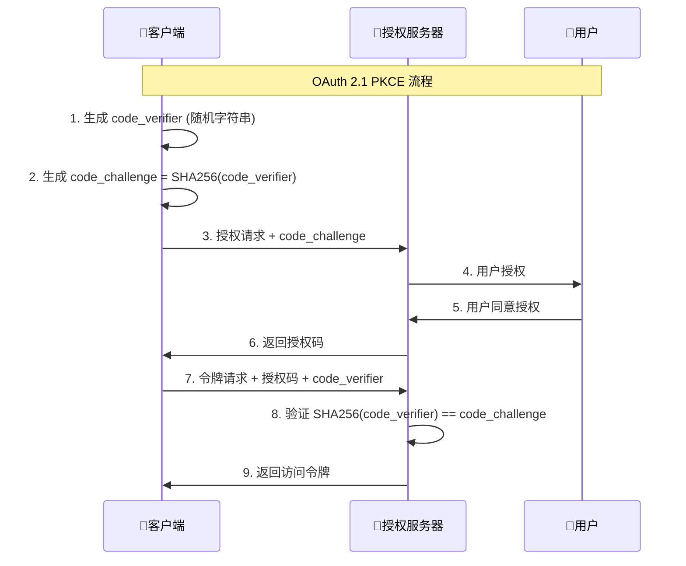

# OAuth 2.1 vs OAuth 2.0 详细对比

## 📋 概述

OAuth 2.1 是 OAuth 2.0 的安全增强版本，于2023年正式发布。它不是一个全新的协议，而是对 OAuth 2.0 的安全改进和最佳实践的整合。

## 🔍 主要区别对比

### 1. **PKCE (Proof Key for Code Exchange) 要求**

| 方面 | OAuth 2.0 | OAuth 2.1 |
|------|-----------|-----------|
| **PKCE使用** | 可选，主要用于公共客户端 | **强制要求**，所有客户端必须使用 |
| **适用范围** | 移动应用、SPA | **所有使用授权码模式的客户端** |
| **安全性** | 基础保护 | **强化保护，防止授权码拦截攻击** |

#### OAuth 2.0 PKCE (可选)
```http
# 授权请求 (可选PKCE)
GET /oauth2/authorize?
    response_type=code&
    client_id=web-client&
    redirect_uri=http://localhost:5666/callback&
    scope=read&
    code_challenge=E9Melhoa2OwvFrEMTJguCHaoeK1t8URWbuGJSstw-cM&
    code_challenge_method=S256
```

#### OAuth 2.1 PKCE (强制)
```http
# 授权请求 (必须包含PKCE)
GET /oauth2/authorize?
    response_type=code&
    client_id=web-client&
    redirect_uri=http://localhost:5666/callback&
    scope=read&
    code_challenge=E9Melhoa2OwvFrEMTJguCHaoeK1t8URWbuGJSstw-cM&
    code_challenge_method=S256

# 令牌请求 (必须包含code_verifier)
POST /oauth2/token
Content-Type: application/x-www-form-urlencoded

grant_type=authorization_code&
code=abc123&
client_id=web-client&
redirect_uri=http://localhost:5666/callback&
code_verifier=dBjftJeZ4CVP-mB92K27uhbUJU1p1r_wW1gFWFOEjXk
```

### 2. **授权模式变更**

| 授权模式 | OAuth 2.0 | OAuth 2.1 | 变更原因 |
|----------|-----------|-----------|----------|
| **授权码模式** | ✅ 支持 | ✅ **推荐，强制PKCE** | 最安全的模式 |
| **隐式模式** | ✅ 支持 | ❌ **已废弃** | 存在令牌泄露风险 |
| **密码模式** | ✅ 支持 | ❌ **已废弃** | 暴露用户凭据风险 |
| **客户端凭证模式** | ✅ 支持 | ✅ 支持 | 服务间调用安全 |

#### 为什么废弃隐式模式？
```javascript
// OAuth 2.0 隐式模式 (已废弃)
// 令牌直接在URL中返回，存在泄露风险
window.location.href = "http://localhost:5666/callback#access_token=abc123&token_type=Bearer";

// OAuth 2.1 推荐方案
// 使用授权码模式 + PKCE，更安全
window.location.href = "http://localhost:5666/callback?code=abc123&state=xyz";
```

### 3. **重定向URI安全要求**

| 方面 | OAuth 2.0 | OAuth 2.1 |
|------|-----------|-----------|
| **匹配方式** | 可以使用模糊匹配 | **必须精确匹配** |
| **通配符** | 允许使用通配符 | **禁止通配符** |
| **安全性** | 存在开放重定向风险 | **防止开放重定向攻击** |

```java
// OAuth 2.0 (允许模糊匹配)
@Bean
public RegisteredClient oauth20Client() {
    return RegisteredClient.withId("client-id")
        .redirectUri("http://localhost:5666/*")  // 允许通配符
        .build();
}

// OAuth 2.1 (必须精确匹配)
@Bean
public RegisteredClient oauth21Client() {
    return RegisteredClient.withId("client-id")
        .redirectUri("http://localhost:5666/auth/callback")  // 精确匹配
        .redirectUri("http://localhost:5666/admin/callback") // 每个URI都要明确指定
        .build();
}
```

### 4. **刷新令牌安全增强**

| 特性 | OAuth 2.0 | OAuth 2.1 |
|------|-----------|-----------|
| **刷新令牌重用** | 允许重复使用 | **建议一次性使用** |
| **令牌轮换** | 可选 | **推荐实施** |
| **安全性** | 基础 | **增强，防止令牌重放攻击** |

```java
// OAuth 2.0 刷新令牌配置
@Bean
public TokenSettings oauth20TokenSettings() {
    return TokenSettings.builder()
        .reuseRefreshTokens(true)  // 允许重用
        .refreshTokenTimeToLive(Duration.ofDays(30))
        .build();
}

// OAuth 2.1 推荐配置
@Bean
public TokenSettings oauth21TokenSettings() {
    return TokenSettings.builder()
        .reuseRefreshTokens(false) // 不重用，每次返回新的刷新令牌
        .refreshTokenTimeToLive(Duration.ofDays(30))
        .build();
}
```

### 5. **客户端认证增强**

| 认证方式 | OAuth 2.0 | OAuth 2.1 |
|----------|-----------|-----------|
| **client_secret_basic** | ✅ 支持 | ✅ 支持 |
| **client_secret_post** | ✅ 支持 | ⚠️ **不推荐** |
| **private_key_jwt** | ✅ 支持 | ✅ **推荐** |
| **client_secret_jwt** | ✅ 支持 | ✅ 支持 |

## 🔧 实际实现对比

### OAuth 2.0 实现示例
```java
@Configuration
public class OAuth20Config {
    
    @Bean
    public RegisteredClientRepository registeredClientRepository() {
        RegisteredClient client = RegisteredClient.withId(UUID.randomUUID().toString())
            .clientId("web-client")
            .clientSecret("{noop}web-secret")
            .clientAuthenticationMethod(ClientAuthenticationMethod.CLIENT_SECRET_BASIC)
            .authorizationGrantType(AuthorizationGrantType.AUTHORIZATION_CODE)
            .authorizationGrantType(AuthorizationGrantType.IMPLICIT) // 支持隐式模式
            .authorizationGrantType(AuthorizationGrantType.PASSWORD)  // 支持密码模式
            .authorizationGrantType(AuthorizationGrantType.REFRESH_TOKEN)
            .redirectUri("http://localhost:5666/*") // 模糊匹配
            .scope("read")
            .scope("write")
            .clientSettings(ClientSettings.builder()
                .requireAuthorizationConsent(true)
                .requireProofKey(false) // PKCE可选
                .build())
            .tokenSettings(TokenSettings.builder()
                .accessTokenTimeToLive(Duration.ofHours(2))
                .refreshTokenTimeToLive(Duration.ofDays(7))
                .reuseRefreshTokens(true) // 允许重用刷新令牌
                .build())
            .build();
            
        return new InMemoryRegisteredClientRepository(client);
    }
}
```

### OAuth 2.1 实现示例
```java
@Configuration
public class OAuth21Config {
    
    @Bean
    public RegisteredClientRepository registeredClientRepository() {
        RegisteredClient client = RegisteredClient.withId(UUID.randomUUID().toString())
            .clientId("web-client")
            .clientSecret("{bcrypt}$2a$10$...") // 强密码哈希
            .clientAuthenticationMethod(ClientAuthenticationMethod.CLIENT_SECRET_BASIC)
            .authorizationGrantType(AuthorizationGrantType.AUTHORIZATION_CODE) // 仅授权码模式
            .authorizationGrantType(AuthorizationGrantType.REFRESH_TOKEN)
            .authorizationGrantType(AuthorizationGrantType.CLIENT_CREDENTIALS)
            .redirectUri("http://localhost:5666/auth/callback") // 精确匹配
            .postLogoutRedirectUri("http://localhost:5666/logout") // 注销重定向
            .scope(OidcScopes.OPENID)
            .scope(OidcScopes.PROFILE)
            .scope("read")
            .scope("write")
            .clientSettings(ClientSettings.builder()
                .requireAuthorizationConsent(false)
                .requireProofKey(true) // 强制PKCE
                .build())
            .tokenSettings(TokenSettings.builder()
                .accessTokenTimeToLive(Duration.ofMinutes(15)) // 更短的访问令牌生命周期
                .refreshTokenTimeToLive(Duration.ofDays(7))
                .reuseRefreshTokens(false) // 不重用刷新令牌
                .idTokenSignatureAlgorithm(SignatureAlgorithm.RS256)
                .accessTokenFormat(OAuth2TokenFormat.SELF_CONTAINED) // JWT格式
                .build())
            .build();
            
        return new InMemoryRegisteredClientRepository(client);
    }
}
```

## 🔒 安全改进详解

### 1. PKCE 工作原理


### 2. 刷新令牌轮换
```java
@Service
public class OAuth21TokenService {
    
    /**
     * OAuth 2.1 刷新令牌处理
     */
    public OAuth2AccessTokenResponse refreshToken(String refreshToken) {
        // 1. 验证刷新令牌
        if (!isValidRefreshToken(refreshToken)) {
            throw new OAuth2AuthenticationException("无效的刷新令牌");
        }
        
        // 2. 生成新的访问令牌和刷新令牌
        String newAccessToken = generateAccessToken();
        String newRefreshToken = generateRefreshToken();
        
        // 3. 撤销旧的刷新令牌 (OAuth 2.1要求)
        revokeRefreshToken(refreshToken);
        
        // 4. 存储新的刷新令牌
        storeRefreshToken(newRefreshToken);
        
        return OAuth2AccessTokenResponse.withToken(newAccessToken)
            .tokenType(OAuth2AccessToken.TokenType.BEARER)
            .expiresIn(Duration.ofMinutes(15))
            .refreshToken(newRefreshToken)
            .build();
    }
}
```

## 📊 迁移建议

### 从 OAuth 2.0 迁移到 OAuth 2.1

#### 1. **立即可行的改进**
```java
// 当前 OAuth 2.0 配置
@Bean
public RegisteredClient currentClient() {
    return RegisteredClient.withId("client")
        .clientSettings(ClientSettings.builder()
            .requireProofKey(false) // 当前：PKCE可选
            .build())
        .tokenSettings(TokenSettings.builder()
            .reuseRefreshTokens(true) // 当前：重用刷新令牌
            .build())
        .build();
}

// 升级到 OAuth 2.1
@Bean
public RegisteredClient upgradedClient() {
    return RegisteredClient.withId("client")
        .clientSettings(ClientSettings.builder()
            .requireProofKey(true) // 改进：强制PKCE
            .build())
        .tokenSettings(TokenSettings.builder()
            .reuseRefreshTokens(false) // 改进：不重用刷新令牌
            .accessTokenTimeToLive(Duration.ofMinutes(15)) // 改进：更短的令牌生命周期
            .build())
        .build();
}
```

#### 2. **移除不安全的授权模式**
```java
// OAuth 2.0 (支持多种模式)
.authorizationGrantType(AuthorizationGrantType.AUTHORIZATION_CODE)
.authorizationGrantType(AuthorizationGrantType.IMPLICIT)     // 移除：隐式模式
.authorizationGrantType(AuthorizationGrantType.PASSWORD)     // 移除：密码模式
.authorizationGrantType(AuthorizationGrantType.REFRESH_TOKEN)

// OAuth 2.1 (仅保留安全模式)
.authorizationGrantType(AuthorizationGrantType.AUTHORIZATION_CODE) // 保留
.authorizationGrantType(AuthorizationGrantType.CLIENT_CREDENTIALS)  // 保留
.authorizationGrantType(AuthorizationGrantType.REFRESH_TOKEN)       // 保留
```

#### 3. **重定向URI精确匹配**
```java
// OAuth 2.0 (模糊匹配)
.redirectUri("http://localhost:5666/*")
.redirectUri("https://*.yourdomain.com/callback")

// OAuth 2.1 (精确匹配)
.redirectUri("http://localhost:5666/auth/callback")
.redirectUri("https://app.yourdomain.com/auth/callback")
.redirectUri("https://admin.yourdomain.com/auth/callback")
```

## 🔧 实用的 OAuth 2.1 实现

### 完整的配置示例
```java
@Configuration
@EnableWebSecurity
public class OAuth21AuthServerConfig {
    
    @Bean
    @Order(1)
    public SecurityFilterChain authorizationServerSecurityFilterChain(HttpSecurity http) throws Exception {
        OAuth2AuthorizationServerConfiguration.applyDefaultSecurity(http);
        
        http.getConfigurer(OAuth2AuthorizationServerConfigurer.class)
            .oidc(Customizer.withDefaults());
        
        return http
            .exceptionHandling(exceptions -> 
                exceptions.defaultAuthenticationEntryPointFor(
                    new LoginUrlAuthenticationEntryPoint("/login"),
                    new MediaTypeRequestMatcher(MediaType.TEXT_HTML)
                )
            )
            .oauth2ResourceServer(oauth2 -> oauth2.jwt(Customizer.withDefaults()))
            .build();
    }
    
    @Bean
    public RegisteredClientRepository registeredClientRepository() {
        // Web前端客户端 (OAuth 2.1标准)
        RegisteredClient webClient = RegisteredClient.withId(UUID.randomUUID().toString())
            .clientId("web-client")
            .clientSecret("{bcrypt}$2a$10$GRLdNijSQMUvl/au9ofL.eDwmoohzzS7.rmNSJZ.0FxO/BTk76klW")
            .clientAuthenticationMethod(ClientAuthenticationMethod.CLIENT_SECRET_BASIC)
            .authorizationGrantType(AuthorizationGrantType.AUTHORIZATION_CODE)
            .authorizationGrantType(AuthorizationGrantType.REFRESH_TOKEN)
            .redirectUri("http://localhost:5666/auth/callback")
            .postLogoutRedirectUri("http://localhost:5666/logout")
            .scope(OidcScopes.OPENID)
            .scope(OidcScopes.PROFILE)
            .scope(OidcScopes.EMAIL)
            .scope("read")
            .scope("write")
            .clientSettings(ClientSettings.builder()
                .requireAuthorizationConsent(false)
                .requireProofKey(true) // OAuth 2.1: 强制PKCE
                .build())
            .tokenSettings(TokenSettings.builder()
                .accessTokenTimeToLive(Duration.ofMinutes(15)) // 短期访问令牌
                .refreshTokenTimeToLive(Duration.ofDays(7))
                .reuseRefreshTokens(false) // OAuth 2.1: 不重用刷新令牌
                .idTokenSignatureAlgorithm(SignatureAlgorithm.RS256)
                .accessTokenFormat(OAuth2TokenFormat.SELF_CONTAINED)
                .build())
            .build();
        
        // 移动端客户端 (公共客户端)
        RegisteredClient mobileClient = RegisteredClient.withId(UUID.randomUUID().toString())
            .clientId("mobile-client")
            .clientAuthenticationMethod(ClientAuthenticationMethod.NONE) // 公共客户端
            .authorizationGrantType(AuthorizationGrantType.AUTHORIZATION_CODE)
            .authorizationGrantType(AuthorizationGrantType.REFRESH_TOKEN)
            .redirectUri("com.yourapp://oauth/callback")
            .scope(OidcScopes.OPENID)
            .scope(OidcScopes.PROFILE)
            .scope("read")
            .clientSettings(ClientSettings.builder()
                .requireAuthorizationConsent(false)
                .requireProofKey(true) // 公共客户端必须使用PKCE
                .build())
            .tokenSettings(TokenSettings.builder()
                .accessTokenTimeToLive(Duration.ofMinutes(15))
                .refreshTokenTimeToLive(Duration.ofDays(7))
                .reuseRefreshTokens(false) // 刷新令牌轮换
                .build())
            .build();
        
        return new InMemoryRegisteredClientRepository(webClient, mobileClient);
    }
    
    @Bean
    public AuthorizationServerSettings authorizationServerSettings() {
        return AuthorizationServerSettings.builder()
            .issuer("http://localhost:8081")
            .authorizationEndpoint("/oauth2/authorize")
            .deviceAuthorizationEndpoint("/oauth2/device_authorization")
            .deviceVerificationEndpoint("/oauth2/device_verification")
            .tokenEndpoint("/oauth2/token")
            .tokenIntrospectionEndpoint("/oauth2/introspect")
            .tokenRevocationEndpoint("/oauth2/revoke")
            .jwkSetEndpoint("/oauth2/jwks")
            .oidcProviderConfigurationEndpoint("/.well-known/openid_configuration")
            .oidcUserInfoEndpoint("/userinfo")
            .build();
    }
}
```

### 前端 OAuth 2.1 集成
```typescript
// OAuth 2.1 前端实现
export class OAuth21AuthService {
    private readonly clientId = 'web-client';
    private readonly redirectUri = 'http://localhost:5666/auth/callback';
    private readonly authServerUrl = 'http://localhost:8081';
    
    /**
     * OAuth 2.1 登录 (强制PKCE)
     */
    public async login(): Promise<void> {
        // 1. 生成PKCE参数
        const codeVerifier = this.generateCodeVerifier();
        const codeChallenge = await this.generateCodeChallenge(codeVerifier);
        const state = this.generateState();
        
        // 2. 存储PKCE参数
        sessionStorage.setItem('oauth_code_verifier', codeVerifier);
        sessionStorage.setItem('oauth_state', state);
        
        // 3. 构建授权URL
        const params = new URLSearchParams({
            response_type: 'code',
            client_id: this.clientId,
            redirect_uri: this.redirectUri,
            scope: 'openid profile read write',
            state: state,
            code_challenge: codeChallenge,
            code_challenge_method: 'S256' // OAuth 2.1要求
        });
        
        // 4. 跳转到授权页面
        window.location.href = `${this.authServerUrl}/oauth2/authorize?${params}`;
    }
    
    /**
     * 处理授权回调
     */
    public async handleCallback(code: string, state: string): Promise<TokenResponse> {
        // 1. 验证state参数
        const storedState = sessionStorage.getItem('oauth_state');
        if (state !== storedState) {
            throw new Error('Invalid state parameter');
        }
        
        // 2. 获取PKCE参数
        const codeVerifier = sessionStorage.getItem('oauth_code_verifier');
        if (!codeVerifier) {
            throw new Error('Code verifier not found');
        }
        
        // 3. 交换授权码获取令牌
        const tokenRequest = {
            grant_type: 'authorization_code',
            client_id: this.clientId,
            redirect_uri: this.redirectUri,
            code: code,
            code_verifier: codeVerifier // OAuth 2.1要求
        };
        
        const response = await fetch(`${this.authServerUrl}/oauth2/token`, {
            method: 'POST',
            headers: {
                'Content-Type': 'application/x-www-form-urlencoded',
                'Authorization': `Basic ${btoa(this.clientId + ':' + this.clientSecret)}`
            },
            body: new URLSearchParams(tokenRequest)
        });
        
        if (!response.ok) {
            throw new Error('Token exchange failed');
        }
        
        const tokenData = await response.json();
        
        // 4. 存储令牌
        this.storeTokens(tokenData);
        
        // 5. 清理临时数据
        sessionStorage.removeItem('oauth_code_verifier');
        sessionStorage.removeItem('oauth_state');
        
        return tokenData;
    }
    
    /**
     * OAuth 2.1 刷新令牌 (不重用)
     */
    public async refreshToken(): Promise<TokenResponse> {
        const refreshToken = localStorage.getItem('refresh_token');
        if (!refreshToken) {
            throw new Error('No refresh token available');
        }
        
        const response = await fetch(`${this.authServerUrl}/oauth2/token`, {
            method: 'POST',
            headers: {
                'Content-Type': 'application/x-www-form-urlencoded',
                'Authorization': `Basic ${btoa(this.clientId + ':' + this.clientSecret)}`
            },
            body: new URLSearchParams({
                grant_type: 'refresh_token',
                refresh_token: refreshToken
            })
        });
        
        if (!response.ok) {
            // 刷新失败，清理令牌并重新登录
            this.clearTokens();
            throw new Error('Token refresh failed');
        }
        
        const tokenData = await response.json();
        
        // OAuth 2.1: 存储新的令牌（包括新的刷新令牌）
        this.storeTokens(tokenData);
        
        return tokenData;
    }
    
    // PKCE相关方法
    private generateCodeVerifier(): string {
        const array = new Uint8Array(32);
        crypto.getRandomValues(array);
        return btoa(String.fromCharCode.apply(null, Array.from(array)))
            .replace(/\+/g, '-')
            .replace(/\//g, '_')
            .replace(/=/g, '');
    }
    
    private async generateCodeChallenge(verifier: string): Promise<string> {
        const encoder = new TextEncoder();
        const data = encoder.encode(verifier);
        const digest = await crypto.subtle.digest('SHA-256', data);
        return btoa(String.fromCharCode.apply(null, Array.from(new Uint8Array(digest))))
            .replace(/\+/g, '-')
            .replace(/\//g, '_')
            .replace(/=/g, '');
    }
}
```

## 🎯 推荐方案

### 对于您的项目，建议采用 **OAuth 2.1**，原因如下：

1. **🔒 更高安全性**: 强制PKCE、精确URI匹配、刷新令牌轮换
2. **📈 面向未来**: 行业标准趋势，避免技术债务
3. **🛡️ 最佳实践**: 整合了多年的安全最佳实践
4. **🔧 实现简单**: Spring Authorization Server原生支持

### 实施建议
```yaml
阶段1: 基础OAuth 2.1配置 (3天)
  - 启用强制PKCE
  - 配置精确重定向URI
  - 禁用不安全的授权模式

阶段2: 刷新令牌优化 (2天)
  - 实现刷新令牌轮换
  - 缩短访问令牌生命周期
  - 添加令牌撤销功能

阶段3: 前端适配 (2天)
  - 前端PKCE实现
  - 令牌管理优化
  - 错误处理完善
```

OAuth 2.1 是更安全、更现代的选择，而且实现复杂度相比我之前提到的复杂方案要简单得多，非常适合您的项目需求！
