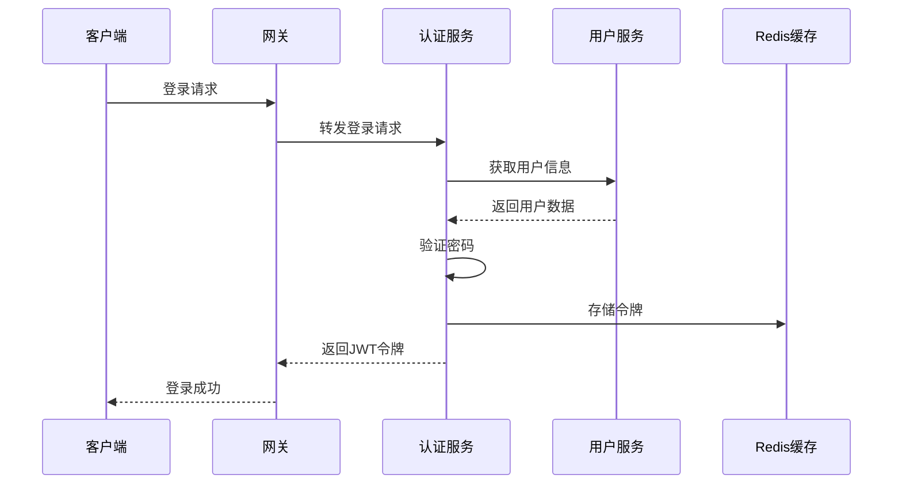
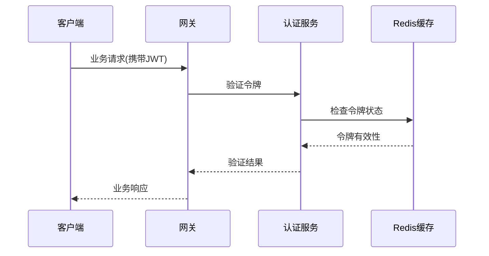

# Admin-Auth 认证服务文档

## 📋 服务概述

认证服务(admin-auth)是基于OAuth 2.1标准的现代化身份认证和授权中心，支持多种登录方式、完善的权限体系和租户隔离。

## 🏗️ 架构设计

### 服务职责
- OAuth 2.1标准认证授权
- 多种登录方式支持（密码/短信/社交）
- JWT令牌生成和验证
- 租户隔离权限管理
- 组织角色权限控制

### 技术栈
- Spring Boot 3.2
- Spring Security 6.2
- Spring Authorization Server 1.2
- OAuth 2.1 + JWT
- Redis (多级缓存)

## 🔧 核心功能

### 1. 用户认证流程


### 2. 权限验证流程


## 📊 API接口

### 认证相关接口
```
POST /auth/login          - 用户登录
POST /auth/logout         - 用户登出
POST /auth/refresh        - 刷新令牌
GET  /auth/me            - 获取当前用户信息
POST /auth/validate      - 验证令牌有效性
```

### 接口详情

#### 用户登录
```http
POST /auth/login
Content-Type: application/json

{
  "username": "admin",
  "password": "admin123"
}
```

响应：
```json
{
  "code": 200,
  "message": "登录成功",
  "data": {
    "token": "eyJhbGciOiJIUzI1NiIsInR5cCI6IkpXVCJ9...",
    "refreshToken": "refresh_token_here",
    "expiresIn": 7200,
    "user": {
      "id": 1,
      "username": "admin",
      "nickname": "管理员"
    }
  }
}
```

#### 获取当前用户信息
```http
GET /auth/me
Authorization: Bearer {token}
```

响应：
```json
{
  "code": 200,
  "message": "获取成功",
  "data": {
    "id": 1,
    "username": "admin",
    "nickname": "管理员",
    "email": "admin@example.com",
    "roles": ["admin", "super"]
  }
}
```

## 🔐 安全机制

### 1. 密码安全
- 支持BCrypt加密密码验证
- 兼容明文密码（用于迁移期）
- 密码强度策略配置

### 2. 令牌安全
- JWT令牌签名验证
- 令牌过期时间控制
- 刷新令牌机制
- 令牌黑名单管理

### 3. 会话管理
- Redis存储会话状态
- 支持单点登录控制
- 会话超时自动清理

## ⚙️ 配置说明

### application.yml 配置
```yaml
# JWT配置
jwt:
  secret: your-secret-key
  expiration: 7200  # 2小时
  refresh-expiration: 604800  # 7天

# Redis配置
spring:
  redis:
    host: localhost
    port: 6379
    password: 
    timeout: 3000
    
# Feign配置
feign:
  client:
    config:
      admin-user:
        connectTimeout: 5000
        readTimeout: 10000
```

## 🔄 服务依赖

### 依赖服务
- **admin-user**: 获取用户基础信息和角色信息
- **Redis**: 令牌缓存和会话管理

### 被依赖服务
- **admin-gateway**: 统一认证入口
- **所有业务服务**: 令牌验证

## 📈 性能优化

### 1. 缓存策略
- 用户信息缓存（30分钟）
- 令牌状态缓存（实时）
- 权限信息缓存（1小时）

### 2. 连接池优化
```yaml
# Feign连接池配置
feign:
  httpclient:
    enabled: true
    max-connections: 200
    max-connections-per-route: 50
```

## 🚨 错误处理

### 常见错误码
- `401`: 未授权（令牌无效或过期）
- `403`: 禁止访问（权限不足）
- `400`: 参数错误（用户名密码错误）
- `500`: 服务内部错误

### 错误响应格式
```json
{
  "code": 401,
  "message": "令牌已过期",
  "data": null,
  "timestamp": "2024-01-01T10:00:00Z"
}
```

## 📊 监控指标

### 关键指标
- 登录成功率
- 令牌验证QPS
- 平均响应时间
- 错误率统计

### 监控配置
```yaml
management:
  endpoints:
    web:
      exposure:
        include: health,info,metrics,prometheus
  metrics:
    export:
      prometheus:
        enabled: true
```

## 🔧 部署说明

### 环境要求
- JDK 1.8+
- Redis 5.0+
- 内存：512MB+
- CPU：1核+

### 启动参数
```bash
java -jar admin-auth.jar \
  --spring.profiles.active=prod \
  --server.port=8081 \
  --spring.redis.host=redis-server
```

## 📝 开发规范

### 代码结构
```
src/main/java/com/admin/auth/
├── controller/     # 控制层
├── service/        # 业务层
├── domain/         # 领域模型
├── config/         # 配置类
├── security/       # 安全相关
├── util/          # 工具类
└── feign/         # Feign客户端
```

### 最佳实践
1. 所有敏感操作都要记录审计日志
2. 异常处理要统一，避免敏感信息泄露
3. 令牌验证要考虑并发性能
4. 密码相关操作要特别注意安全性

## 🔄 版本历史

### v1.2.0 (当前版本)
- ✅ 支持多租户认证
- ✅ 集成真实数据库查询
- ✅ 支持BCrypt密码验证
- ✅ 完善错误处理机制

### v1.1.0
- ✅ 基础JWT认证功能
- ✅ Redis会话管理
- ✅ Feign服务调用

### v1.0.0
- ✅ 基础认证服务框架
