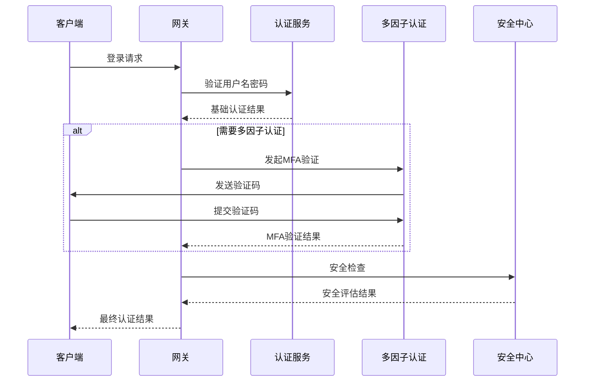

# 网关安全架构设计文档

## 🎯 设计目标

构建一个安全可靠、高性能的API网关安全体系，实现统一的认证鉴权、流量控制、安全防护和威胁检测功能。

## 🛡️ 安全架构概述

### 多层安全防护体系
```
🌐 外部网络
    ↓
🚧 网络层安全 (Network Security)
├── DDoS防护
├── IP黑白名单
└── 地理位置过滤
    ↓
🔒 传输层安全 (Transport Security)  
├── HTTPS/TLS加密
├── 证书管理
└── 协议安全
    ↓
🛡️ 应用层安全 (Application Security)
├── 身份认证
├── 权限授权
├── 输入验证
└── 输出编码
    ↓
📊 业务层安全 (Business Security)
├── 业务规则验证
├── 数据权限控制
└── 审计日志
```

### 安全组件架构
```
┌─────────────────────────────────────────┐
│              安全网关                    │
│  ┌─────────┐ ┌─────────┐ ┌─────────┐   │
│  │认证模块 │ │授权模块 │ │审计模块 │   │
│  └─────────┘ └─────────┘ └─────────┘   │
│  ┌─────────┐ ┌─────────┐ ┌─────────┐   │
│  │限流模块 │ │防护模块 │ │监控模块 │   │
│  └─────────┘ └─────────┘ └─────────┘   │
└─────────────────────────────────────────┘
                    ↓
┌─────────────────────────────────────────┐
│              安全存储                    │
│  Redis缓存 | 数据库 | 日志存储          │
└─────────────────────────────────────────┘
```

## 🔐 身份认证系统

### 1. 多因子认证架构

#### 认证流程设计


#### 认证安全过滤器
```java
@Component
public class SecurityAuthenticationFilter implements GatewayFilter, Ordered {
    
    @Autowired
    private AuthenticationService authenticationService;
    
    @Autowired
    private SecurityAssessmentService securityAssessmentService;
    
    @Autowired
    private AuditService auditService;
    
    @Override
    public Mono<Void> filter(ServerWebExchange exchange, GatewayFilterChain chain) {
        ServerHttpRequest request = exchange.getRequest();
        
        // 1. 提取认证信息
        return extractAuthenticationInfo(request)
            .flatMap(authInfo -> {
                // 2. 基础认证验证
                return performBasicAuthentication(authInfo)
                    .flatMap(basicResult -> {
                        if (!basicResult.isSuccess()) {
                            return handleAuthenticationFailure(exchange, basicResult);
                        }
                        
                        // 3. 安全风险评估
                        return assessSecurityRisk(request, authInfo)
                            .flatMap(riskLevel -> {
                                // 4. 根据风险等级决定认证策略
                                return applyAuthenticationStrategy(exchange, authInfo, riskLevel)
                                    .flatMap(finalResult -> {
                                        if (!finalResult.isSuccess()) {
                                            return handleAuthenticationFailure(exchange, finalResult);
                                        }
                                        
                                        // 5. 记录认证成功日志
                                        auditService.logAuthenticationSuccess(authInfo, riskLevel);
                                        
                                        // 6. 设置安全上下文
                                        return setSecurityContext(exchange, finalResult)
                                            .then(chain.filter(exchange));
                                    });
                            });
                    });
            })
            .onErrorResume(ex -> handleAuthenticationError(exchange, ex));
    }
    
    /**
     * 安全风险评估
     */
    private Mono<SecurityRiskLevel> assessSecurityRisk(ServerHttpRequest request, AuthenticationInfo authInfo) {
        return Mono.fromCallable(() -> {
            SecurityContext context = SecurityContext.builder()
                .userId(authInfo.getUserId())
                .clientIp(getClientIp(request))
                .userAgent(getUserAgent(request))
                .timestamp(LocalDateTime.now())
                .build();
                
            return securityAssessmentService.assessRisk(context);
        })
        .subscribeOn(Schedulers.boundedElastic());
    }
    
    /**
     * 应用认证策略
     */
    private Mono<AuthenticationResult> applyAuthenticationStrategy(
            ServerWebExchange exchange, 
            AuthenticationInfo authInfo, 
            SecurityRiskLevel riskLevel) {
        
        switch (riskLevel) {
            case LOW:
                return Mono.just(AuthenticationResult.success(authInfo));
                
            case MEDIUM:
                return performEnhancedVerification(authInfo);
                
            case HIGH:
                return performMultiFactorAuthentication(exchange, authInfo);
                
            case CRITICAL:
                return performStrictAuthentication(exchange, authInfo);
                
            default:
                return Mono.just(AuthenticationResult.failure("未知风险等级"));
        }
    }
    
    /**
     * 多因子认证
     */
    private Mono<AuthenticationResult> performMultiFactorAuthentication(
            ServerWebExchange exchange, 
            AuthenticationInfo authInfo) {
        
        return authenticationService.checkMfaRequired(authInfo.getUserId())
            .flatMap(mfaRequired -> {
                if (!mfaRequired) {
                    return Mono.just(AuthenticationResult.success(authInfo));
                }
                
                // 检查MFA令牌
                String mfaToken = extractMfaToken(exchange.getRequest());
                if (StringUtils.isEmpty(mfaToken)) {
                    return Mono.just(AuthenticationResult.mfaRequired("需要多因子认证"));
                }
                
                return authenticationService.verifyMfaToken(authInfo.getUserId(), mfaToken)
                    .map(verified -> verified ? 
                        AuthenticationResult.success(authInfo) : 
                        AuthenticationResult.failure("多因子认证失败"));
            });
    }
    
    @Override
    public int getOrder() {
        return -200; // 最高优先级
    }
}
```

### 2. JWT安全增强

#### 安全JWT管理器
```java
@Service
public class SecureJwtManager {
    
    @Autowired
    private RedisTemplate<String, Object> redisTemplate;
    
    @Autowired
    private SecurityConfig securityConfig;
    
    private final Map<String, SecretKey> keyRotationMap = new ConcurrentHashMap<>();
    
    /**
     * 生成安全JWT令牌
     */
    public String generateSecureToken(UserAuthenticationInfo userInfo) {
        // 1. 选择当前密钥
        SecretKey currentKey = getCurrentSigningKey();
        String keyId = getCurrentKeyId();
        
        // 2. 构建JWT声明
        JwtClaimsSet claims = JwtClaimsSet.builder()
            .issuer("admin-gateway")
            .subject(String.valueOf(userInfo.getUserId()))
            .audience(Collections.singletonList("admin-services"))
            .issuedAt(Instant.now())
            .expiresAt(Instant.now().plus(securityConfig.getTokenExpiration()))
            .claim("username", userInfo.getUsername())
            .claim("tenantId", userInfo.getTenantId())
            .claim("roles", userInfo.getRoles())
            .claim("permissions", userInfo.getPermissions())
            .claim("sessionId", generateSessionId())
            .claim("keyId", keyId) // 密钥ID用于密钥轮换
            .build();
        
        // 3. 签名JWT
        JwtEncoder jwtEncoder = createJwtEncoder(currentKey);
        Jwt jwt = jwtEncoder.encode(JwtEncoderParameters.from(claims));
        
        // 4. 存储令牌元数据
        storeTokenMetadata(jwt.getTokenValue(), userInfo);
        
        return jwt.getTokenValue();
    }
    
    /**
     * 验证安全JWT令牌
     */
    public TokenValidationResult validateSecureToken(String token) {
        try {
            // 1. 解析JWT头部获取密钥ID
            String keyId = extractKeyId(token);
            SecretKey signingKey = getSigningKey(keyId);
            
            if (signingKey == null) {
                return TokenValidationResult.invalid("无效的密钥ID");
            }
            
            // 2. 验证JWT签名和有效期
            JwtDecoder jwtDecoder = createJwtDecoder(signingKey);
            Jwt jwt = jwtDecoder.decode(token);
            
            // 3. 检查令牌是否在黑名单中
            if (isTokenBlacklisted(token)) {
                return TokenValidationResult.invalid("令牌已被撤销");
            }
            
            // 4. 验证会话有效性
            String sessionId = jwt.getClaimAsString("sessionId");
            if (!isSessionValid(sessionId)) {
                return TokenValidationResult.invalid("会话已失效");
            }
            
            // 5. 检查令牌是否需要刷新
            boolean needsRefresh = checkTokenRefreshNeeded(jwt);
            
            // 6. 构建验证结果
            return TokenValidationResult.builder()
                .valid(true)
                .userId(Long.parseLong(jwt.getSubject()))
                .username(jwt.getClaimAsString("username"))
                .tenantId(jwt.getClaimAsString("tenantId"))
                .roles(jwt.getClaimAsStringList("roles"))
                .permissions(jwt.getClaimAsStringList("permissions"))
                .sessionId(sessionId)
                .needsRefresh(needsRefresh)
                .build();
                
        } catch (JwtException e) {
            return TokenValidationResult.invalid("令牌验证失败: " + e.getMessage());
        }
    }
    
    /**
     * 密钥轮换
     */
    @Scheduled(cron = "0 0 2 * * ?") // 每天凌晨2点执行
    public void rotateSigningKeys() {
        try {
            // 1. 生成新密钥
            SecretKey newKey = generateNewSigningKey();
            String newKeyId = generateKeyId();
            
            // 2. 存储新密钥
            keyRotationMap.put(newKeyId, newKey);
            
            // 3. 更新当前密钥ID
            updateCurrentKeyId(newKeyId);
            
            // 4. 清理过期密钥
            cleanupExpiredKeys();
            
            log.info("密钥轮换完成，新密钥ID: {}", newKeyId);
            
        } catch (Exception e) {
            log.error("密钥轮换失败", e);
            alertService.sendAlert("密钥轮换失败", AlertLevel.CRITICAL);
        }
    }
    
    /**
     * 令牌刷新
     */
    public String refreshToken(String oldToken) {
        TokenValidationResult validation = validateSecureToken(oldToken);
        if (!validation.isValid()) {
            throw new TokenRefreshException("无法刷新无效令牌");
        }
        
        // 1. 撤销旧令牌
        revokeToken(oldToken);
        
        // 2. 生成新令牌
        UserAuthenticationInfo userInfo = UserAuthenticationInfo.builder()
            .userId(validation.getUserId())
            .username(validation.getUsername())
            .tenantId(validation.getTenantId())
            .roles(validation.getRoles())
            .permissions(validation.getPermissions())
            .build();
            
        return generateSecureToken(userInfo);
    }
    
    /**
     * 撤销令牌
     */
    public void revokeToken(String token) {
        // 1. 添加到黑名单
        String tokenId = extractTokenId(token);
        Duration expiration = getTokenRemainingExpiration(token);
        redisTemplate.opsForValue().set("blacklist:token:" + tokenId, "revoked", expiration);
        
        // 2. 清理令牌元数据
        clearTokenMetadata(token);
        
        // 3. 记录撤销日志
        auditService.logTokenRevocation(tokenId);
    }
}
```

### 3. 会话安全管理

#### 安全会话管理器
```java
@Service
public class SecureSessionManager {
    
    @Autowired
    private RedisTemplate<String, Object> redisTemplate;
    
    @Autowired
    private SecurityEventPublisher eventPublisher;
    
    /**
     * 创建安全会话
     */
    public SecureSession createSession(UserAuthenticationInfo userInfo, HttpServletRequest request) {
        String sessionId = generateSecureSessionId();
        
        SecureSession session = SecureSession.builder()
            .sessionId(sessionId)
            .userId(userInfo.getUserId())
            .username(userInfo.getUsername())
            .tenantId(userInfo.getTenantId())
            .clientIp(getClientIp(request))
            .userAgent(getUserAgent(request))
            .createTime(LocalDateTime.now())
            .lastAccessTime(LocalDateTime.now())
            .maxInactiveInterval(Duration.ofMinutes(30))
            .attributes(new ConcurrentHashMap<>())
            .build();
        
        // 1. 检查并发会话限制
        enforceSessionConcurrencyLimit(userInfo.getUserId());
        
        // 2. 存储会话
        storeSession(session);
        
        // 3. 绑定用户会话
        bindUserSession(userInfo.getUserId(), sessionId);
        
        // 4. 发布会话创建事件
        eventPublisher.publishEvent(new SessionCreatedEvent(session));
        
        return session;
    }
    
    /**
     * 验证会话
     */
    public SessionValidationResult validateSession(String sessionId, HttpServletRequest request) {
        SecureSession session = getSession(sessionId);
        if (session == null) {
            return SessionValidationResult.invalid("会话不存在");
        }
        
        // 1. 检查会话是否过期
        if (isSessionExpired(session)) {
            removeSession(sessionId);
            return SessionValidationResult.invalid("会话已过期");
        }
        
        // 2. 检查IP地址是否一致（可选）
        if (securityConfig.isStrictIpBinding()) {
            String currentIp = getClientIp(request);
            if (!Objects.equals(session.getClientIp(), currentIp)) {
                // IP地址变化，可能存在会话劫持风险
                eventPublisher.publishEvent(new SuspiciousActivityEvent(
                    session.getUserId(), "IP地址变化", session.getClientIp(), currentIp));
                    
                if (securityConfig.isStrictSecurityMode()) {
                    removeSession(sessionId);
                    return SessionValidationResult.invalid("会话安全验证失败");
                }
            }
        }
        
        // 3. 检查用户代理是否一致（可选）
        if (securityConfig.isStrictUserAgentBinding()) {
            String currentUserAgent = getUserAgent(request);
            if (!Objects.equals(session.getUserAgent(), currentUserAgent)) {
                eventPublisher.publishEvent(new SuspiciousActivityEvent(
                    session.getUserId(), "用户代理变化", session.getUserAgent(), currentUserAgent));
            }
        }
        
        // 4. 更新最后访问时间
        session.setLastAccessTime(LocalDateTime.now());
        updateSession(session);
        
        return SessionValidationResult.valid(session);
    }
    
    /**
     * 并发会话限制
     */
    private void enforceSessionConcurrencyLimit(Long userId) {
        int maxConcurrentSessions = securityConfig.getMaxConcurrentSessions();
        if (maxConcurrentSessions <= 0) {
            return; // 无限制
        }
        
        List<String> userSessions = getUserSessions(userId);
        if (userSessions.size() >= maxConcurrentSessions) {
            // 删除最旧的会话
            String oldestSessionId = findOldestSession(userSessions);
            removeSession(oldestSessionId);
            
            eventPublisher.publishEvent(new SessionEvictedEvent(userId, oldestSessionId, "并发会话限制"));
        }
    }
    
    /**
     * 会话清理任务
     */
    @Scheduled(fixedRate = 300000) // 5分钟执行一次
    public void cleanupExpiredSessions() {
        try {
            Set<String> allSessionKeys = redisTemplate.keys("session:*");
            if (allSessionKeys == null || allSessionKeys.isEmpty()) {
                return;
            }
            
            List<String> expiredSessions = new ArrayList<>();
            
            for (String sessionKey : allSessionKeys) {
                SecureSession session = (SecureSession) redisTemplate.opsForValue().get(sessionKey);
                if (session != null && isSessionExpired(session)) {
                    expiredSessions.add(session.getSessionId());
                }
            }
            
            // 批量删除过期会话
            if (!expiredSessions.isEmpty()) {
                expiredSessions.forEach(this::removeSession);
                log.info("清理过期会话 {} 个", expiredSessions.size());
            }
            
        } catch (Exception e) {
            log.error("会话清理任务执行失败", e);
        }
    }
    
    /**
     * 异常会话检测
     */
    @Scheduled(fixedRate = 600000) // 10分钟执行一次
    public void detectAnomalousSessions() {
        try {
            List<SecureSession> allSessions = getAllActiveSessions();
            
            for (SecureSession session : allSessions) {
                // 1. 检测长时间活跃会话
                if (isLongRunningSession(session)) {
                    eventPublisher.publishEvent(new AnomalousSessionEvent(
                        session, AnomalousSessionType.LONG_RUNNING));
                }
                
                // 2. 检测异常访问频率
                if (hasAbnormalAccessFrequency(session)) {
                    eventPublisher.publishEvent(new AnomalousSessionEvent(
                        session, AnomalousSessionType.ABNORMAL_FREQUENCY));
                }
                
                // 3. 检测地理位置异常
                if (hasGeographicAnomaly(session)) {
                    eventPublisher.publishEvent(new AnomalousSessionEvent(
                        session, AnomalousSessionType.GEOGRAPHIC_ANOMALY));
                }
            }
            
        } catch (Exception e) {
            log.error("异常会话检测失败", e);
        }
    }
}
```

## 🚧 安全防护系统

### 1. DDoS防护

#### DDoS检测和防护
```java
@Component
public class DDoSProtectionFilter implements GatewayFilter, Ordered {
    
    @Autowired
    private RedisTemplate<String, Object> redisTemplate;
    
    @Autowired
    private DDoSProtectionConfig protectionConfig;
    
    @Autowired
    private SecurityEventPublisher eventPublisher;
    
    @Override
    public Mono<Void> filter(ServerWebExchange exchange, GatewayFilterChain chain) {
        ServerHttpRequest request = exchange.getRequest();
        String clientIp = getClientIp(request);
        
        return checkDDoSProtection(clientIp, request)
            .flatMap(protectionResult -> {
                if (protectionResult.isBlocked()) {
                    return handleDDoSBlock(exchange, protectionResult);
                }
                
                if (protectionResult.needsCaptcha()) {
                    return handleCaptchaChallenge(exchange, protectionResult);
                }
                
                return chain.filter(exchange);
            });
    }
    
    /**
     * DDoS检测
     */
    private Mono<DDoSProtectionResult> checkDDoSProtection(String clientIp, ServerHttpRequest request) {
        return Mono.fromCallable(() -> {
            // 1. 检查IP黑名单
            if (isIpBlacklisted(clientIp)) {
                return DDoSProtectionResult.blocked("IP在黑名单中");
            }
            
            // 2. 检查IP白名单
            if (isIpWhitelisted(clientIp)) {
                return DDoSProtectionResult.allowed();
            }
            
            // 3. 检查请求频率
            RequestFrequencyResult frequencyResult = checkRequestFrequency(clientIp);
            if (frequencyResult.exceedsThreshold()) {
                return handleFrequencyExceeded(clientIp, frequencyResult);
            }
            
            // 4. 检查请求模式
            RequestPatternResult patternResult = analyzeRequestPattern(clientIp, request);
            if (patternResult.isSuspicious()) {
                return handleSuspiciousPattern(clientIp, patternResult);
            }
            
            // 5. 检查地理位置异常
            GeolocationResult geoResult = checkGeolocationAnomaly(clientIp);
            if (geoResult.isAnomalous()) {
                return handleGeolocationAnomaly(clientIp, geoResult);
            }
            
            return DDoSProtectionResult.allowed();
        })
        .subscribeOn(Schedulers.boundedElastic());
    }
    
    /**
     * 请求频率检查
     */
    private RequestFrequencyResult checkRequestFrequency(String clientIp) {
        String key = "ddos:freq:" + clientIp;
        long currentTime = System.currentTimeMillis();
        long windowStart = currentTime - protectionConfig.getFrequencyWindowSize();
        
        // 清理过期数据
        redisTemplate.opsForZSet().removeRangeByScore(key, 0, windowStart);
        
        // 获取当前窗口内的请求数量
        Long requestCount = redisTemplate.opsForZSet().count(key, windowStart, currentTime);
        
        // 记录当前请求
        redisTemplate.opsForZSet().add(key, UUID.randomUUID().toString(), currentTime);
        redisTemplate.expire(key, Duration.ofMillis(protectionConfig.getFrequencyWindowSize()));
        
        RequestFrequencyResult result = new RequestFrequencyResult();
        result.setRequestCount(requestCount != null ? requestCount.intValue() : 0);
        result.setThreshold(protectionConfig.getFrequencyThreshold());
        result.setWindowSize(protectionConfig.getFrequencyWindowSize());
        
        return result;
    }
    
    /**
     * 请求模式分析
     */
    private RequestPatternResult analyzeRequestPattern(String clientIp, ServerHttpRequest request) {
        RequestPatternAnalyzer analyzer = new RequestPatternAnalyzer();
        
        // 1. 分析请求路径模式
        String path = request.getPath().toString();
        PatternScore pathScore = analyzer.analyzePathPattern(clientIp, path);
        
        // 2. 分析请求头模式
        HttpHeaders headers = request.getHeaders();
        PatternScore headerScore = analyzer.analyzeHeaderPattern(clientIp, headers);
        
        // 3. 分析请求参数模式
        MultiValueMap<String, String> params = request.getQueryParams();
        PatternScore paramScore = analyzer.analyzeParamPattern(clientIp, params);
        
        // 4. 计算综合可疑度分数
        double suspiciousScore = (pathScore.getScore() + headerScore.getScore() + paramScore.getScore()) / 3.0;
        
        RequestPatternResult result = new RequestPatternResult();
        result.setSuspiciousScore(suspiciousScore);
        result.setSuspiciousThreshold(protectionConfig.getPatternSuspiciousThreshold());
        result.setPathScore(pathScore);
        result.setHeaderScore(headerScore);
        result.setParamScore(paramScore);
        
        return result;
    }
    
    /**
     * 处理频率超限
     */
    private DDoSProtectionResult handleFrequencyExceeded(String clientIp, RequestFrequencyResult frequencyResult) {
        int requestCount = frequencyResult.getRequestCount();
        int threshold = frequencyResult.getThreshold();
        
        if (requestCount > threshold * 2) {
            // 严重超限，直接封禁
            blockIp(clientIp, Duration.ofHours(1), "请求频率严重超限");
            eventPublisher.publishEvent(new DDoSAttackEvent(clientIp, DDoSAttackType.FREQUENCY_FLOOD, requestCount));
            return DDoSProtectionResult.blocked("请求频率严重超限，IP已被封禁");
        } else if (requestCount > threshold * 1.5) {
            // 中度超限，要求验证码
            return DDoSProtectionResult.captchaRequired("请求频率超限，需要验证码验证");
        } else {
            // 轻度超限，警告
            eventPublisher.publishEvent(new DDoSWarningEvent(clientIp, "请求频率接近阈值", requestCount, threshold));
            return DDoSProtectionResult.warning("请求频率接近阈值");
        }
    }
    
    /**
     * IP封禁管理
     */
    public void blockIp(String ip, Duration duration, String reason) {
        String key = "ddos:blocked:" + ip;
        
        IpBlockInfo blockInfo = new IpBlockInfo();
        blockInfo.setIp(ip);
        blockInfo.setReason(reason);
        blockInfo.setBlockTime(LocalDateTime.now());
        blockInfo.setExpireTime(LocalDateTime.now().plus(duration));
        blockInfo.setBlockDuration(duration);
        
        redisTemplate.opsForValue().set(key, blockInfo, duration);
        
        // 记录封禁日志
        auditService.logIpBlock(blockInfo);
        
        // 发送告警
        alertService.sendAlert("IP封禁", String.format("IP %s 因 %s 被封禁 %d 分钟", 
            ip, reason, duration.toMinutes()), AlertLevel.WARNING);
    }
    
    @Override
    public int getOrder() {
        return -300; // 最高优先级
    }
}
```

### 2. SQL注入防护

#### SQL注入检测过滤器
```java
@Component
public class SqlInjectionProtectionFilter implements GatewayFilter, Ordered {
    
    private static final List<Pattern> SQL_INJECTION_PATTERNS = Arrays.asList(
        Pattern.compile("(?i).*\\b(union|select|insert|update|delete|drop|create|alter|exec|execute)\\b.*"),
        Pattern.compile("(?i).*\\b(script|javascript|vbscript|onload|onerror)\\b.*"),
        Pattern.compile("(?i).*['\";].*"),
        Pattern.compile("(?i).*\\b(or|and)\\s+\\d+\\s*=\\s*\\d+.*"),
        Pattern.compile("(?i).*\\b(sleep|benchmark|waitfor)\\s*\\(.*\\).*")
    );
    
    @Autowired
    private SecurityEventPublisher eventPublisher;
    
    @Override
    public Mono<Void> filter(ServerWebExchange exchange, GatewayFilterChain chain) {
        ServerHttpRequest request = exchange.getRequest();
        
        return checkSqlInjection(request)
            .flatMap(detectionResult -> {
                if (detectionResult.isThreat()) {
                    return handleSqlInjectionThreat(exchange, detectionResult);
                }
                return chain.filter(exchange);
            });
    }
    
    /**
     * SQL注入检测
     */
    private Mono<SqlInjectionDetectionResult> checkSqlInjection(ServerHttpRequest request) {
        return Mono.fromCallable(() -> {
            SqlInjectionDetectionResult result = new SqlInjectionDetectionResult();
            
            // 1. 检查查询参数
            MultiValueMap<String, String> queryParams = request.getQueryParams();
            for (Map.Entry<String, List<String>> entry : queryParams.entrySet()) {
                for (String value : entry.getValue()) {
                    SqlInjectionMatch match = detectSqlInjection(value);
                    if (match.isMatch()) {
                        result.addThreat(new SqlInjectionThreat(
                            ThreatLocation.QUERY_PARAM, entry.getKey(), value, match));
                    }
                }
            }
            
            // 2. 检查请求头
            HttpHeaders headers = request.getHeaders();
            for (Map.Entry<String, List<String>> entry : headers.entrySet()) {
                for (String value : entry.getValue()) {
                    SqlInjectionMatch match = detectSqlInjection(value);
                    if (match.isMatch()) {
                        result.addThreat(new SqlInjectionThreat(
                            ThreatLocation.HEADER, entry.getKey(), value, match));
                    }
                }
            }
            
            // 3. 检查请求路径
            String path = request.getPath().toString();
            SqlInjectionMatch pathMatch = detectSqlInjection(path);
            if (pathMatch.isMatch()) {
                result.addThreat(new SqlInjectionThreat(
                    ThreatLocation.PATH, "path", path, pathMatch));
            }
            
            return result;
        })
        .subscribeOn(Schedulers.boundedElastic());
    }
    
    /**
     * SQL注入模式匹配
     */
    private SqlInjectionMatch detectSqlInjection(String input) {
        if (StringUtils.isEmpty(input)) {
            return SqlInjectionMatch.noMatch();
        }
        
        String decodedInput = urlDecode(input);
        
        for (int i = 0; i < SQL_INJECTION_PATTERNS.size(); i++) {
            Pattern pattern = SQL_INJECTION_PATTERNS.get(i);
            Matcher matcher = pattern.matcher(decodedInput);
            
            if (matcher.matches()) {
                return SqlInjectionMatch.match(i, pattern.pattern(), matcher.group());
            }
        }
        
        return SqlInjectionMatch.noMatch();
    }
    
    /**
     * 处理SQL注入威胁
     */
    private Mono<Void> handleSqlInjectionThreat(ServerWebExchange exchange, SqlInjectionDetectionResult result) {
        ServerHttpRequest request = exchange.getRequest();
        String clientIp = getClientIp(request);
        
        // 1. 记录安全事件
        SecurityIncident incident = SecurityIncident.builder()
            .type(SecurityIncidentType.SQL_INJECTION_ATTEMPT)
            .clientIp(clientIp)
            .userAgent(getUserAgent(request))
            .requestPath(request.getPath().toString())
            .threats(result.getThreats())
            .timestamp(LocalDateTime.now())
            .build();
            
        eventPublisher.publishEvent(new SecurityIncidentEvent(incident));
        
        // 2. 根据威胁级别采取行动
        ThreatLevel maxThreatLevel = result.getMaxThreatLevel();
        switch (maxThreatLevel) {
            case HIGH:
                // 高威胁：封禁IP
                blockIp(clientIp, Duration.ofHours(24), "SQL注入攻击");
                break;
            case MEDIUM:
                // 中威胁：临时限制
                temporarilyRestrictIp(clientIp, Duration.ofMinutes(30));
                break;
            case LOW:
                // 低威胁：记录警告
                log.warn("检测到可能的SQL注入尝试: IP={}, Path={}", clientIp, request.getPath());
                break;
        }
        
        // 3. 返回安全错误响应
        return handleSecurityThreat(exchange, "检测到潜在的安全威胁");
    }
    
    @Override
    public int getOrder() {
        return -250;
    }
}
```

### 3. XSS防护

#### XSS防护过滤器
```java
@Component
public class XssProtectionFilter implements GatewayFilter, Ordered {
    
    private static final List<Pattern> XSS_PATTERNS = Arrays.asList(
        Pattern.compile("(?i)<script[^>]*>.*?</script>"),
        Pattern.compile("(?i)<iframe[^>]*>.*?</iframe>"),
        Pattern.compile("(?i)javascript:"),
        Pattern.compile("(?i)on\\w+\\s*="),
        Pattern.compile("(?i)]+src[\\s]*=[\\s]*[\"\\']?[\\s]*javascript:"),
        Pattern.compile("(?i)<[^>]+style[\\s]*=[\\s]*[\"\\']?[^\"\\'>]*expression[\\s]*\\(")
    );
    
    @Override
    public Mono<Void> filter(ServerWebExchange exchange, GatewayFilterChain chain) {
        ServerHttpRequest request = exchange.getRequest();
        
        return checkXssThreats(request)
            .flatMap(detectionResult -> {
                if (detectionResult.hasThreat()) {
                    return handleXssThreat(exchange, detectionResult);
                }
                return chain.filter(exchange);
            });
    }
    
    /**
     * XSS威胁检测
     */
    private Mono<XssDetectionResult> checkXssThreats(ServerHttpRequest request) {
        return Mono.fromCallable(() -> {
            XssDetectionResult result = new XssDetectionResult();
            
            // 1. 检查查询参数
            MultiValueMap<String, String> queryParams = request.getQueryParams();
            for (Map.Entry<String, List<String>> entry : queryParams.entrySet()) {
                for (String value : entry.getValue()) {
                    XssThreat threat = detectXss(value);
                    if (threat != null) {
                        threat.setLocation(ThreatLocation.QUERY_PARAM);
                        threat.setParameterName(entry.getKey());
                        result.addThreat(threat);
                    }
                }
            }
            
            // 2. 检查请求头
            HttpHeaders headers = request.getHeaders();
            for (Map.Entry<String, List<String>> entry : headers.entrySet()) {
                for (String value : entry.getValue()) {
                    XssThreat threat = detectXss(value);
                    if (threat != null) {
                        threat.setLocation(ThreatLocation.HEADER);
                        threat.setParameterName(entry.getKey());
                        result.addThreat(threat);
                    }
                }
            }
            
            return result;
        })
        .subscribeOn(Schedulers.boundedElastic());
    }
    
    /**
     * XSS模式检测
     */
    private XssThreat detectXss(String input) {
        if (StringUtils.isEmpty(input)) {
            return null;
        }
        
        String decodedInput = htmlDecode(urlDecode(input));
        
        for (Pattern pattern : XSS_PATTERNS) {
            Matcher matcher = pattern.matcher(decodedInput);
            if (matcher.find()) {
                return new XssThreat(
                    input,
                    decodedInput,
                    pattern.pattern(),
                    matcher.group(),
                    calculateThreatLevel(pattern, matcher.group())
                );
            }
        }
        
        return null;
    }
    
    /**
     * 清理XSS内容
     */
    public String sanitizeXss(String input) {
        if (StringUtils.isEmpty(input)) {
            return input;
        }
        
        String sanitized = input;
        
        // 1. HTML实体编码
        sanitized = htmlEncode(sanitized);
        
        // 2. 移除危险标签
        for (Pattern pattern : XSS_PATTERNS) {
            sanitized = pattern.matcher(sanitized).replaceAll("");
        }
        
        // 3. 过滤JavaScript协议
        sanitized = sanitized.replaceAll("(?i)javascript:", "");
        
        // 4. 过滤事件处理器
        sanitized = sanitized.replaceAll("(?i)on\\w+\\s*=\\s*[\"'][^\"']*[\"']", "");
        
        return sanitized;
    }
    
    @Override
    public int getOrder() {
        return -240;
    }
}
```

## 📊 安全监控与审计

### 1. 安全事件监控

#### 安全事件处理器
```java
@Component
public class SecurityEventHandler {
    
    @Autowired
    private SecurityEventRepository eventRepository;
    
    @Autowired
    private AlertService alertService;
    
    @Autowired
    private ThreatIntelligenceService threatIntelligenceService;
    
    /**
     * 处理安全事件
     */
    @EventListener
    @Async
    public void handleSecurityEvent(SecurityEvent event) {
        try {
            // 1. 持久化事件
            persistSecurityEvent(event);
            
            // 2. 威胁情报分析
            ThreatAnalysisResult analysis = threatIntelligenceService.analyzeEvent(event);
            
            // 3. 根据威胁级别处理
            handleThreatLevel(event, analysis);
            
            // 4. 更新安全指标
            updateSecurityMetrics(event);
            
            // 5. 触发自动响应
            triggerAutomaticResponse(event, analysis);
            
        } catch (Exception e) {
            log.error("处理安全事件失败", e);
        }
    }
    
    /**
     * 威胁级别处理
     */
    private void handleThreatLevel(SecurityEvent event, ThreatAnalysisResult analysis) {
        switch (analysis.getThreatLevel()) {
            case CRITICAL:
                handleCriticalThreat(event, analysis);
                break;
            case HIGH:
                handleHighThreat(event, analysis);
                break;
            case MEDIUM:
                handleMediumThreat(event, analysis);
                break;
            case LOW:
                handleLowThreat(event, analysis);
                break;
        }
    }
    
    /**
     * 处理严重威胁
     */
    private void handleCriticalThreat(SecurityEvent event, ThreatAnalysisResult analysis) {
        // 1. 立即封禁攻击源
        if (event.getClientIp() != null) {
            securityService.blockIpImmediately(event.getClientIp(), Duration.ofHours(24));
        }
        
        // 2. 发送紧急告警
        AlertMessage alert = AlertMessage.builder()
            .title("严重安全威胁检测")
            .content(String.format("检测到严重安全威胁: %s，来源IP: %s", 
                event.getEventType(), event.getClientIp()))
            .level(AlertLevel.CRITICAL)
            .timestamp(LocalDateTime.now())
            .build();
        alertService.sendUrgentAlert(alert);
        
        // 3. 启动应急响应
        incidentResponseService.initiateEmergencyResponse(event, analysis);
        
        // 4. 通知安全团队
        securityTeamNotificationService.notifySecurityTeam(event, analysis);
    }
    
    /**
     * 安全趋势分析
     */
    @Scheduled(fixedRate = 300000) // 5分钟执行一次
    public void analyzeSecurityTrends() {
        try {
            LocalDateTime endTime = LocalDateTime.now();
            LocalDateTime startTime = endTime.minusMinutes(5);
            
            // 1. 获取时间窗口内的安全事件
            List<SecurityEvent> recentEvents = eventRepository.findByTimestampBetween(startTime, endTime);
            
            // 2. 分析事件趋势
            SecurityTrendAnalysis trendAnalysis = analyzeTrends(recentEvents);
            
            // 3. 检测异常模式
            List<SecurityAnomaly> anomalies = detectAnomalies(trendAnalysis);
            
            // 4. 处理检测到的异常
            for (SecurityAnomaly anomaly : anomalies) {
                handleSecurityAnomaly(anomaly);
            }
            
            // 5. 更新威胁情报
            threatIntelligenceService.updateThreatIntelligence(trendAnalysis);
            
        } catch (Exception e) {
            log.error("安全趋势分析失败", e);
        }
    }
    
    /**
     * 生成安全报告
     */
    @Scheduled(cron = "0 0 1 * * ?") // 每天凌晨1点执行
    public void generateDailySecurityReport() {
        try {
            LocalDate reportDate = LocalDate.now().minusDays(1);
            SecurityReport report = generateSecurityReport(reportDate);
            
            // 1. 保存报告
            securityReportService.saveReport(report);
            
            // 2. 发送报告给安全团队
            securityTeamNotificationService.sendDailyReport(report);
            
            // 3. 如果有高风险事件，发送特别通知
            if (report.hasHighRiskEvents()) {
                alertService.sendAlert("每日安全报告 - 发现高风险事件", 
                    report.getHighRiskEventsSummary(), AlertLevel.WARNING);
            }
            
        } catch (Exception e) {
            log.error("生成每日安全报告失败", e);
        }
    }
}
```

### 2. 审计日志系统

#### 安全审计服务
```java
@Service
public class SecurityAuditService {
    
    @Autowired
    private AuditLogRepository auditLogRepository;
    
    @Autowired
    private RedisTemplate<String, Object> redisTemplate;
    
    /**
     * 记录认证审计
     */
    public void logAuthentication(AuthenticationEvent event) {
        AuditLog auditLog = AuditLog.builder()
            .eventType(AuditEventType.AUTHENTICATION)
            .userId(event.getUserId())
            .username(event.getUsername())
            .clientIp(event.getClientIp())
            .userAgent(event.getUserAgent())
            .result(event.getResult())
            .details(buildAuthenticationDetails(event))
            .timestamp(LocalDateTime.now())
            .build();
            
        saveAuditLog(auditLog);
    }
    
    /**
     * 记录授权审计
     */
    public void logAuthorization(AuthorizationEvent event) {
        AuditLog auditLog = AuditLog.builder()
            .eventType(AuditEventType.AUTHORIZATION)
            .userId(event.getUserId())
            .resource(event.getResource())
            .action(event.getAction())
            .result(event.getResult())
            .details(buildAuthorizationDetails(event))
            .timestamp(LocalDateTime.now())
            .build();
            
        saveAuditLog(auditLog);
    }
    
    /**
     * 记录安全事件审计
     */
    public void logSecurityIncident(SecurityIncident incident) {
        AuditLog auditLog = AuditLog.builder()
            .eventType(AuditEventType.SECURITY_INCIDENT)
            .clientIp(incident.getClientIp())
            .incidentType(incident.getType().name())
            .threatLevel(incident.getThreatLevel().name())
            .details(buildIncidentDetails(incident))
            .timestamp(LocalDateTime.now())
            .build();
            
        saveAuditLog(auditLog);
    }
    
    /**
     * 保存审计日志
     */
    private void saveAuditLog(AuditLog auditLog) {
        try {
            // 1. 异步保存到数据库
            CompletableFuture.runAsync(() -> {
                auditLogRepository.save(auditLog);
            });
            
            // 2. 实时存储到Redis（用于快速查询）
            String key = "audit:realtime:" + LocalDate.now().toString();
            redisTemplate.opsForList().rightPush(key, auditLog);
            redisTemplate.expire(key, Duration.ofDays(7)); // 保留7天
            
            // 3. 如果是高风险事件，立即处理
            if (isHighRiskEvent(auditLog)) {
                handleHighRiskAuditEvent(auditLog);
            }
            
        } catch (Exception e) {
            log.error("保存审计日志失败", e);
        }
    }
    
    /**
     * 审计日志分析
     */
    public AuditAnalysisResult analyzeAuditLogs(AuditAnalysisRequest request) {
        AuditAnalysisResult result = new AuditAnalysisResult();
        
        // 1. 获取审计日志
        List<AuditLog> auditLogs = auditLogRepository.findByTimestampBetween(
            request.getStartTime(), request.getEndTime());
        
        // 2. 统计分析
        result.setTotalEvents(auditLogs.size());
        result.setEventTypeDistribution(calculateEventTypeDistribution(auditLogs));
        result.setUserActivitySummary(calculateUserActivitySummary(auditLogs));
        result.setSecurityIncidentSummary(calculateSecurityIncidentSummary(auditLogs));
        result.setTopRiskyIps(findTopRiskyIps(auditLogs));
        result.setAnomalousActivities(detectAnomalousActivities(auditLogs));
        
        // 3. 趋势分析
        result.setTrendAnalysis(analyzeTrends(auditLogs, request.getTimeGranularity()));
        
        return result;
    }
    
    /**
     * 审计日志归档
     */
    @Scheduled(cron = "0 0 2 * * ?") // 每天凌晨2点执行
    public void archiveAuditLogs() {
        try {
            LocalDateTime archiveThreshold = LocalDateTime.now().minusDays(90); // 90天前的数据
            
            // 1. 查找需要归档的日志
            List<AuditLog> logsToArchive = auditLogRepository.findByTimestampBefore(archiveThreshold);
            
            if (logsToArchive.isEmpty()) {
                return;
            }
            
            // 2. 导出到归档文件
            String archiveFileName = "audit_archive_" + LocalDate.now().toString() + ".json";
            exportAuditLogsToFile(logsToArchive, archiveFileName);
            
            // 3. 上传到云存储
            cloudStorageService.uploadFile(archiveFileName, getArchiveFilePath(archiveFileName));
            
            // 4. 删除已归档的日志
            auditLogRepository.deleteAll(logsToArchive);
            
            log.info("审计日志归档完成，归档数量: {}", logsToArchive.size());
            
        } catch (Exception e) {
            log.error("审计日志归档失败", e);
        }
    }
}
```

## 🔧 安全配置管理

### 安全配置类
```java
@Configuration
@ConfigurationProperties(prefix = "gateway.security")
@Data
public class SecurityConfig {
    
    /**
     * JWT配置
     */
    private JwtConfig jwt = new JwtConfig();
    
    /**
     * 会话配置
     */
    private SessionConfig session = new SessionConfig();
    
    /**
     * DDoS防护配置
     */
    private DDoSConfig ddos = new DDoSConfig();
    
    /**
     * 审计配置
     */
    private AuditConfig audit = new AuditConfig();
    
    @Data
    public static class JwtConfig {
        private Duration tokenExpiration = Duration.ofHours(2);
        private Duration refreshExpiration = Duration.ofDays(7);
        private String secretKey = "default-secret-key";
        private boolean enableKeyRotation = true;
        private Duration keyRotationInterval = Duration.ofDays(30);
    }
    
    @Data
    public static class SessionConfig {
        private Duration maxInactiveInterval = Duration.ofMinutes(30);
        private int maxConcurrentSessions = 5;
        private boolean strictIpBinding = false;
        private boolean strictUserAgentBinding = false;
        private boolean strictSecurityMode = false;
    }
    
    @Data
    public static class DDoSConfig {
        private boolean enabled = true;
        private int frequencyThreshold = 100;
        private long frequencyWindowSize = 60000; // 1分钟
        private double patternSuspiciousThreshold = 0.7;
        private List<String> ipWhitelist = new ArrayList<>();
        private List<String> ipBlacklist = new ArrayList<>();
    }
    
    @Data
    public static class AuditConfig {
        private boolean enabled = true;
        private boolean logAuthentication = true;
        private boolean logAuthorization = true;
        private boolean logSecurityIncidents = true;
        private Duration retentionPeriod = Duration.ofDays(90);
        private boolean enableRealTimeAnalysis = true;
    }
}
```

这个网关安全架构设计提供了：

1. **多层安全防护** - 网络、传输、应用、业务四层安全
2. **完善的认证鉴权** - 多因子认证、JWT安全管理、会话安全
3. **全面的攻击防护** - DDoS、SQL注入、XSS等攻击防护
4. **智能威胁检测** - 异常模式识别、威胁情报分析
5. **完整的审计体系** - 安全事件记录、审计日志管理、合规报告

系统具有高度的安全性和可扩展性，能够有效防护各种网络安全威胁。
