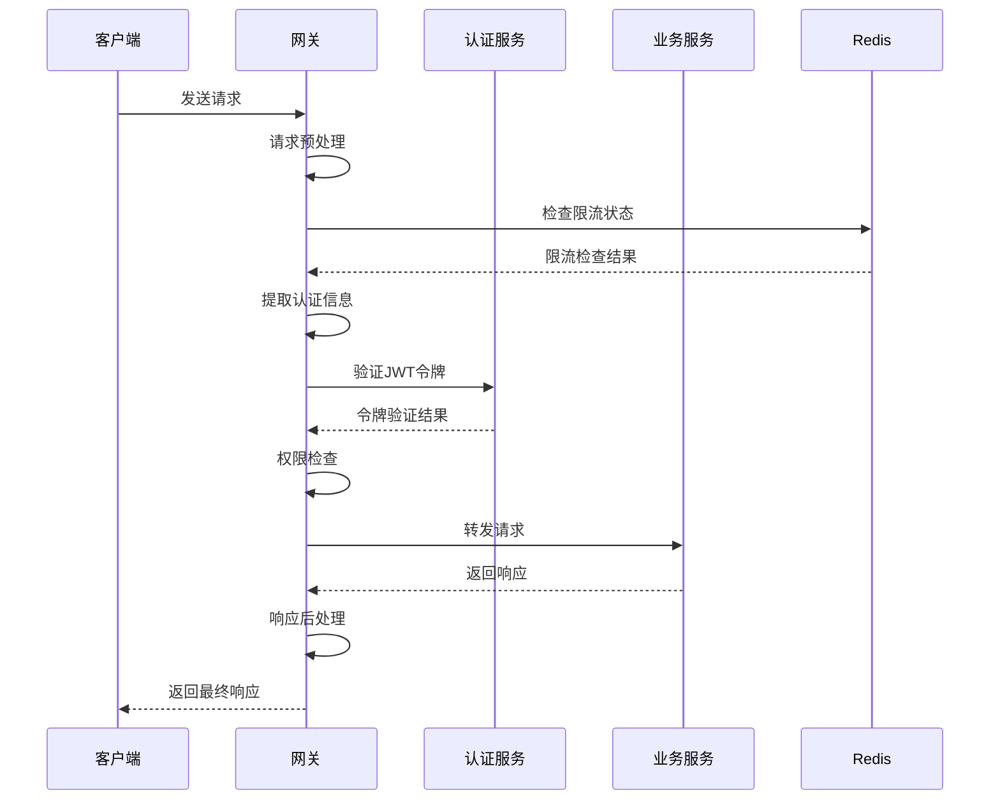

# Admin-Gateway 网关服务文档

## 📋 服务概述

网关服务(admin-gateway)是整个系统的统一入口，负责请求路由、负载均衡、认证鉴权、限流熔断、监控统计等功能。

## 🏗️ 架构设计

### 服务职责
- 统一API入口管理
- 请求路由和负载均衡
- 身份认证和权限验证
- 流量控制和熔断保护
- 请求/响应数据转换
- 监控统计和日志记录

### 技术栈
- Spring Cloud Gateway
- Spring Security
- Redis (限流缓存)
- Resilience4j (熔断器)
- Micrometer (监控指标)

## 🌐 网关架构

### 整体架构图
```
┌─────────────────────────────────────────┐
│                客户端                    │
│   Web应用 | 移动端 | 第三方系统          │
└─────────────────────────────────────────┘
                    ↓
┌─────────────────────────────────────────┐
│              负载均衡                    │
│          Nginx/HAProxy                  │
└─────────────────────────────────────────┘
                    ↓
┌─────────────────────────────────────────┐
│            API网关集群                   │
│    Gateway-1 | Gateway-2 | Gateway-3   │
└─────────────────────────────────────────┘
                    ↓
┌─────────────────────────────────────────┐
│              微服务集群                  │
│  Auth | User | System | Common         │
└─────────────────────────────────────────┘
```

### 请求处理流程


## 🔧 核心功能

### 1. 路由管理

#### 动态路由配置
```yaml
spring:
  cloud:
    gateway:
      routes:
        # 认证服务路由
        - id: admin-auth
          uri: lb://admin-auth
          predicates:
            - Path=/auth/**
          filters:
            - name: RequestRateLimiter
              args:
                redis-rate-limiter.replenishRate: 100
                redis-rate-limiter.burstCapacity: 200
                redis-rate-limiter.requestedTokens: 1
            - name: Retry
              args:
                retries: 3
                statuses: BAD_GATEWAY,GATEWAY_TIMEOUT
                methods: GET,POST
        
        # 用户服务路由
        - id: admin-user
          uri: lb://admin-user
          predicates:
            - Path=/user/**
          filters:
            - AuthenticationFilter
            - name: CircuitBreaker
              args:
                name: admin-user-cb
                fallbackUri: forward:/fallback/user
        
        # 系统服务路由
        - id: admin-system
          uri: lb://admin-system
          predicates:
            - Path=/system/**
          filters:
            - AuthenticationFilter
            - PermissionFilter
            - name: RequestSize
              args:
                maxSize: 5000000
```

#### 路由管理服务
```java
@Service
public class RouteManagementService {
    
    @Autowired
    private RouteDefinitionWriter routeDefinitionWriter;
    
    @Autowired
    private ApplicationEventPublisher eventPublisher;
    
    /**
     * 动态添加路由
     */
    public void addRoute(RouteDefinition routeDefinition) {
        try {
            routeDefinitionWriter.save(Mono.just(routeDefinition)).subscribe();
            eventPublisher.publishEvent(new RefreshRoutesEvent(this));
            log.info("动态添加路由成功: {}", routeDefinition.getId());
        } catch (Exception e) {
            log.error("动态添加路由失败", e);
            throw new RouteManagementException("添加路由失败: " + e.getMessage());
        }
    }
    
    /**
     * 动态删除路由
     */
    public void deleteRoute(String routeId) {
        try {
            routeDefinitionWriter.delete(Mono.just(routeId)).subscribe();
            eventPublisher.publishEvent(new RefreshRoutesEvent(this));
            log.info("动态删除路由成功: {}", routeId);
        } catch (Exception e) {
            log.error("动态删除路由失败", e);
            throw new RouteManagementException("删除路由失败: " + e.getMessage());
        }
    }
    
    /**
     * 路由健康检查
     */
    @Scheduled(fixedRate = 30000) // 30秒检查一次
    public void checkRouteHealth() {
        List<RouteDefinition> routes = getActiveRoutes();
        
        for (RouteDefinition route : routes) {
            String serviceId = extractServiceId(route.getUri().toString());
            boolean isHealthy = checkServiceHealth(serviceId);
            
            if (!isHealthy) {
                log.warn("服务 {} 健康检查失败，考虑降级处理", serviceId);
                handleUnhealthyService(serviceId);
            }
        }
    }
    
    /**
     * 智能路由选择
     */
    public RouteDefinition selectOptimalRoute(String path, Map<String, String> headers) {
        List<RouteDefinition> candidateRoutes = findMatchingRoutes(path);
        
        if (candidateRoutes.isEmpty()) {
            throw new RouteNotFoundException("未找到匹配的路由: " + path);
        }
        
        if (candidateRoutes.size() == 1) {
            return candidateRoutes.get(0);
        }
        
        // 基于多种因素选择最优路由
        return candidateRoutes.stream()
            .max(Comparator.comparingDouble(route -> calculateRouteScore(route, headers)))
            .orElse(candidateRoutes.get(0));
    }
    
    private double calculateRouteScore(RouteDefinition route, Map<String, String> headers) {
        double score = 0.0;
        
        // 服务健康度评分
        String serviceId = extractServiceId(route.getUri().toString());
        ServiceHealth health = getServiceHealth(serviceId);
        score += health.getHealthScore() * 0.4;
        
        // 响应时间评分
        double avgResponseTime = getAverageResponseTime(serviceId);
        score += (1.0 / (1.0 + avgResponseTime / 1000.0)) * 0.3;
        
        // 负载评分
        double loadFactor = getCurrentLoadFactor(serviceId);
        score += (1.0 - loadFactor) * 0.2;
        
        // 地理位置评分（如果有地理信息）
        if (headers.containsKey("X-User-Location")) {
            double geoScore = calculateGeographicScore(serviceId, headers.get("X-User-Location"));
            score += geoScore * 0.1;
        }
        
        return score;
    }
}
```

### 2. 认证鉴权

#### JWT认证过滤器
```java
@Component
public class JwtAuthenticationFilter implements GatewayFilter, Ordered {
    
    @Autowired
    private JwtTokenProvider jwtTokenProvider;
    
    @Autowired
    private RedisTemplate<String, Object> redisTemplate;
    
    @Override
    public Mono<Void> filter(ServerWebExchange exchange, GatewayFilterChain chain) {
        ServerHttpRequest request = exchange.getRequest();
        
        // 检查是否为白名单路径
        if (isWhitelistPath(request.getPath().toString())) {
            return chain.filter(exchange);
        }
        
        // 提取JWT令牌
        String token = extractToken(request);
        if (StringUtils.isEmpty(token)) {
            return handleUnauthorized(exchange, "缺少认证令牌");
        }
        
        // 验证令牌
        return validateToken(token)
            .flatMap(validationResult -> {
                if (!validationResult.isValid()) {
                    return handleUnauthorized(exchange, validationResult.getErrorMessage());
                }
                
                // 添加用户信息到请求头
                ServerHttpRequest modifiedRequest = request.mutate()
                    .header("X-User-Id", String.valueOf(validationResult.getUserId()))
                    .header("X-User-Name", validationResult.getUsername())
                    .header("X-Tenant-Id", String.valueOf(validationResult.getTenantId()))
                    .header("X-User-Roles", String.join(",", validationResult.getRoles()))
                    .build();
                
                return chain.filter(exchange.mutate().request(modifiedRequest).build());
            })
            .onErrorResume(ex -> handleUnauthorized(exchange, "令牌验证失败: " + ex.getMessage()));
    }
    
    private Mono<TokenValidationResult> validateToken(String token) {
        return Mono.fromCallable(() -> {
            // 1. 检查令牌格式
            if (!jwtTokenProvider.validateTokenFormat(token)) {
                return TokenValidationResult.invalid("令牌格式无效");
            }
            
            // 2. 检查令牌是否在黑名单中
            String tokenId = jwtTokenProvider.getTokenId(token);
            if (isTokenBlacklisted(tokenId)) {
                return TokenValidationResult.invalid("令牌已被撤销");
            }
            
            // 3. 验证令牌签名和过期时间
            if (!jwtTokenProvider.validateToken(token)) {
                return TokenValidationResult.invalid("令牌无效或已过期");
            }
            
            // 4. 提取用户信息
            Long userId = jwtTokenProvider.getUserId(token);
            String username = jwtTokenProvider.getUsername(token);
            Long tenantId = jwtTokenProvider.getTenantId(token);
            List<String> roles = jwtTokenProvider.getRoles(token);
            
            return TokenValidationResult.valid(userId, username, tenantId, roles);
        })
        .subscribeOn(Schedulers.boundedElastic());
    }
    
    private boolean isTokenBlacklisted(String tokenId) {
        return redisTemplate.hasKey("blacklist:token:" + tokenId);
    }
    
    private Mono<Void> handleUnauthorized(ServerWebExchange exchange, String message) {
        ServerHttpResponse response = exchange.getResponse();
        response.setStatusCode(HttpStatus.UNAUTHORIZED);
        response.getHeaders().add("Content-Type", "application/json;charset=UTF-8");
        
        String body = JSON.toJSONString(Result.error(401, message));
        DataBuffer buffer = response.bufferFactory().wrap(body.getBytes(StandardCharsets.UTF_8));
        
        return response.writeWith(Mono.just(buffer));
    }
    
    @Override
    public int getOrder() {
        return -100; // 高优先级
    }
}
```

#### 权限验证过滤器
```java
@Component
public class PermissionFilter implements GatewayFilter, Ordered {
    
    @Autowired
    private PermissionService permissionService;
    
    @Override
    public Mono<Void> filter(ServerWebExchange exchange, GatewayFilterChain chain) {
        ServerHttpRequest request = exchange.getRequest();
        
        // 提取用户信息
        String userIdHeader = request.getHeaders().getFirst("X-User-Id");
        if (StringUtils.isEmpty(userIdHeader)) {
            return chain.filter(exchange); // 未认证请求，由认证过滤器处理
        }
        
        Long userId = Long.parseLong(userIdHeader);
        String path = request.getPath().toString();
        String method = request.getMethod().name();
        
        // 检查权限
        return checkPermission(userId, path, method)
            .flatMap(hasPermission -> {
                if (!hasPermission) {
                    return handleForbidden(exchange, "权限不足");
                }
                return chain.filter(exchange);
            })
            .onErrorResume(ex -> handleForbidden(exchange, "权限检查失败: " + ex.getMessage()));
    }
    
    private Mono<Boolean> checkPermission(Long userId, String path, String method) {
        return Mono.fromCallable(() -> {
            // 1. 根据路径和方法确定所需权限
            String requiredPermission = determineRequiredPermission(path, method);
            if (StringUtils.isEmpty(requiredPermission)) {
                return true; // 无需特定权限
            }
            
            // 2. 检查用户是否有该权限
            return permissionService.hasPermission(userId, requiredPermission);
        })
        .subscribeOn(Schedulers.boundedElastic());
    }
    
    private String determineRequiredPermission(String path, String method) {
        // 权限映射规则
        Map<String, String> permissionMappings = getPermissionMappings();
        
        String key = method + ":" + path;
        
        // 精确匹配
        if (permissionMappings.containsKey(key)) {
            return permissionMappings.get(key);
        }
        
        // 模式匹配
        for (Map.Entry<String, String> entry : permissionMappings.entrySet()) {
            if (pathMatches(key, entry.getKey())) {
                return entry.getValue();
            }
        }
        
        return null;
    }
    
    private Map<String, String> getPermissionMappings() {
        Map<String, String> mappings = new HashMap<>();
        
        // 用户管理权限
        mappings.put("GET:/user/page", "system:user:list");
        mappings.put("POST:/user", "system:user:add");
        mappings.put("PUT:/user", "system:user:edit");
        mappings.put("DELETE:/user/*", "system:user:delete");
        
        // 角色管理权限
        mappings.put("GET:/system/role/page", "system:role:list");
        mappings.put("POST:/system/role", "system:role:add");
        mappings.put("PUT:/system/role", "system:role:edit");
        mappings.put("DELETE:/system/role/*", "system:role:delete");
        
        // 菜单管理权限
        mappings.put("GET:/system/menu/tree", "system:menu:list");
        mappings.put("POST:/system/menu", "system:menu:add");
        mappings.put("PUT:/system/menu", "system:menu:edit");
        mappings.put("DELETE:/system/menu/*", "system:menu:delete");
        
        return mappings;
    }
    
    @Override
    public int getOrder() {
        return -90; // 在认证过滤器之后
    }
}
```

### 3. 流量控制

#### 限流过滤器
```java
@Component
public class RateLimitFilter implements GatewayFilter, Ordered {
    
    @Autowired
    private RedisTemplate<String, Object> redisTemplate;
    
    @Autowired
    private RateLimitConfig rateLimitConfig;
    
    @Override
    public Mono<Void> filter(ServerWebExchange exchange, GatewayFilterChain chain) {
        ServerHttpRequest request = exchange.getRequest();
        
        // 获取限流key
        String rateLimitKey = getRateLimitKey(request);
        
        // 执行限流检查
        return checkRateLimit(rateLimitKey)
            .flatMap(allowed -> {
                if (!allowed) {
                    return handleRateLimitExceeded(exchange);
                }
                return chain.filter(exchange);
            });
    }
    
    private String getRateLimitKey(ServerHttpRequest request) {
        // 多维度限流key生成
        StringBuilder keyBuilder = new StringBuilder();
        
        // 1. 基于IP限流
        String clientIp = getClientIp(request);
        keyBuilder.append("ip:").append(clientIp);
        
        // 2. 基于用户限流
        String userId = request.getHeaders().getFirst("X-User-Id");
        if (StringUtils.isNotEmpty(userId)) {
            keyBuilder.append(":user:").append(userId);
        }
        
        // 3. 基于API路径限流
        String path = request.getPath().toString();
        keyBuilder.append(":path:").append(path);
        
        return keyBuilder.toString();
    }
    
    private Mono<Boolean> checkRateLimit(String key) {
        return Mono.fromCallable(() -> {
            RateLimitRule rule = rateLimitConfig.getRuleForKey(key);
            if (rule == null) {
                return true; // 无限流规则，允许通过
            }
            
            return executeRateLimit(key, rule);
        })
        .subscribeOn(Schedulers.boundedElastic());
    }
    
    private boolean executeRateLimit(String key, RateLimitRule rule) {
        String redisKey = "rate_limit:" + key;
        
        // 使用滑动窗口算法
        long currentTime = System.currentTimeMillis();
        long windowStart = currentTime - rule.getWindowSize();
        
        // 清理过期数据
        redisTemplate.opsForZSet().removeRangeByScore(redisKey, 0, windowStart);
        
        // 检查当前窗口内的请求数量
        Long currentCount = redisTemplate.opsForZSet().count(redisKey, windowStart, currentTime);
        
        if (currentCount >= rule.getMaxRequests()) {
            return false; // 超过限流阈值
        }
        
        // 记录当前请求
        redisTemplate.opsForZSet().add(redisKey, UUID.randomUUID().toString(), currentTime);
        redisTemplate.expire(redisKey, Duration.ofMillis(rule.getWindowSize()));
        
        return true;
    }
    
    private Mono<Void> handleRateLimitExceeded(ServerWebExchange exchange) {
        ServerHttpResponse response = exchange.getResponse();
        response.setStatusCode(HttpStatus.TOO_MANY_REQUESTS);
        response.getHeaders().add("Content-Type", "application/json;charset=UTF-8");
        
        String body = JSON.toJSONString(Result.error(429, "请求过于频繁，请稍后再试"));
        DataBuffer buffer = response.bufferFactory().wrap(body.getBytes(StandardCharsets.UTF_8));
        
        return response.writeWith(Mono.just(buffer));
    }
    
    @Override
    public int getOrder() {
        return -80;
    }
}
```

#### 熔断器配置
```java
@Configuration
public class CircuitBreakerConfig {
    
    @Bean
    public CircuitBreaker adminUserCircuitBreaker() {
        return CircuitBreaker.ofDefaults("admin-user")
            .toBuilder()
            .failureRateThreshold(50) // 失败率阈值50%
            .waitDurationInOpenState(Duration.ofSeconds(30)) // 熔断器打开30秒
            .slidingWindowSize(10) // 滑动窗口大小10
            .minimumNumberOfCalls(5) // 最小调用次数5
            .build();
    }
    
    @Bean
    public CircuitBreaker adminSystemCircuitBreaker() {
        return CircuitBreaker.ofDefaults("admin-system")
            .toBuilder()
            .failureRateThreshold(60)
            .waitDurationInOpenState(Duration.ofSeconds(20))
            .slidingWindowSize(8)
            .minimumNumberOfCalls(3)
            .build();
    }
    
    /**
     * 熔断器事件监听
     */
    @EventListener
    public void handleCircuitBreakerEvent(CircuitBreakerEvent event) {
        switch (event.getEventType()) {
            case STATE_TRANSITION:
                CircuitBreakerOnStateTransitionEvent transitionEvent = 
                    (CircuitBreakerOnStateTransitionEvent) event;
                log.warn("熔断器 {} 状态变更: {} -> {}", 
                    event.getCircuitBreakerName(),
                    transitionEvent.getStateTransition().getFromState(),
                    transitionEvent.getStateTransition().getToState());
                
                // 发送告警
                sendCircuitBreakerAlert(transitionEvent);
                break;
                
            case FAILURE_RATE_EXCEEDED:
                log.warn("熔断器 {} 失败率超过阈值", event.getCircuitBreakerName());
                break;
        }
    }
    
    private void sendCircuitBreakerAlert(CircuitBreakerOnStateTransitionEvent event) {
        // 发送告警通知
        AlertMessage alert = new AlertMessage();
        alert.setTitle("熔断器状态变更");
        alert.setContent(String.format("服务 %s 熔断器状态从 %s 变更为 %s",
            event.getCircuitBreakerName(),
            event.getStateTransition().getFromState(),
            event.getStateTransition().getToState()));
        alert.setLevel(AlertLevel.WARNING);
        
        alertService.sendAlert(alert);
    }
}
```

### 4. 请求/响应处理

#### 全局过滤器
```java
@Component
public class GlobalRequestResponseFilter implements GlobalFilter, Ordered {
    
    @Override
    public Mono<Void> filter(ServerWebExchange exchange, GatewayFilterChain chain) {
        ServerHttpRequest request = exchange.getRequest();
        
        // 生成请求ID
        String requestId = generateRequestId();
        
        // 记录请求开始时间
        long startTime = System.currentTimeMillis();
        
        // 添加请求ID到响应头
        ServerHttpResponse response = exchange.getResponse();
        response.getHeaders().add("X-Request-Id", requestId);
        
        // 请求日志
        logRequest(request, requestId);
        
        return chain.filter(exchange)
            .then(Mono.fromRunnable(() -> {
                // 计算请求耗时
                long duration = System.currentTimeMillis() - startTime;
                
                // 响应日志
                logResponse(response, requestId, duration);
                
                // 记录监控指标
                recordMetrics(request, response, duration);
            }));
    }
    
    private void logRequest(ServerHttpRequest request, String requestId) {
        log.info("请求开始 - ID: {}, Method: {}, URI: {}, RemoteAddress: {}", 
            requestId,
            request.getMethod(),
            request.getURI(),
            request.getRemoteAddress());
    }
    
    private void logResponse(ServerHttpResponse response, String requestId, long duration) {
        log.info("请求结束 - ID: {}, Status: {}, Duration: {}ms", 
            requestId,
            response.getStatusCode(),
            duration);
    }
    
    private void recordMetrics(ServerHttpRequest request, ServerHttpResponse response, long duration) {
        String path = request.getPath().toString();
        String method = request.getMethod().name();
        String status = response.getStatusCode().toString();
        
        // 记录请求计数
        meterRegistry.counter("gateway.requests.total",
            "method", method,
            "path", path,
            "status", status)
            .increment();
        
        // 记录请求耗时
        meterRegistry.timer("gateway.request.duration",
            "method", method,
            "path", path)
            .record(duration, TimeUnit.MILLISECONDS);
    }
    
    @Override
    public int getOrder() {
        return Ordered.HIGHEST_PRECEDENCE;
    }
}
```

#### 跨域配置
```java
@Configuration
public class CorsConfig {
    
    @Bean
    public CorsWebFilter corsWebFilter() {
        CorsConfiguration config = new CorsConfiguration();
        
        // 允许的源
        config.addAllowedOriginPattern("*");
        
        // 允许的方法
        config.addAllowedMethod("*");
        
        // 允许的头
        config.addAllowedHeader("*");
        
        // 允许携带凭证
        config.setAllowCredentials(true);
        
        // 预检请求缓存时间
        config.setMaxAge(3600L);
        
        UrlBasedCorsConfigurationSource source = new UrlBasedCorsConfigurationSource();
        source.registerCorsConfiguration("/**", config);
        
        return new CorsWebFilter(source);
    }
}
```

## 📊 监控和统计

### 1. 监控指标

#### 自定义监控指标
```java
@Component
public class GatewayMetrics {
    
    private final MeterRegistry meterRegistry;
    
    private final Counter totalRequests;
    private final Counter errorRequests;
    private final Timer requestDuration;
    private final Gauge activeConnections;
    
    public GatewayMetrics(MeterRegistry meterRegistry) {
        this.meterRegistry = meterRegistry;
        
        this.totalRequests = Counter.builder("gateway.requests.total")
            .description("网关总请求数")
            .register(meterRegistry);
            
        this.errorRequests = Counter.builder("gateway.requests.error")
            .description("网关错误请求数")
            .register(meterRegistry);
            
        this.requestDuration = Timer.builder("gateway.request.duration")
            .description("网关请求耗时")
            .register(meterRegistry);
            
        this.activeConnections = Gauge.builder("gateway.connections.active")
            .description("网关活跃连接数")
            .register(meterRegistry, this, GatewayMetrics::getActiveConnectionCount);
    }
    
    public void recordRequest(String path, String method, String status, long duration) {
        totalRequests.increment(
            Tags.of(
                Tag.of("path", path),
                Tag.of("method", method),
                Tag.of("status", status)
            )
        );
        
        if (isErrorStatus(status)) {
            errorRequests.increment(
                Tags.of(
                    Tag.of("path", path),
                    Tag.of("method", method),
                    Tag.of("status", status)
                )
            );
        }
        
        requestDuration.record(duration, TimeUnit.MILLISECONDS,
            Tags.of(
                Tag.of("path", path),
                Tag.of("method", method)
            )
        );
    }
    
    private boolean isErrorStatus(String status) {
        return status.startsWith("4") || status.startsWith("5");
    }
    
    private double getActiveConnectionCount() {
        // 获取活跃连接数的实现
        return NettyChannelMetrics.getActiveConnectionCount();
    }
}
```

### 2. 健康检查

#### 健康检查端点
```java
@RestController
@RequestMapping("/actuator")
public class GatewayHealthController {
    
    @Autowired
    private DiscoveryClient discoveryClient;
    
    @Autowired
    private RouteDefinitionLocator routeDefinitionLocator;
    
    @GetMapping("/health/gateway")
    public Mono<ResponseEntity<Map<String, Object>>> gatewayHealth() {
        return Mono.fromCallable(() -> {
            Map<String, Object> health = new HashMap<>();
            health.put("status", "UP");
            health.put("timestamp", LocalDateTime.now());
            
            // 检查路由健康状态
            Map<String, Object> routeHealth = checkRouteHealth();
            health.put("routes", routeHealth);
            
            // 检查服务发现健康状态
            Map<String, Object> discoveryHealth = checkDiscoveryHealth();
            health.put("discovery", discoveryHealth);
            
            // 检查Redis连接
            Map<String, Object> redisHealth = checkRedisHealth();
            health.put("redis", redisHealth);
            
            return ResponseEntity.ok(health);
        })
        .subscribeOn(Schedulers.boundedElastic());
    }
    
    private Map<String, Object> checkRouteHealth() {
        Map<String, Object> routeHealth = new HashMap<>();
        
        try {
            List<RouteDefinition> routes = routeDefinitionLocator.getRouteDefinitions()
                .collectList()
                .block();
                
            routeHealth.put("status", "UP");
            routeHealth.put("count", routes != null ? routes.size() : 0);
            
            // 检查每个路由的目标服务状态
            Map<String, String> serviceStatus = new HashMap<>();
            if (routes != null) {
                for (RouteDefinition route : routes) {
                    String serviceId = extractServiceId(route.getUri().toString());
                    boolean isHealthy = checkServiceHealth(serviceId);
                    serviceStatus.put(serviceId, isHealthy ? "UP" : "DOWN");
                }
            }
            routeHealth.put("services", serviceStatus);
            
        } catch (Exception e) {
            routeHealth.put("status", "DOWN");
            routeHealth.put("error", e.getMessage());
        }
        
        return routeHealth;
    }
    
    private Map<String, Object> checkDiscoveryHealth() {
        Map<String, Object> discoveryHealth = new HashMap<>();
        
        try {
            List<String> services = discoveryClient.getServices();
            discoveryHealth.put("status", "UP");
            discoveryHealth.put("services", services);
            
            // 检查每个服务的实例数
            Map<String, Integer> instanceCounts = new HashMap<>();
            for (String service : services) {
                List<ServiceInstance> instances = discoveryClient.getInstances(service);
                instanceCounts.put(service, instances.size());
            }
            discoveryHealth.put("instanceCounts", instanceCounts);
            
        } catch (Exception e) {
            discoveryHealth.put("status", "DOWN");
            discoveryHealth.put("error", e.getMessage());
        }
        
        return discoveryHealth;
    }
    
    private Map<String, Object> checkRedisHealth() {
        Map<String, Object> redisHealth = new HashMap<>();
        
        try {
            redisTemplate.execute((RedisCallback<String>) connection -> {
                return connection.ping();
            });
            
            redisHealth.put("status", "UP");
        } catch (Exception e) {
            redisHealth.put("status", "DOWN");
            redisHealth.put("error", e.getMessage());
        }
        
        return redisHealth;
    }
}
```

## 🔧 配置管理

### 1. 应用配置
```yaml
server:
  port: 8080

spring:
  application:
    name: admin-gateway
    
  cloud:
    gateway:
      # 全局跨域配置
      globalcors:
        cors-configurations:
          '[/**]':
            allowed-origin-patterns: "*"
            allowed-methods: "*"
            allowed-headers: "*"
            allow-credentials: true
            max-age: 3600
            
      # 默认过滤器
      default-filters:
        - DedupeResponseHeader=Access-Control-Allow-Credentials Access-Control-Allow-Origin
        - AddResponseHeader=X-Response-Default-Foo, Default-Bar
        
      # 路由发现
      discovery:
        locator:
          enabled: true
          lower-case-service-id: true
          
    # 服务发现配置
    nacos:
      discovery:
        server-addr: ${NACOS_SERVER:localhost:8848}
        namespace: ${NACOS_NAMESPACE:public}
        group: ${NACOS_GROUP:DEFAULT_GROUP}
        
  # Redis配置
  redis:
    host: ${REDIS_HOST:localhost}
    port: ${REDIS_PORT:6379}
    password: ${REDIS_PASSWORD:}
    database: 0
    timeout: 3000ms
    lettuce:
      pool:
        max-active: 200
        max-idle: 20
        min-idle: 5
        max-wait: 3000ms

# 限流配置
rate-limit:
  # 全局限流配置
  global:
    enabled: true
    max-requests: 1000
    window-size: 60000 # 1分钟
    
  # API级别限流配置
  apis:
    - path: "/auth/login"
      max-requests: 10
      window-size: 60000
    - path: "/user/**"
      max-requests: 100
      window-size: 60000
      
# 熔断器配置
resilience4j:
  circuitbreaker:
    instances:
      admin-user:
        failure-rate-threshold: 50
        wait-duration-in-open-state: 30s
        sliding-window-size: 10
        minimum-number-of-calls: 5
      admin-system:
        failure-rate-threshold: 60
        wait-duration-in-open-state: 20s
        sliding-window-size: 8
        minimum-number-of-calls: 3

# 监控配置
management:
  endpoints:
    web:
      exposure:
        include: health,info,metrics,prometheus,gateway
  endpoint:
    health:
      show-details: always
  metrics:
    export:
      prometheus:
        enabled: true

# 日志配置
logging:
  level:
    org.springframework.cloud.gateway: DEBUG
    com.admin.gateway: DEBUG
  pattern:
    console: "%d{yyyy-MM-dd HH:mm:ss} [%thread] %-5level [%X{traceId}] %logger{50} - %msg%n"
```

### 2. 白名单配置
```java
@ConfigurationProperties(prefix = "gateway.whitelist")
@Data
public class WhitelistConfig {
    
    /**
     * 认证白名单路径
     */
    private List<String> authPaths = Arrays.asList(
        "/auth/login",
        "/auth/register", 
        "/auth/captcha",
        "/actuator/**",
        "/doc.html",
        "/swagger-ui/**",
        "/v3/api-docs/**"
    );
    
    /**
     * 限流白名单IP
     */
    private List<String> rateLimitIps = Arrays.asList(
        "127.0.0.1",
        "::1"
    );
    
    /**
     * 权限白名单路径
     */
    private List<String> permissionPaths = Arrays.asList(
        "/auth/**",
        "/actuator/health",
        "/favicon.ico"
    );
    
    /**
     * 检查路径是否在认证白名单中
     */
    public boolean isAuthWhitelist(String path) {
        return authPaths.stream().anyMatch(pattern -> pathMatches(path, pattern));
    }
    
    /**
     * 检查IP是否在限流白名单中
     */
    public boolean isRateLimitWhitelist(String ip) {
        return rateLimitIps.contains(ip);
    }
    
    /**
     * 检查路径是否在权限白名单中
     */
    public boolean isPermissionWhitelist(String path) {
        return permissionPaths.stream().anyMatch(pattern -> pathMatches(path, pattern));
    }
    
    private boolean pathMatches(String path, String pattern) {
        return new AntPathMatcher().match(pattern, path);
    }
}
```

## 🚨 异常处理

### 全局异常处理
```java
@Component
@Order(-1)
public class GlobalExceptionHandler implements WebExceptionHandler {
    
    @Override
    public Mono<Void> handle(ServerWebExchange exchange, Throwable ex) {
        ServerHttpResponse response = exchange.getResponse();
        
        if (response.isCommitted()) {
            return Mono.error(ex);
        }
        
        response.getHeaders().add("Content-Type", "application/json;charset=UTF-8");
        
        String body;
        HttpStatus status;
        
        if (ex instanceof TimeoutException) {
            status = HttpStatus.GATEWAY_TIMEOUT;
            body = JSON.toJSONString(Result.error(504, "网关超时"));
        } else if (ex instanceof ConnectException) {
            status = HttpStatus.BAD_GATEWAY;
            body = JSON.toJSONString(Result.error(502, "服务连接失败"));
        } else if (ex instanceof ResponseStatusException) {
            ResponseStatusException responseStatusException = (ResponseStatusException) ex;
            status = responseStatusException.getStatus();
            body = JSON.toJSONString(Result.error(status.value(), responseStatusException.getReason()));
        } else {
            status = HttpStatus.INTERNAL_SERVER_ERROR;
            body = JSON.toJSONString(Result.error(500, "网关内部错误"));
        }
        
        response.setStatusCode(status);
        DataBuffer buffer = response.bufferFactory().wrap(body.getBytes(StandardCharsets.UTF_8));
        
        return response.writeWith(Mono.just(buffer));
    }
}
```

## 📈 性能优化

### 1. 连接池优化
```yaml
spring:
  cloud:
    gateway:
      httpclient:
        # 连接超时时间
        connect-timeout: 5000
        # 响应超时时间
        response-timeout: 10s
        # 连接池配置
        pool:
          # 连接池类型
          type: elastic
          # 最大连接数
          max-connections: 1000
          # 连接获取超时时间
          acquire-timeout: 45s
          # 最大空闲时间
          max-idle-time: 30s
          # 最大生存时间
          max-life-time: 60s
```

### 2. 缓存优化
```java
@Configuration
@EnableCaching
public class CacheConfig {
    
    @Bean
    public CacheManager cacheManager() {
        RedisCacheManager.Builder builder = RedisCacheManager.RedisCacheManagerBuilder
            .fromConnectionFactory(redisConnectionFactory())
            .cacheDefaults(cacheConfiguration());
            
        return builder.build();
    }
    
    private RedisCacheConfiguration cacheConfiguration() {
        return RedisCacheConfiguration.defaultCacheConfig()
            .entryTtl(Duration.ofMinutes(10))
            .serializeKeysWith(RedisSerializationContext.SerializationPair.fromSerializer(new StringRedisSerializer()))
            .serializeValuesWith(RedisSerializationContext.SerializationPair.fromSerializer(new GenericJackson2JsonRedisSerializer()));
    }
}
```

## 🚀 部署说明

### Docker部署
```dockerfile
FROM openjdk:8-jre-slim

COPY admin-gateway.jar /app/admin-gateway.jar

EXPOSE 8080

ENTRYPOINT ["java", "-jar", "/app/admin-gateway.jar"]
```

### docker-compose.yml
```yaml
version: '3.8'
services:
  admin-gateway:
    image: admin-gateway:latest
    ports:
      - "8080:8080"
    environment:
      - SPRING_PROFILES_ACTIVE=prod
      - NACOS_SERVER=nacos:8848
      - REDIS_HOST=redis
    depends_on:
      - nacos
      - redis
    networks:
      - admin-network
```

## 📝 版本历史

### v1.3.0 (当前版本)
- ✅ 完善认证鉴权机制
- ✅ 支持多维度限流
- ✅ 增加熔断器保护
- ✅ 优化监控指标

### v1.2.0
- ✅ 基础网关功能
- ✅ 路由管理
- ✅ JWT认证

### v1.1.0
- ✅ 基础过滤器
- ✅ 跨域配置

### v1.0.0
- ✅ 基础网关框架
