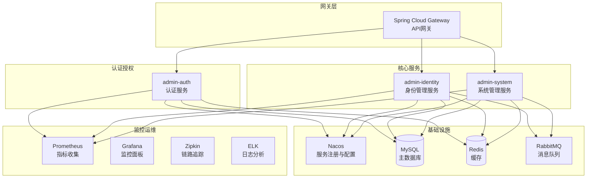

# 统一身份管理系统架构设计

## 1. 技术架构概览

### 1.1 分层架构设计

```
┌─────────────────────────────────────────────────────────────────┐
│                        表现层 (Presentation Layer)               │
│  ┌─────────────────┐ ┌─────────────────┐ ┌─────────────────┐    │
│  │   Web控制器     │ │   RESTful API   │ │   GraphQL API   │    │
│  │   @Controller   │ │  @RestController │ │   (Optional)    │    │
│  └─────────────────┘ └─────────────────┘ └─────────────────┘    │
├─────────────────────────────────────────────────────────────────┤
│                        应用层 (Application Layer)                │
│  ┌─────────────────┐ ┌─────────────────┐ ┌─────────────────┐    │
│  │   应用服务      │ │   DTO转换       │ │   事件处理      │    │
│  │   @Service      │ │   MapStruct     │ │   @EventHandler │    │
│  └─────────────────┘ └─────────────────┘ └─────────────────┘    │
├─────────────────────────────────────────────────────────────────┤
│                        领域层 (Domain Layer)                     │
│  ┌─────────────────┐ ┌─────────────────┐ ┌─────────────────┐    │
│  │   领域服务      │ │   领域实体      │ │   值对象        │    │
│  │   DomainService │ │   Entity        │ │   ValueObject   │    │
│  └─────────────────┘ └─────────────────┘ └─────────────────┘    │
├─────────────────────────────────────────────────────────────────┤
│                        基础设施层 (Infrastructure Layer)          │
│  ┌─────────────────┐ ┌─────────────────┐ ┌─────────────────┐    │
│  │   数据访问      │ │   外部服务      │ │   配置管理      │    │
│  │   @Repository   │ │   @FeignClient  │ │   @Configuration│    │
│  └─────────────────┘ └─────────────────┘ └─────────────────┘    │
└─────────────────────────────────────────────────────────────────┘
```

### 1.2 微服务架构设计



## 2. 核心组件设计

### 2.1 租户管理组件架构

```java
// 租户管理核心架构
package com.admin.identity.tenant;

├── controller/
│   ├── TenantController.java              // 租户REST控制器
│   └── TenantManagementController.java    // 租户管理控制器
├── service/
│   ├── TenantService.java                 // 租户服务接口
│   ├── impl/
│   │   ├── TenantServiceImpl.java         // 租户服务实现
│   │   └── TenantQuotaServiceImpl.java    // 租户配额服务
│   └── domain/
│       ├── TenantDomainService.java       // 租户领域服务
│       └── TenantFactory.java             // 租户工厂
├── repository/
│   ├── TenantRepository.java              // 租户仓储接口
│   └── impl/
│       └── TenantRepositoryImpl.java      // 租户仓储实现
├── dto/
│   ├── TenantCreateDTO.java               // 租户创建DTO
│   ├── TenantUpdateDTO.java               // 租户更新DTO
│   ├── TenantQueryDTO.java                // 租户查询DTO
│   └── TenantResponseDTO.java             // 租户响应DTO
└── event/
    ├── TenantCreatedEvent.java            // 租户创建事件
    ├── TenantUpdatedEvent.java            // 租户更新事件
    └── TenantExpiredEvent.java            // 租户过期事件
```

### 2.2 多租户数据隔离架构

```java
/**
 * 多租户拦截器架构设计
 */
@Component
public class TenantInterceptor implements HandlerInterceptor {
    
    @Override
    public boolean preHandle(HttpServletRequest request, 
                           HttpServletResponse response, 
                           Object handler) throws Exception {
        // 1. 从Token中提取租户ID
        String tenantId = extractTenantId(request);
        
        // 2. 设置租户上下文
        TenantContext.setTenantId(tenantId);
        
        // 3. 验证租户状态
        validateTenantStatus(tenantId);
        
        return true;
    }
    
    @Override
    public void afterCompletion(HttpServletRequest request, 
                              HttpServletResponse response, 
                              Object handler, Exception ex) {
        // 清理租户上下文
        TenantContext.clear();
    }
}

/**
 * MyBatis多租户插件
 */
@Intercepts({
    @Signature(type = Executor.class, method = "query", 
               args = {MappedStatement.class, Object.class, 
                      RowBounds.class, ResultHandler.class}),
    @Signature(type = Executor.class, method = "update", 
               args = {MappedStatement.class, Object.class})
})
public class TenantSqlInterceptor implements Interceptor {
    
    @Override
    public Object intercept(Invocation invocation) throws Throwable {
        // 1. 获取当前租户ID
        Long tenantId = TenantContext.getTenantId();
        if (tenantId == null) {
            return invocation.proceed();
        }
        
        // 2. 解析SQL
        MappedStatement mappedStatement = (MappedStatement) invocation.getArgs()[0];
        BoundSql boundSql = mappedStatement.getBoundSql(invocation.getArgs()[1]);
        String sql = boundSql.getSql();
        
        // 3. 注入租户条件
        String tenantSql = addTenantCondition(sql, tenantId);
        
        // 4. 重写SQL
        BoundSql newBoundSql = new BoundSql(mappedStatement.getConfiguration(),
                                          tenantSql, 
                                          boundSql.getParameterMappings(),
                                          boundSql.getParameterObject());
        
        return invocation.proceed();
    }
}
```

### 2.3 权限控制架构

```java
/**
 * 权限验证架构设计
 */
@Component
public class PermissionEvaluator {
    
    /**
     * 检查用户是否有指定权限
     */
    public boolean hasPermission(Long userId, String permission) {
        // 1. 从缓存获取用户权限
        Set<String> userPermissions = getUserPermissions(userId);
        
        // 2. 检查权限
        return userPermissions.contains(permission);
    }
    
    /**
     * 检查用户是否有数据权限
     */
    public boolean hasDataPermission(Long userId, String resource, Object data) {
        // 1. 获取用户数据权限范围
        DataScope dataScope = getUserDataScope(userId, resource);
        
        // 2. 根据数据权限范围验证
        return validateDataAccess(dataScope, data);
    }
    
    /**
     * 获取用户权限列表（支持多级缓存）
     */
    @Cacheable(value = "user_permissions", key = "#userId")
    public Set<String> getUserPermissions(Long userId) {
        // 1. 查询用户角色
        List<Role> roles = roleService.getUserRoles(userId);
        
        // 2. 查询角色权限
        Set<String> permissions = new HashSet<>();
        for (Role role : roles) {
            permissions.addAll(permissionService.getRolePermissions(role.getId()));
        }
        
        // 3. 查询用户直接权限
        permissions.addAll(permissionService.getUserDirectPermissions(userId));
        
        return permissions;
    }
}

/**
 * 数据权限过滤器
 */
@Component
public class DataPermissionFilter {
    
    public String buildDataScopeFilter(Long userId, String alias) {
        User user = userService.getUserById(userId);
        StringBuilder filter = new StringBuilder();
        
        // 获取用户最高数据权限
        String dataScope = getMaxDataScope(userId);
        
        switch (dataScope) {
            case "1": // 全部数据权限
                break;
            case "2": // 租户数据权限
                filter.append(String.format(" AND %s.tenant_id = %d", 
                                           alias, user.getTenantId()));
                break;
            case "3": // 本组织数据权限
                filter.append(String.format(" AND %s.org_id = %d", 
                                           alias, user.getOrgId()));
                break;
            case "4": // 本组织及以下数据权限
                List<Long> orgIds = organizationService.getOrgAndSubOrgIds(user.getOrgId());
                filter.append(String.format(" AND %s.org_id IN (%s)", 
                                           alias, StringUtils.join(orgIds, ",")));
                break;
            case "5": // 仅本人数据权限
                filter.append(String.format(" AND %s.create_by = %d", 
                                           alias, userId));
                break;
            case "6": // 自定义数据权限
                List<Long> customOrgIds = getCustomDataScopeOrgIds(userId);
                if (!customOrgIds.isEmpty()) {
                    filter.append(String.format(" AND %s.org_id IN (%s)", 
                                               alias, StringUtils.join(customOrgIds, ",")));
                }
                break;
        }
        
        return filter.toString();
    }
}
```

## 3. 数据库架构设计

### 3.1 数据库分层设计

```
┌─────────────────────────────────────────────────────────────────┐
│                        应用数据库层                               │
│  ┌─────────────────────────────────────────────────────────────┐ │
│  │                    业务数据库                                │ │
│  │  ┌─────────────┐ ┌─────────────┐ ┌─────────────┐        │ │
│  │  │  用户库     │ │  租户库     │ │  权限库     │        │ │
│  │  │  (主写)     │ │  (主写)     │ │  (主写)     │        │ │
│  │  └─────────────┘ └─────────────┘ └─────────────┘        │ │
│  │  ┌─────────────┐ ┌─────────────┐ ┌─────────────┐        │ │
│  │  │  用户库     │ │  租户库     │ │  权限库     │        │ │
│  │  │  (只读)     │ │  (只读)     │ │  (只读)     │        │ │
│  │  └─────────────┘ └─────────────┘ └─────────────┘        │ │
│  └─────────────────────────────────────────────────────────────┘ │
├─────────────────────────────────────────────────────────────────┤
│                        缓存数据层                                 │
│  ┌─────────────────────────────────────────────────────────────┐ │
│  │                     Redis集群                              │ │
│  │  ┌─────────────┐ ┌─────────────┐ ┌─────────────┐        │ │
│  │  │ 用户缓存    │ │ 权限缓存    │ │ 会话缓存    │        │ │
│  │  │ (热点数据)  │ │ (权限树)    │ │ (登录状态)  │        │ │
│  │  └─────────────┘ └─────────────┘ └─────────────┘        │ │
│  └─────────────────────────────────────────────────────────────┘ │
├─────────────────────────────────────────────────────────────────┤
│                        本地缓存层                                 │
│  ┌─────────────────────────────────────────────────────────────┐ │
│  │                    Caffeine缓存                           │ │
│  │  ┌─────────────┐ ┌─────────────┐ ┌─────────────┐        │ │
│  │  │ 配置缓存    │ │ 权限缓存    │ │ 组织缓存    │        │ │
│  │  │ (系统配置)  │ │ (用户权限)  │ │ (组织树)    │        │ │
│  │  └─────────────┘ └─────────────┘ └─────────────┘        │ │
│  └─────────────────────────────────────────────────────────────┘ │
└─────────────────────────────────────────────────────────────────┘
```

### 3.2 分库分表策略

```sql
-- 租户分表策略（按租户ID取模）
CREATE TABLE sys_user_0 LIKE sys_user;
CREATE TABLE sys_user_1 LIKE sys_user;
CREATE TABLE sys_user_2 LIKE sys_user;
CREATE TABLE sys_user_3 LIKE sys_user;

-- 分表路由规则
-- 小租户：tenant_id % 4 决定分表
-- 大租户：独立表 sys_user_tenant_{tenant_id}

-- 分库策略（按业务域分库）
-- identity_db：用户、组织、租户相关表
-- auth_db：认证、权限、会话相关表
-- system_db：系统配置、日志、监控相关表
```

### 3.3 索引优化策略

```sql
-- 复合索引设计原则：租户隔离 + 业务查询

-- 用户表索引
CREATE INDEX idx_user_tenant_username ON sys_user(tenant_id, username);
CREATE INDEX idx_user_tenant_email ON sys_user(tenant_id, email);
CREATE INDEX idx_user_tenant_org ON sys_user(tenant_id, org_id);
CREATE INDEX idx_user_tenant_status ON sys_user(tenant_id, status, del_flag);

-- 组织表索引
CREATE INDEX idx_org_tenant_parent ON sys_organization(tenant_id, parent_id);
CREATE INDEX idx_org_tenant_level ON sys_organization(tenant_id, level);
CREATE INDEX idx_org_tenant_code ON sys_organization(tenant_id, org_code);

-- 权限表索引
CREATE INDEX idx_user_role_tenant_user ON sys_user_role(tenant_id, user_id);
CREATE INDEX idx_role_perm_tenant_role ON sys_role_permission(tenant_id, role_id);
CREATE INDEX idx_user_org_tenant_user ON sys_user_organization(tenant_id, user_id);

-- 覆盖索引（减少回表查询）
CREATE INDEX idx_user_login_info ON sys_user(tenant_id, username, password, status) 
WHERE del_flag = 0;
```

## 4. 安全架构设计

### 4.1 多层安全防护

```
┌─────────────────────────────────────────────────────────────────┐
│                        网络安全层                                 │
│  ┌─────────────────┐ ┌─────────────────┐ ┌─────────────────┐    │
│  │   WAF防护       │ │   DDoS防护      │ │   IP白名单      │    │
│  │   (Web防火墙)   │ │   (流量清洗)    │ │   (访问控制)    │    │
│  └─────────────────┘ └─────────────────┘ └─────────────────┘    │
├─────────────────────────────────────────────────────────────────┤
│                        应用安全层                                 │
│  ┌─────────────────┐ ┌─────────────────┐ ┌─────────────────┐    │
│  │   认证安全      │ │   授权安全      │ │   会话安全      │    │
│  │   (JWT+MFA)     │ │   (RBAC+ABAC)   │ │   (Session管理) │    │
│  └─────────────────┘ └─────────────────┘ └─────────────────┘    │
├─────────────────────────────────────────────────────────────────┤
│                        数据安全层                                 │
│  ┌─────────────────┐ ┌─────────────────┐ ┌─────────────────┐    │
│  │   传输加密      │ │   存储加密      │ │   字段加密      │    │
│  │   (TLS 1.3)     │ │   (AES-256)     │ │   (敏感数据)    │    │
│  └─────────────────┘ └─────────────────┘ └─────────────────┘    │
├─────────────────────────────────────────────────────────────────┤
│                        审计安全层                                 │
│  ┌─────────────────┐ ┌─────────────────┐ ┌─────────────────┐    │
│  │   操作审计      │ │   安全监控      │ │   异常告警      │    │
│  │   (行为记录)    │ │   (实时监控)    │ │   (自动响应)    │    │
│  └─────────────────┘ └─────────────────┘ └─────────────────┘    │
└─────────────────────────────────────────────────────────────────┘
```

### 4.2 JWT安全设计

```java
/**
 * JWT安全配置
 */
@Configuration
public class JwtSecurityConfig {
    
    // JWT密钥管理（支持密钥轮换）
    @Bean
    public JwtKeyManager jwtKeyManager() {
        return new JwtKeyManager()
            .setKeyRotationInterval(Duration.ofDays(30))
            .setSigningAlgorithm(SignatureAlgorithm.RS256)
            .setKeySize(2048);
    }
    
    // JWT Token配置
    @Bean
    public JwtTokenConfig jwtTokenConfig() {
        return JwtTokenConfig.builder()
            .accessTokenExpiry(Duration.ofHours(2))      // 访问令牌2小时
            .refreshTokenExpiry(Duration.ofDays(7))      // 刷新令牌7天
            .issuer("admin-identity")
            .audience("admin-client")
            .enableRefreshToken(true)
            .enableBlacklist(true)
            .build();
    }
}

/**
 * JWT令牌服务
 */
@Service
public class JwtTokenService {
    
    public JwtToken generateToken(UserDetails userDetails) {
        String accessToken = Jwts.builder()
            .setSubject(userDetails.getUsername())
            .setIssuer("admin-identity")
            .setIssuedAt(new Date())
            .setExpiration(new Date(System.currentTimeMillis() + ACCESS_TOKEN_EXPIRY))
            .claim("tenantId", userDetails.getTenantId())
            .claim("userId", userDetails.getId())
            .claim("authorities", userDetails.getAuthorities())
            .signWith(getSigningKey(), SignatureAlgorithm.RS256)
            .compact();
            
        String refreshToken = generateRefreshToken(userDetails);
        
        return new JwtToken(accessToken, refreshToken);
    }
    
    public boolean validateToken(String token) {
        try {
            // 1. 验证Token格式和签名
            Claims claims = Jwts.parserBuilder()
                .setSigningKey(getSigningKey())
                .build()
                .parseClaimsJws(token)
                .getBody();
            
            // 2. 检查黑名单
            if (tokenBlacklistService.isBlacklisted(token)) {
                return false;
            }
            
            // 3. 检查用户状态
            Long userId = claims.get("userId", Long.class);
            if (!userService.isUserActive(userId)) {
                return false;
            }
            
            return true;
        } catch (JwtException e) {
            log.warn("Invalid JWT token: {}", e.getMessage());
            return false;
        }
    }
}
```

### 4.3 密码安全策略

```java
/**
 * 密码安全策略
 */
@Component
public class PasswordSecurityPolicy {
    
    /**
     * 密码复杂度验证
     */
    public PasswordValidationResult validatePassword(String password) {
        List<String> errors = new ArrayList<>();
        
        // 长度检查
        if (password.length() < 8) {
            errors.add("密码长度至少8位");
        }
        
        // 复杂度检查
        if (!password.matches(".*[a-z].*")) {
            errors.add("密码必须包含小写字母");
        }
        if (!password.matches(".*[A-Z].*")) {
            errors.add("密码必须包含大写字母");
        }
        if (!password.matches(".*[0-9].*")) {
            errors.add("密码必须包含数字");
        }
        if (!password.matches(".*[!@#$%^&*()].*")) {
            errors.add("密码必须包含特殊字符");
        }
        
        // 常见密码检查
        if (isCommonPassword(password)) {
            errors.add("不能使用常见密码");
        }
        
        return new PasswordValidationResult(errors.isEmpty(), errors);
    }
    
    /**
     * 密码加密（使用BCrypt + Salt）
     */
    public String encryptPassword(String plainPassword) {
        return BCrypt.hashpw(plainPassword, BCrypt.gensalt(12));
    }
    
    /**
     * 密码验证
     */
    public boolean verifyPassword(String plainPassword, String hashedPassword) {
        return BCrypt.checkpw(plainPassword, hashedPassword);
    }
    
    /**
     * 密码过期检查
     */
    public boolean isPasswordExpired(User user) {
        if (user.getPasswordUpdateTime() == null) {
            return true; // 首次登录必须修改密码
        }
        
        LocalDateTime expireTime = user.getPasswordUpdateTime()
            .plusDays(getPasswordExpiryDays(user.getTenantId()));
        
        return LocalDateTime.now().isAfter(expireTime);
    }
}
```

## 5. 性能优化架构

### 5.1 缓存架构设计

```java
/**
 * 多级缓存管理器
 */
@Configuration
@EnableCaching
public class CacheConfig {
    
    /**
     * 本地缓存配置（Caffeine）
     */
    @Bean
    @Primary
    public CacheManager caffeineCacheManager() {
        CaffeineCacheManager cacheManager = new CaffeineCacheManager();
        cacheManager.setCaffeine(Caffeine.newBuilder()
            .maximumSize(10000)
            .expireAfterWrite(Duration.ofMinutes(30))
            .recordStats());
        return cacheManager;
    }
    
    /**
     * 分布式缓存配置（Redis）
     */
    @Bean
    public CacheManager redisCacheManager(RedisConnectionFactory factory) {
        RedisCacheConfiguration config = RedisCacheConfiguration.defaultCacheConfig()
            .entryTtl(Duration.ofHours(1))
            .serializeKeysWith(RedisSerializationContext.SerializationPair
                .fromSerializer(new StringRedisSerializer()))
            .serializeValuesWith(RedisSerializationContext.SerializationPair
                .fromSerializer(new GenericJackson2JsonRedisSerializer()));
        
        return RedisCacheManager.builder(factory)
            .cacheDefaults(config)
            .build();
    }
}

/**
 * 缓存策略注解
 */
@Target(ElementType.METHOD)
@Retention(RetentionPolicy.RUNTIME)
public @interface MultiLevelCache {
    String value();
    int localTtl() default 300;    // 本地缓存TTL（秒）
    int redisTtl() default 3600;   // Redis缓存TTL（秒）
    boolean syncUpdate() default true; // 是否同步更新
}

/**
 * 多级缓存切面
 */
@Aspect
@Component
public class MultiLevelCacheAspect {
    
    @Around("@annotation(multiLevelCache)")
    public Object around(ProceedingJoinPoint joinPoint, 
                        MultiLevelCache multiLevelCache) throws Throwable {
        String key = generateKey(joinPoint, multiLevelCache.value());
        
        // 1. 尝试从本地缓存获取
        Object result = localCache.get(key);
        if (result != null) {
            return result;
        }
        
        // 2. 尝试从Redis缓存获取
        result = redisCache.get(key);
        if (result != null) {
            // 写入本地缓存
            localCache.put(key, result, multiLevelCache.localTtl());
            return result;
        }
        
        // 3. 执行原方法
        result = joinPoint.proceed();
        
        // 4. 写入多级缓存
        localCache.put(key, result, multiLevelCache.localTtl());
        redisCache.put(key, result, multiLevelCache.redisTtl());
        
        return result;
    }
}
```

### 5.2 数据库连接池优化

```yaml
# 数据源配置优化
spring:
  datasource:
    type: com.zaxxer.hikari.HikariDataSource
    hikari:
      # 连接池配置
      minimum-idle: 10                    # 最小空闲连接数
      maximum-pool-size: 50               # 最大连接池大小
      connection-timeout: 30000           # 连接超时时间(ms)
      idle-timeout: 600000               # 空闲超时时间(ms)
      max-lifetime: 1800000              # 连接最大生命周期(ms)
      leak-detection-threshold: 60000     # 连接泄漏检测阈值(ms)
      
      # 连接验证
      connection-test-query: SELECT 1
      validation-timeout: 5000
      
      # 性能优化
      auto-commit: false
      read-only: false
      isolation-level: TRANSACTION_READ_COMMITTED
      
  # JPA配置优化
  jpa:
    hibernate:
      ddl-auto: none
    properties:
      hibernate:
        # 批处理优化
        jdbc:
          batch_size: 50
          batch_versioned_data: true
        order_inserts: true
        order_updates: true
        
        # 缓存配置
        cache:
          use_second_level_cache: true
          use_query_cache: true
          provider_class: org.hibernate.cache.caffeine.CaffeineRegionFactory
          
        # SQL优化
        show_sql: false
        format_sql: false
        use_sql_comments: false
        
        # 统计信息
        generate_statistics: true
```

### 5.3 异步处理架构

```java
/**
 * 异步任务配置
 */
@Configuration
@EnableAsync
public class AsyncConfig {
    
    @Bean("taskExecutor")
    public TaskExecutor taskExecutor() {
        ThreadPoolTaskExecutor executor = new ThreadPoolTaskExecutor();
        executor.setCorePoolSize(10);
        executor.setMaxPoolSize(50);
        executor.setQueueCapacity(200);
        executor.setKeepAliveSeconds(60);
        executor.setThreadNamePrefix("async-task-");
        executor.setRejectedExecutionHandler(new ThreadPoolExecutor.CallerRunsPolicy());
        executor.initialize();
        return executor;
    }
    
    @Bean("eventExecutor")
    public TaskExecutor eventExecutor() {
        ThreadPoolTaskExecutor executor = new ThreadPoolTaskExecutor();
        executor.setCorePoolSize(5);
        executor.setMaxPoolSize(20);
        executor.setQueueCapacity(100);
        executor.setThreadNamePrefix("event-");
        executor.initialize();
        return executor;
    }
}

/**
 * 异步事件处理
 */
@Component
public class AsyncEventHandler {
    
    /**
     * 异步处理用户创建事件
     */
    @Async("eventExecutor")
    @EventListener
    public void handleUserCreatedEvent(UserCreatedEvent event) {
        try {
            // 1. 发送欢迎邮件
            emailService.sendWelcomeEmail(event.getUser());
            
            // 2. 创建用户目录
            fileService.createUserDirectory(event.getUser());
            
            // 3. 记录审计日志
            auditService.recordUserCreation(event.getUser());
            
            // 4. 通知相关系统
            integrationService.notifyUserCreated(event.getUser());
            
        } catch (Exception e) {
            log.error("处理用户创建事件失败", e);
            // 错误处理和重试机制
            retryEventProcessing(event);
        }
    }
    
    /**
     * 异步批量操作
     */
    @Async("taskExecutor")
    public CompletableFuture<BatchResult> batchCreateUsers(List<UserCreateDTO> users) {
        BatchResult result = new BatchResult();
        
        for (UserCreateDTO userDto : users) {
            try {
                User user = userService.createUser(userDto);
                result.addSuccess(user);
            } catch (Exception e) {
                result.addError(userDto, e.getMessage());
            }
        }
        
        return CompletableFuture.completedFuture(result);
    }
}
```

## 6. 监控与运维架构

### 6.1 监控指标设计

```java
/**
 * 业务指标监控
 */
@Component
public class BusinessMetrics {
    
    private final MeterRegistry meterRegistry;
    
    // 租户相关指标
    private final Counter tenantCreatedCounter;
    private final Gauge activeTenantGauge;
    private final Timer tenantCreateTimer;
    
    // 用户相关指标
    private final Counter userLoginCounter;
    private final Counter userLoginFailedCounter;
    private final Gauge activeUserGauge;
    private final Timer userCreateTimer;
    
    // 权限相关指标
    private final Counter permissionCheckCounter;
    private final Counter permissionDeniedCounter;
    private final Timer permissionCheckTimer;
    
    public BusinessMetrics(MeterRegistry meterRegistry) {
        this.meterRegistry = meterRegistry;
        
        // 初始化指标
        this.tenantCreatedCounter = Counter.builder("tenant.created")
            .description("租户创建次数")
            .register(meterRegistry);
            
        this.userLoginCounter = Counter.builder("user.login")
            .description("用户登录次数")
            .tag("status", "success")
            .register(meterRegistry);
            
        this.permissionCheckCounter = Counter.builder("permission.check")
            .description("权限检查次数")
            .register(meterRegistry);
    }
    
    // 记录租户创建
    public void recordTenantCreated(String tenantType) {
        tenantCreatedCounter.increment(Tags.of("type", tenantType));
    }
    
    // 记录用户登录
    public void recordUserLogin(String result, String tenantId) {
        userLoginCounter.increment(Tags.of("result", result, "tenant", tenantId));
    }
    
    // 记录权限检查
    public void recordPermissionCheck(String permission, boolean granted) {
        permissionCheckCounter.increment(Tags.of(
            "permission", permission,
            "granted", String.valueOf(granted)
        ));
    }
}
```

### 6.2 健康检查设计

```java
/**
 * 自定义健康检查
 */
@Component
public class IdentityHealthIndicator implements HealthIndicator {
    
    @Override
    public Health health() {
        try {
            // 1. 检查数据库连接
            checkDatabaseHealth();
            
            // 2. 检查Redis连接
            checkRedisHealth();
            
            // 3. 检查关键业务功能
            checkBusinessHealth();
            
            return Health.up()
                .withDetail("database", "OK")
                .withDetail("redis", "OK")
                .withDetail("business", "OK")
                .build();
                
        } catch (Exception e) {
            return Health.down()
                .withDetail("error", e.getMessage())
                .build();
        }
    }
    
    private void checkBusinessHealth() {
        // 检查是否能正常创建测试用户
        UserCreateDTO testUser = new UserCreateDTO();
        testUser.setUsername("health_check_" + System.currentTimeMillis());
        testUser.setEmail("health@test.com");
        testUser.setPassword("Test123!");
        
        try {
            userService.validateUserData(testUser);
        } catch (Exception e) {
            throw new RuntimeException("用户验证功能异常", e);
        }
    }
}
```

### 6.3 日志架构设计

```java
/**
 * 统一日志配置
 */
@Configuration
public class LoggingConfig {
    
    @Bean
    public Logger auditLogger() {
        return LoggerFactory.getLogger("AUDIT");
    }
    
    @Bean
    public Logger securityLogger() {
        return LoggerFactory.getLogger("SECURITY");
    }
    
    @Bean
    public Logger businessLogger() {
        return LoggerFactory.getLogger("BUSINESS");
    }
}

/**
 * 审计日志切面
 */
@Aspect
@Component
public class AuditLogAspect {
    
    private final Logger auditLogger = LoggerFactory.getLogger("AUDIT");
    
    @Around("@annotation(auditLog)")
    public Object around(ProceedingJoinPoint joinPoint, AuditLog auditLog) throws Throwable {
        String operation = auditLog.operation();
        String resource = auditLog.resource();
        
        // 记录操作开始
        AuditLogEntry logEntry = AuditLogEntry.builder()
            .timestamp(Instant.now())
            .tenantId(TenantContext.getTenantId())
            .userId(SecurityContext.getCurrentUserId())
            .operation(operation)
            .resource(resource)
            .ip(RequestContext.getClientIp())
            .userAgent(RequestContext.getUserAgent())
            .build();
        
        try {
            Object result = joinPoint.proceed();
            
            // 记录操作成功
            logEntry.setResult("SUCCESS");
            logEntry.setDetails(buildSuccessDetails(result));
            
            return result;
        } catch (Exception e) {
            // 记录操作失败
            logEntry.setResult("FAILED");
            logEntry.setError(e.getMessage());
            
            throw e;
        } finally {
            auditLogger.info(JsonUtils.toJson(logEntry));
        }
    }
}
```

这个架构设计文档提供了完整的技术架构方案，包括分层架构、微服务设计、安全架构、性能优化和监控运维等方面。接下来我们将基于这个架构开始具体的功能实现。

<function_calls>
<invoke name="todo_write">
<parameter name="merge">true
