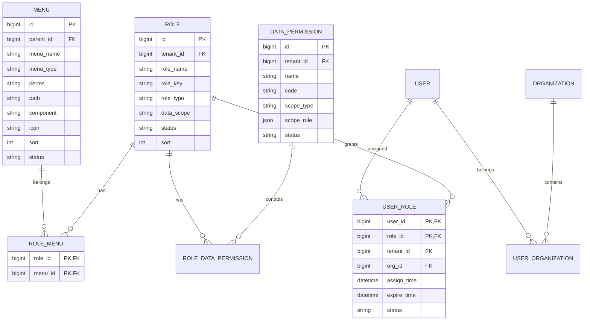

# Admin-System 系统管理服务文档

## 📋 服务概述

系统配置服务(admin-system)负责系统级配置管理，包括菜单管理、数据字典管理、系统参数配置等功能。

> **注意**: 权限管理、角色管理、组织架构管理功能已迁移到 `admin-identity` 统一身份管理服务。

## 🏗️ 架构设计

### 服务职责
- 菜单配置管理
- 数据字典管理
- 系统参数配置
- 操作日志记录
- 系统级配置缓存

### 技术栈
- Spring Boot 2.x
- MyBatis Plus
- MySQL 8.0
- Redis (权限缓存)
- Spring Security (权限框架)

## 🗄️ 数据模型

### 核心实体关系


### 数据表结构

#### 角色表 (sys_role)
```sql
CREATE TABLE `sys_role` (
  `id` bigint(20) NOT NULL COMMENT '角色ID',
  `tenant_id` bigint(20) DEFAULT NULL COMMENT '租户ID',
  `role_name` varchar(30) NOT NULL COMMENT '角色名称',
  `role_key` varchar(100) NOT NULL COMMENT '角色权限字符串',
  `role_type` varchar(20) DEFAULT 'FUNCTIONAL' COMMENT '角色类型',
  `role_category` varchar(20) DEFAULT 'CUSTOM' COMMENT '角色分类',
  `sort` int(4) DEFAULT 0 COMMENT '显示顺序',
  `data_scope` char(1) DEFAULT '1' COMMENT '数据范围',
  `menu_check_strictly` tinyint(1) DEFAULT 1 COMMENT '菜单树选择项是否关联显示',
  `dept_check_strictly` tinyint(1) DEFAULT 1 COMMENT '部门树选择项是否关联显示',
  `status` char(1) DEFAULT '0' COMMENT '角色状态（0正常 1停用）',
  `is_default` tinyint(1) DEFAULT 0 COMMENT '是否默认角色',
  `is_inheritable` tinyint(1) DEFAULT 1 COMMENT '是否可继承',
  `parent_role_id` bigint(20) DEFAULT NULL COMMENT '父角色ID',
  `apply_scope` varchar(20) DEFAULT 'TENANT' COMMENT '适用范围',
  `auto_assign_rule` json DEFAULT NULL COMMENT '自动分配规则',
  `create_by` varchar(64) DEFAULT '' COMMENT '创建者',
  `create_time` datetime DEFAULT CURRENT_TIMESTAMP COMMENT '创建时间',
  `update_by` varchar(64) DEFAULT '' COMMENT '更新者',
  `update_time` datetime DEFAULT CURRENT_TIMESTAMP ON UPDATE CURRENT_TIMESTAMP COMMENT '更新时间',
  `del_flag` tinyint(1) DEFAULT 0 COMMENT '删除标志',
  `remark` varchar(500) DEFAULT NULL COMMENT '备注',
  PRIMARY KEY (`id`),
  UNIQUE KEY `uk_tenant_role_key` (`tenant_id`, `role_key`),
  KEY `idx_tenant_id` (`tenant_id`)
) ENGINE=InnoDB DEFAULT CHARSET=utf8mb4 COMMENT='角色信息表';
```

#### 菜单权限表 (sys_menu)
```sql
CREATE TABLE `sys_menu` (
  `id` bigint(20) NOT NULL COMMENT '菜单ID',
  `menu_name` varchar(50) NOT NULL COMMENT '菜单名称',
  `parent_id` bigint(20) DEFAULT 0 COMMENT '父菜单ID',
  `order_num` int(4) DEFAULT 0 COMMENT '显示顺序',
  `path` varchar(200) DEFAULT '' COMMENT '路由地址',
  `component` varchar(255) DEFAULT NULL COMMENT '组件路径',
  `query` varchar(255) DEFAULT NULL COMMENT '路由参数',
  `is_frame` int(1) DEFAULT 1 COMMENT '是否为外链（0是 1否）',
  `is_cache` int(1) DEFAULT 0 COMMENT '是否缓存（0缓存 1不缓存）',
  `menu_type` char(1) DEFAULT '' COMMENT '菜单类型（M目录 C菜单 F按钮）',
  `visible` char(1) DEFAULT 0 COMMENT '菜单状态（0显示 1隐藏）',
  `status` char(1) DEFAULT 0 COMMENT '菜单状态（0正常 1停用）',
  `perms` varchar(100) DEFAULT NULL COMMENT '权限标识',
  `icon` varchar(100) DEFAULT '#' COMMENT '菜单图标',
  `create_by` varchar(64) DEFAULT '' COMMENT '创建者',
  `create_time` datetime DEFAULT CURRENT_TIMESTAMP COMMENT '创建时间',
  `update_by` varchar(64) DEFAULT '' COMMENT '更新者',
  `update_time` datetime DEFAULT CURRENT_TIMESTAMP ON UPDATE CURRENT_TIMESTAMP COMMENT '更新时间',
  `remark` varchar(500) DEFAULT '' COMMENT '备注',
  PRIMARY KEY (`id`),
  KEY `idx_parent_id` (`parent_id`)
) ENGINE=InnoDB DEFAULT CHARSET=utf8mb4 COMMENT='菜单权限表';
```

#### 数据权限表 (sys_data_permission)
```sql
CREATE TABLE `sys_data_permission` (
  `id` bigint(20) NOT NULL AUTO_INCREMENT COMMENT '权限ID',
  `tenant_id` bigint(20) NOT NULL COMMENT '租户ID',
  `name` varchar(50) NOT NULL COMMENT '权限名称',
  `code` varchar(100) NOT NULL COMMENT '权限编码',
  `scope_type` varchar(20) NOT NULL COMMENT '权限范围类型',
  `scope_rule` json DEFAULT NULL COMMENT '自定义范围规则',
  `description` varchar(200) DEFAULT NULL COMMENT '权限描述',
  `status` char(1) DEFAULT '1' COMMENT '状态',
  `create_by` varchar(64) DEFAULT '' COMMENT '创建者',
  `create_time` datetime DEFAULT CURRENT_TIMESTAMP COMMENT '创建时间',
  `update_by` varchar(64) DEFAULT '' COMMENT '更新者',
  `update_time` datetime DEFAULT CURRENT_TIMESTAMP ON UPDATE CURRENT_TIMESTAMP COMMENT '更新时间',
  `del_flag` tinyint(1) DEFAULT 0 COMMENT '删除标志',
  PRIMARY KEY (`id`),
  UNIQUE KEY `uk_tenant_code` (`tenant_id`, `code`),
  KEY `idx_scope_type` (`scope_type`)
) ENGINE=InnoDB DEFAULT CHARSET=utf8mb4 COMMENT='数据权限表';
```

## 📊 API接口

### 权限管理接口
```
GET  /system/permission/codes           - 获取用户权限代码
GET  /system/permission/menus           - 获取用户菜单权限
POST /system/permission/refresh/{userId} - 刷新权限缓存
GET  /system/permission/check           - 检查用户权限
```

### 角色管理接口
```
GET    /system/role/page                - 分页查询角色
GET    /system/role/{id}                - 获取角色详情
POST   /system/role                     - 创建角色
PUT    /system/role                     - 更新角色
DELETE /system/role/{id}                - 删除角色
GET    /system/role/user/{userId}       - 获取用户角色
PUT    /system/role/{id}/menus          - 分配角色菜单权限
GET    /system/role/{id}/menus          - 获取角色菜单权限
POST   /system/role/{id}/users          - 批量分配用户角色
DELETE /system/role/{id}/users          - 批量撤销用户角色
```

### 菜单管理接口
```
GET    /system/menu/tree               - 获取菜单树
GET    /system/menu/{id}               - 获取菜单详情
POST   /system/menu                    - 创建菜单
PUT    /system/menu                    - 更新菜单
DELETE /system/menu/{id}               - 删除菜单
GET    /system/menu/role/{roleId}      - 获取角色菜单列表
```

### 组织管理接口
```
GET    /system/organization/tree       - 获取组织树
GET    /system/organization/{id}       - 获取组织详情
POST   /system/organization            - 创建组织
PUT    /system/organization            - 更新组织
DELETE /system/organization/{id}       - 删除组织
PUT    /system/organization/{id}/leader - 分配组织负责人
GET    /system/organization/{id}/users  - 获取组织用户列表
```

### 接口详情

#### 获取用户权限代码
```http
GET /system/permission/codes
X-User-Id: 1
X-Tenant-Id: 1
```

响应：
```json
{
  "code": 200,
  "message": "获取成功",
  "data": {
    "codes": [
      "system:user:list",
      "system:user:add",
      "system:user:edit",
      "system:user:delete",
      "system:role:list",
      "system:menu:list"
    ]
  }
}
```

#### 获取用户菜单权限
```http
GET /system/permission/menus
X-User-Id: 1
X-Tenant-Id: 1
```

响应：
```json
{
  "code": 200,
  "message": "获取成功",
  "data": {
    "menus": [
      {
        "id": 1,
        "menuName": "系统管理",
        "path": "/system",
        "component": "Layout",
        "icon": "system",
        "children": [
          {
            "id": 2,
            "menuName": "用户管理",
            "path": "/system/user",
            "component": "/system/user/index",
            "perms": "system:user:list"
          }
        ]
      }
    ],
    "permissions": ["system:user:list", "system:role:list"]
  }
}
```

## 🔧 核心功能

### 1. 多维度权限控制

#### 权限服务实现
```java
@Service
public class PermissionServiceImpl implements PermissionService {
    
    private static final String USER_PERMISSION_KEY = "user:permission:";
    private static final String USER_MENU_KEY = "user:menu:";
    
    /**
     * 获取用户权限代码
     */
    @Override
    public List<String> getUserPermissionCodes(Long userId) {
        String cacheKey = USER_PERMISSION_KEY + userId;
        
        // 先从缓存获取
        List<String> cachedPermissions = (List<String>) redisTemplate.opsForValue().get(cacheKey);
        if (cachedPermissions != null) {
            return cachedPermissions;
        }
        
        // 从数据库查询
        List<String> permissions = new ArrayList<>();
        
        // 1. 获取用户角色
        List<Role> userRoles = roleService.getUserRoles(userId);
        
        // 2. 获取角色权限
        for (Role role : userRoles) {
            List<String> rolePermissions = menuService.selectMenuPermsByRoleId(role.getId());
            permissions.addAll(rolePermissions);
        }
        
        // 3. 获取组织权限
        List<String> orgPermissions = getOrganizationPermissions(userId);
        permissions.addAll(orgPermissions);
        
        // 4. 去重
        permissions = permissions.stream().distinct().collect(Collectors.toList());
        
        // 存入缓存
        redisTemplate.opsForValue().set(cacheKey, permissions, 30, TimeUnit.MINUTES);
        
        return permissions;
    }
    
    /**
     * 检查用户权限
     */
    @Override
    public boolean hasPermission(Long userId, String permission) {
        List<String> userPermissions = getUserPermissionCodes(userId);
        return userPermissions.contains(permission) || userPermissions.contains("*:*:*");
    }
    
    /**
     * 检查数据权限
     */
    @Override
    public boolean hasDataPermission(Long userId, String resource, Object data) {
        // 1. 获取用户数据权限范围
        DataScope dataScope = getUserDataScope(userId, resource);
        
        // 2. 根据数据权限范围检查
        switch (dataScope.getScopeType()) {
            case "ALL":
                return true;
            case "TENANT":
                return checkTenantDataPermission(userId, data);
            case "ORG":
                return checkOrganizationDataPermission(userId, data);
            case "DEPT":
                return checkDepartmentDataPermission(userId, data);
            case "SELF":
                return checkSelfDataPermission(userId, data);
            case "CUSTOM":
                return checkCustomDataPermission(userId, data, dataScope.getScopeRule());
            default:
                return false;
        }
    }
}
```

#### 动态权限计算
```java
@Service
public class DynamicPermissionService {
    
    /**
     * 计算上下文权限
     */
    public Set<String> calculateContextPermissions(Long userId, PermissionContext context) {
        Set<String> permissions = new HashSet<>();
        
        // 1. 基础角色权限
        permissions.addAll(getBaseRolePermissions(userId));
        
        // 2. 组织角色权限
        if (context.getOrgId() != null) {
            permissions.addAll(getOrganizationPermissions(userId, context.getOrgId()));
        }
        
        // 3. 项目角色权限
        if (context.getProjectId() != null) {
            permissions.addAll(getProjectPermissions(userId, context.getProjectId()));
        }
        
        // 4. 临时权限
        permissions.addAll(getTemporaryPermissions(userId, context.getTimestamp()));
        
        // 5. 权限过滤
        permissions = filterDeniedPermissions(userId, permissions);
        
        return permissions;
    }
    
    /**
     * 权限继承计算
     */
    public Set<String> calculateInheritedPermissions(Long userId, Long orgId) {
        Set<String> permissions = new HashSet<>();
        
        // 1. 获取组织层级路径
        List<Long> orgPath = organizationService.getOrganizationPath(orgId);
        
        // 2. 从上级组织继承权限
        for (Long parentOrgId : orgPath) {
            if (!parentOrgId.equals(orgId)) {
                Set<String> parentPermissions = getOrganizationPermissions(userId, parentOrgId);
                permissions.addAll(filterInheritablePermissions(parentPermissions));
            }
        }
        
        return permissions;
    }
}
```

### 2. 角色管理系统

#### 角色服务实现
```java
@Service
@Transactional
public class RoleServiceImpl extends ServiceImpl<RoleMapper, Role> implements RoleService {
    
    /**
     * 创建角色
     */
    @Override
    public Role createRole(CreateRoleRequest request) {
        // 1. 验证角色key唯一性
        validateRoleKey(request.getRoleKey(), request.getTenantId());
        
        // 2. 创建角色实体
        Role role = new Role();
        BeanUtils.copyProperties(request, role);
        role.setTenantId(TenantContextHolder.getCurrentTenant());
        role.setStatus("0");
        role.setRoleCategory(RoleCategory.CUSTOM);
        
        // 3. 保存角色
        save(role);
        
        // 4. 分配菜单权限
        if (CollectionUtils.isNotEmpty(request.getMenuIds())) {
            roleMenuService.assignMenusToRole(role.getId(), request.getMenuIds());
        }
        
        // 5. 分配数据权限
        if (CollectionUtils.isNotEmpty(request.getDataPermissionIds())) {
            roleDataPermissionService.assignDataPermissionsToRole(role.getId(), request.getDataPermissionIds());
        }
        
        // 6. 记录操作日志
        logRoleOperation("CREATE", role.getId(), "创建角色");
        
        return role;
    }
    
    /**
     * 角色继承处理
     */
    @Override
    public void setupRoleInheritance(Long childRoleId, Long parentRoleId) {
        Role childRole = getById(childRoleId);
        Role parentRole = getById(parentRoleId);
        
        if (childRole == null || parentRole == null) {
            throw new RoleNotFoundException("角色不存在");
        }
        
        // 1. 设置继承关系
        childRole.setParentRoleId(parentRoleId);
        updateById(childRole);
        
        // 2. 继承父角色权限
        if (childRole.getIsInheritable()) {
            List<Long> parentMenuIds = roleMenuService.getMenuIdsByRoleId(parentRoleId);
            roleMenuService.assignMenusToRole(childRoleId, parentMenuIds);
        }
        
        // 3. 刷新相关用户权限缓存
        List<Long> affectedUserIds = userRoleService.getUserIdsByRoleId(childRoleId);
        permissionCacheService.batchEvictUserPermissions(affectedUserIds);
    }
    
    /**
     * 智能角色推荐
     */
    @Override
    public List<RoleRecommendation> recommendRoles(Long userId, Long orgId) {
        List<RoleRecommendation> recommendations = new ArrayList<>();
        
        // 1. 基于组织推荐
        List<Role> orgRoles = getOrganizationRecommendedRoles(orgId);
        for (Role role : orgRoles) {
            recommendations.add(new RoleRecommendation(
                role.getId(),
                role.getRoleName(),
                "基于组织职能推荐",
                0.8
            ));
        }
        
        // 2. 基于同事推荐
        List<Role> colleagueRoles = getColleagueRoles(userId, orgId);
        for (Role role : colleagueRoles) {
            recommendations.add(new RoleRecommendation(
                role.getId(),
                role.getRoleName(),
                "基于同事角色推荐",
                0.6
            ));
        }
        
        // 3. 基于职位推荐
        String userPosition = userService.getUserPosition(userId);
        List<Role> positionRoles = getPositionBasedRoles(userPosition);
        for (Role role : positionRoles) {
            recommendations.add(new RoleRecommendation(
                role.getId(),
                role.getRoleName(),
                "基于职位推荐",
                0.7
            ));
        }
        
        // 4. 按推荐度排序并去重
        return recommendations.stream()
            .collect(Collectors.toMap(
                RoleRecommendation::getRoleId,
                Function.identity(),
                (existing, replacement) -> existing.getScore() > replacement.getScore() ? existing : replacement
            ))
            .values()
            .stream()
            .sorted((a, b) -> Double.compare(b.getScore(), a.getScore()))
            .limit(10)
            .collect(Collectors.toList());
    }
}
```

### 3. 菜单权限管理

#### 菜单服务实现
```java
@Service
public class MenuServiceImpl extends ServiceImpl<MenuMapper, Menu> implements MenuService {
    
    /**
     * 构建菜单树
     */
    @Override
    public List<MenuTreeNode> buildMenuTree() {
        List<Menu> allMenus = list(new LambdaQueryWrapper<Menu>()
            .eq(Menu::getStatus, "0")
            .orderByAsc(Menu::getParentId)
            .orderByAsc(Menu::getOrderNum));
            
        return buildTree(allMenus, 0L);
    }
    
    /**
     * 获取用户菜单树
     */
    @Override
    public List<MenuTreeNode> getUserMenuTree(Long userId) {
        // 1. 获取用户权限
        List<String> userPermissions = permissionService.getUserPermissionCodes(userId);
        
        // 2. 获取有权限的菜单
        List<Menu> userMenus = baseMapper.selectMenusByPermissions(userPermissions);
        
        // 3. 构建菜单树
        return buildTree(userMenus, 0L);
    }
    
    /**
     * 动态菜单生成
     */
    @Override
    public List<MenuTreeNode> generateDynamicMenus(Long userId, String menuType) {
        List<MenuTreeNode> dynamicMenus = new ArrayList<>();
        
        switch (menuType) {
            case "DASHBOARD":
                dynamicMenus.addAll(generateDashboardMenus(userId));
                break;
            case "REPORT":
                dynamicMenus.addAll(generateReportMenus(userId));
                break;
            case "WORKFLOW":
                dynamicMenus.addAll(generateWorkflowMenus(userId));
                break;
        }
        
        return dynamicMenus;
    }
    
    private List<MenuTreeNode> buildTree(List<Menu> menus, Long parentId) {
        return menus.stream()
            .filter(menu -> Objects.equals(menu.getParentId(), parentId))
            .map(menu -> {
                MenuTreeNode node = new MenuTreeNode();
                BeanUtils.copyProperties(menu, node);
                node.setChildren(buildTree(menus, menu.getId()));
                return node;
            })
            .collect(Collectors.toList());
    }
}
```

### 4. 数据权限控制

#### 数据权限服务
```java
@Service
public class DataPermissionServiceImpl implements DataPermissionService {
    
    /**
     * 应用数据权限过滤
     */
    @Override
    public void applyDataPermissionFilter(Long userId, String resource, QueryWrapper<?> queryWrapper) {
        DataScope dataScope = getUserDataScope(userId, resource);
        
        switch (dataScope.getScopeType()) {
            case "TENANT":
                queryWrapper.eq("tenant_id", TenantContextHolder.getCurrentTenant());
                break;
            case "ORG":
                List<Long> orgIds = getUserOrganizationIds(userId);
                queryWrapper.in("org_id", orgIds);
                break;
            case "DEPT":
                List<Long> deptIds = getUserDepartmentIds(userId);
                queryWrapper.in("dept_id", deptIds);
                break;
            case "SELF":
                queryWrapper.eq("create_by", userId);
                break;
            case "CUSTOM":
                applyCustomDataFilter(queryWrapper, dataScope.getScopeRule());
                break;
        }
    }
    
    /**
     * 自定义数据权限过滤
     */
    private void applyCustomDataFilter(QueryWrapper<?> queryWrapper, String scopeRule) {
        try {
            JSONObject rule = JSON.parseObject(scopeRule);
            
            // 解析自定义规则
            if (rule.containsKey("conditions")) {
                JSONArray conditions = rule.getJSONArray("conditions");
                for (int i = 0; i < conditions.size(); i++) {
                    JSONObject condition = conditions.getJSONObject(i);
                    String field = condition.getString("field");
                    String operator = condition.getString("operator");
                    Object value = condition.get("value");
                    
                    switch (operator) {
                        case "eq":
                            queryWrapper.eq(field, value);
                            break;
                        case "in":
                            queryWrapper.in(field, (Collection<?>) value);
                            break;
                        case "like":
                            queryWrapper.like(field, value);
                            break;
                    }
                }
            }
        } catch (Exception e) {
            log.error("解析自定义数据权限规则失败", e);
        }
    }
}
```

## 📈 性能优化

### 1. 权限缓存策略

#### 分层缓存实现
```java
@Component
public class PermissionCacheManager {
    
    @Autowired
    private RedisTemplate<String, Object> redisTemplate;
    
    @Autowired
    private CacheManager cacheManager;
    
    /**
     * 用户权限缓存
     */
    @Cacheable(value = "user_permissions", key = "#userId", expire = 1800)
    public Set<String> getUserPermissions(Long userId) {
        return permissionService.calculateUserPermissions(userId);
    }
    
    /**
     * 角色权限缓存
     */
    @Cacheable(value = "role_permissions", key = "#roleId", expire = 3600)
    public Set<String> getRolePermissions(Long roleId) {
        return roleService.getRolePermissions(roleId);
    }
    
    /**
     * 菜单权限缓存
     */
    @Cacheable(value = "menu_permissions", key = "#menuId", expire = 7200)
    public List<String> getMenuPermissions(Long menuId) {
        return menuService.getMenuPermissions(menuId);
    }
    
    /**
     * 批量清理用户权限缓存
     */
    public void batchEvictUserPermissions(Set<Long> userIds) {
        userIds.forEach(userId -> {
            cacheManager.getCache("user_permissions").evict(userId);
            redisTemplate.delete("user:permission:" + userId);
        });
    }
    
    /**
     * 权限预热
     */
    @PostConstruct
    public void warmUpPermissionCache() {
        // 预热常用角色权限
        List<Role> commonRoles = roleService.getCommonRoles();
        commonRoles.forEach(role -> getRolePermissions(role.getId()));
        
        // 预热活跃用户权限
        List<User> activeUsers = userService.getActiveUsers();
        activeUsers.forEach(user -> getUserPermissions(user.getId()));
    }
}
```

### 2. 查询优化

#### 权限查询优化
```java
@Repository
public class PermissionMapper extends BaseMapper<Permission> {
    
    /**
     * 批量查询用户权限
     */
    @Select("SELECT DISTINCT p.perms FROM sys_menu p " +
            "INNER JOIN sys_role_menu rm ON p.id = rm.menu_id " +
            "INNER JOIN sys_user_role ur ON rm.role_id = ur.role_id " +
            "WHERE ur.user_id = #{userId} AND p.status = '0' AND p.perms IS NOT NULL")
    List<String> selectPermissionsByUserId(@Param("userId") Long userId);
    
    /**
     * 查询组织用户权限
     */
    @Select("SELECT DISTINCT p.perms FROM sys_menu p " +
            "INNER JOIN sys_role_menu rm ON p.id = rm.menu_id " +
            "INNER JOIN sys_role r ON rm.role_id = r.id " +
            "INNER JOIN sys_user_organization uo ON r.org_id = uo.org_id " +
            "WHERE uo.user_id = #{userId} AND uo.status = '1' " +
            "AND p.status = '0' AND p.perms IS NOT NULL")
    List<String> selectOrgPermissionsByUserId(@Param("userId") Long userId);
    
    /**
     * 权限统计查询
     */
    @Select("SELECT " +
            "COUNT(DISTINCT ur.user_id) as user_count, " +
            "COUNT(DISTINCT ur.role_id) as role_count, " +
            "COUNT(DISTINCT rm.menu_id) as menu_count " +
            "FROM sys_user_role ur " +
            "LEFT JOIN sys_role_menu rm ON ur.role_id = rm.role_id " +
            "WHERE ur.tenant_id = #{tenantId}")
    PermissionStatistics selectPermissionStatistics(@Param("tenantId") Long tenantId);
}
```

## 🔄 服务集成

### 1. 与认证服务集成

#### 权限验证接口
```java
@RestController
@RequestMapping("/system/permission")
public class PermissionController {
    
    /**
     * 验证用户权限
     */
    @PostMapping("/validate")
    public ResponseEntity<PermissionValidationResult> validatePermission(
            @RequestBody PermissionValidationRequest request) {
        
        boolean hasPermission = permissionService.hasPermission(
            request.getUserId(),
            request.getPermission()
        );
        
        PermissionValidationResult result = new PermissionValidationResult();
        result.setHasPermission(hasPermission);
        result.setUserId(request.getUserId());
        result.setPermission(request.getPermission());
        result.setValidateTime(LocalDateTime.now());
        
        return ResponseEntity.ok(result);
    }
    
    /**
     * 批量权限验证
     */
    @PostMapping("/batch-validate")
    public ResponseEntity<Map<String, Boolean>> batchValidatePermissions(
            @RequestBody BatchPermissionValidationRequest request) {
        
        Map<String, Boolean> results = new HashMap<>();
        
        for (String permission : request.getPermissions()) {
            boolean hasPermission = permissionService.hasPermission(
                request.getUserId(), permission);
            results.put(permission, hasPermission);
        }
        
        return ResponseEntity.ok(results);
    }
}
```

### 2. 权限变更通知

#### 权限事件发布
```java
@Component
public class PermissionEventPublisher {
    
    @Autowired
    private ApplicationEventPublisher eventPublisher;
    
    /**
     * 发布角色分配事件
     */
    public void publishRoleAssignmentEvent(Long userId, Long roleId, String operation) {
        RoleAssignmentEvent event = new RoleAssignmentEvent();
        event.setUserId(userId);
        event.setRoleId(roleId);
        event.setOperation(operation);
        event.setTimestamp(LocalDateTime.now());
        
        eventPublisher.publishEvent(event);
    }
    
    /**
     * 发布权限变更事件
     */
    public void publishPermissionChangeEvent(Long userId, List<String> changedPermissions) {
        PermissionChangeEvent event = new PermissionChangeEvent();
        event.setUserId(userId);
        event.setChangedPermissions(changedPermissions);
        event.setTimestamp(LocalDateTime.now());
        
        eventPublisher.publishEvent(event);
    }
}

@EventListener
@Component
public class PermissionEventListener {
    
    @Autowired
    private PermissionCacheManager cacheManager;
    
    @Autowired
    private NotificationService notificationService;
    
    /**
     * 处理角色分配事件
     */
    @EventListener
    @Async
    public void handleRoleAssignmentEvent(RoleAssignmentEvent event) {
        // 1. 清理权限缓存
        cacheManager.evictUserPermissions(event.getUserId());
        
        // 2. 发送通知
        notificationService.sendRoleAssignmentNotification(event);
        
        // 3. 记录审计日志
        auditService.logRoleAssignment(event);
    }
    
    /**
     * 处理权限变更事件
     */
    @EventListener
    @Async
    public void handlePermissionChangeEvent(PermissionChangeEvent event) {
        // 1. 清理相关缓存
        cacheManager.evictUserPermissions(event.getUserId());
        
        // 2. 通知前端刷新权限
        websocketService.notifyPermissionChange(event.getUserId());
        
        // 3. 记录变更日志
        auditService.logPermissionChange(event);
    }
}
```

## 📊 监控和分析

### 1. 权限使用统计

#### 权限分析服务
```java
@Service
public class PermissionAnalyticsService {
    
    /**
     * 生成权限使用报告
     */
    public PermissionUsageReport generateUsageReport(Long tenantId, DateRange dateRange) {
        PermissionUsageReport report = new PermissionUsageReport();
        
        // 1. 权限使用频率统计
        Map<String, Long> usageFrequency = auditService.getPermissionUsageFrequency(tenantId, dateRange);
        report.setUsageFrequency(usageFrequency);
        
        // 2. 未使用权限识别
        Set<String> unusedPermissions = identifyUnusedPermissions(tenantId, dateRange);
        report.setUnusedPermissions(unusedPermissions);
        
        // 3. 权限冲突检测
        List<PermissionConflict> conflicts = detectPermissionConflicts(tenantId);
        report.setConflicts(conflicts);
        
        // 4. 角色效率分析
        List<RoleEfficiency> roleEfficiencies = analyzeRoleEfficiency(tenantId);
        report.setRoleEfficiencies(roleEfficiencies);
        
        return report;
    }
    
    /**
     * 权限优化建议
     */
    public List<PermissionOptimizationSuggestion> generateOptimizationSuggestions(Long tenantId) {
        List<PermissionOptimizationSuggestion> suggestions = new ArrayList<>();
        
        // 1. 冗余权限建议
        List<String> redundantPermissions = findRedundantPermissions(tenantId);
        if (!redundantPermissions.isEmpty()) {
            suggestions.add(new PermissionOptimizationSuggestion(
                OptimizationType.REMOVE_REDUNDANT_PERMISSIONS,
                "发现冗余权限，建议清理",
                redundantPermissions
            ));
        }
        
        // 2. 角色合并建议
        List<RoleMergeSuggestion> mergeableRoles = findMergeableRoles(tenantId);
        for (RoleMergeSuggestion mergeable : mergeableRoles) {
            suggestions.add(new PermissionOptimizationSuggestion(
                OptimizationType.MERGE_SIMILAR_ROLES,
                "发现相似角色，建议合并",
                mergeable
            ));
        }
        
        return suggestions;
    }
}
```

## 🚨 异常处理

### 权限异常处理
```java
@RestControllerAdvice
public class SystemServiceExceptionHandler {
    
    @ExceptionHandler(PermissionDeniedException.class)
    public ResponseEntity<ErrorResponse> handlePermissionDenied(PermissionDeniedException e) {
        ErrorResponse error = ErrorResponse.builder()
            .code(403)
            .message("权限不足")
            .detail(e.getMessage())
            .timestamp(LocalDateTime.now())
            .build();
        return ResponseEntity.status(403).body(error);
    }
    
    @ExceptionHandler(RoleNotFoundException.class)
    public ResponseEntity<ErrorResponse> handleRoleNotFound(RoleNotFoundException e) {
        ErrorResponse error = ErrorResponse.builder()
            .code(404)
            .message("角色不存在")
            .detail(e.getMessage())
            .timestamp(LocalDateTime.now())
            .build();
        return ResponseEntity.status(404).body(error);
    }
    
    @ExceptionHandler(InvalidPermissionException.class)
    public ResponseEntity<ErrorResponse> handleInvalidPermission(InvalidPermissionException e) {
        ErrorResponse error = ErrorResponse.builder()
            .code(400)
            .message("无效的权限")
            .detail(e.getMessage())
            .timestamp(LocalDateTime.now())
            .build();
        return ResponseEntity.status(400).body(error);
    }
}
```

## 📊 监控指标

### 关键指标定义
```java
@Component
public class SystemServiceMetrics {
    
    private final MeterRegistry meterRegistry;
    
    public SystemServiceMetrics(MeterRegistry meterRegistry) {
        this.meterRegistry = meterRegistry;
    }
    
    public void recordPermissionCheck(String permission, boolean granted, long duration) {
        Timer.builder("permission.check")
            .tag("permission", permission)
            .tag("granted", String.valueOf(granted))
            .register(meterRegistry)
            .record(duration, TimeUnit.MILLISECONDS);
    }
    
    public void recordRoleAssignment(String operation) {
        Counter.builder("role.assignment")
            .tag("operation", operation)
            .register(meterRegistry)
            .increment();
    }
    
    public void recordCacheHit(String cacheType) {
        Counter.builder("permission.cache.hit")
            .tag("type", cacheType)
            .register(meterRegistry)
            .increment();
    }
}
```

## 🔧 配置说明

### application.yml
```yaml
# 权限配置
permission:
  # 是否启用权限控制
  enabled: true
  # 超级管理员权限标识
  super-admin-permission: "*:*:*"
  # 权限缓存时间（秒）
  cache-expire-time: 1800
  # 是否启用数据权限
  data-permission-enabled: true
  
# 角色配置
role:
  # 默认角色
  default-roles:
    - "user"
  # 角色继承深度限制
  max-inheritance-depth: 5
  # 是否允许角色自动分配
  auto-assignment-enabled: true

# 菜单配置
menu:
  # 是否启用动态菜单
  dynamic-menu-enabled: true
  # 菜单缓存时间（秒）
  cache-expire-time: 3600
```

## 🚀 部署说明

### Docker部署
```dockerfile
FROM openjdk:8-jre-slim

COPY admin-system.jar /app/admin-system.jar

EXPOSE 8083

ENTRYPOINT ["java", "-jar", "/app/admin-system.jar"]
```

## 📝 版本历史

### v1.3.0 (当前版本)
- ✅ 完善多维度权限控制
- ✅ 支持角色继承机制
- ✅ 增加数据权限控制
- ✅ 优化权限缓存策略

### v1.2.0
- ✅ 基础权限管理功能
- ✅ 角色菜单管理
- ✅ Redis权限缓存

### v1.1.0
- ✅ 基础系统管理功能
- ✅ 菜单权限管理

### v1.0.0
- ✅ 基础服务框架
