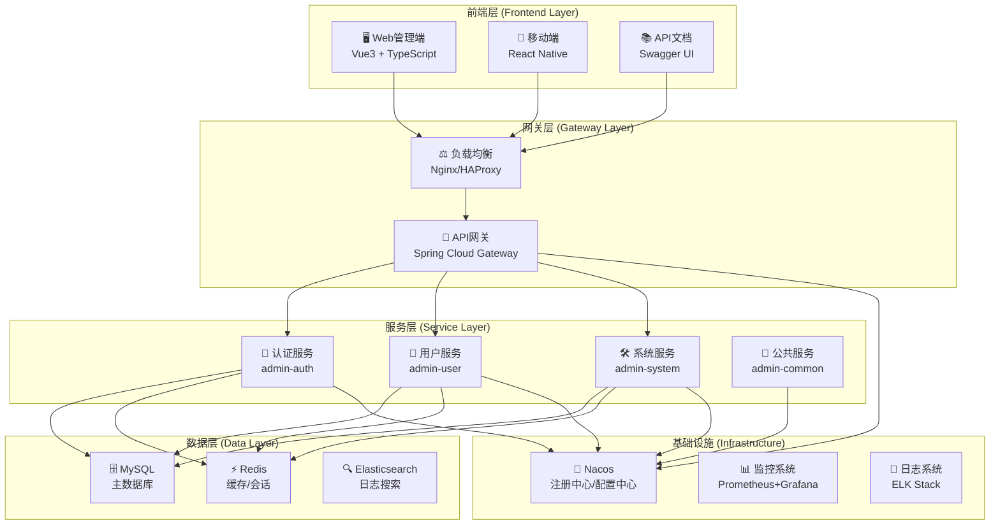
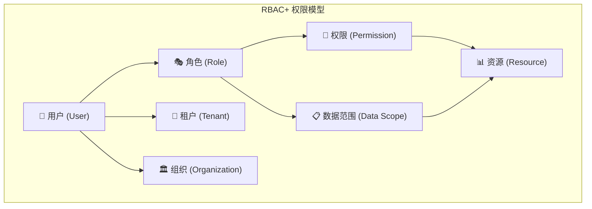

# XingChen-Admin 整体架构概览

## 🎯 项目概述

XingChen-Admin 是一个基于Spring Cloud微服务架构的企业级管理系统，提供完整的用户管理、组织架构、权限控制、租户体系等功能。系统采用前后端分离架构，支持多租户SaaS模式，具有高可用、高性能、高安全性的特点。

## 🏗️ 整体架构

### 系统架构图


### 技术架构栈
```
📊 技术架构栈
├── 🖥️ 前端技术栈
│   ├── Vue 3.x (渐进式框架)
│   ├── TypeScript (类型安全)
│   ├── Vite (构建工具)
│   ├── Element Plus (UI组件库)
│   ├── Pinia (状态管理)
│   └── Vue Router (路由管理)
├── 🔙 后端技术栈
│   ├── Spring Boot 2.7.x (应用框架)
│   ├── Spring Cloud 2021.x (微服务框架)
│   ├── Spring Security (安全框架)
│   ├── MyBatis Plus (ORM框架)
│   ├── Spring Cloud Gateway (API网关)
│   └── Resilience4j (熔断器)
├── 🗄️ 数据存储
│   ├── MySQL 8.0 (关系数据库)
│   ├── Redis 6.x (缓存数据库)
│   └── Elasticsearch 7.x (搜索引擎)
├── ☁️ 基础设施
│   ├── Nacos (服务发现/配置管理)
│   ├── Docker (容器化)
│   ├── Kubernetes (容器编排)
│   └── Jenkins (CI/CD)
└── 📊 监控运维
    ├── Prometheus (指标收集)
    ├── Grafana (监控面板)
    ├── ELK Stack (日志分析)
    └── SkyWalking (链路追踪)
```

## 🎭 核心服务介绍

### 1. admin-gateway (API网关)
**职责**: 统一API入口，路由转发，认证鉴权，流量控制
- ✅ 请求路由和负载均衡
- ✅ JWT令牌验证
- ✅ 权限检查和授权
- ✅ 限流和熔断保护
- ✅ 跨域处理
- ✅ 监控和日志记录

### 2. admin-auth (认证服务)
**职责**: 用户身份认证，令牌管理，会话控制
- ✅ 用户登录验证
- ✅ JWT令牌生成和刷新
- ✅ 多因子认证支持
- ✅ 会话管理
- ✅ 密码安全策略
- ✅ 登录审计日志

### 3. admin-user (用户服务)
**职责**: 用户信息管理，租户管理，组织关联
- ✅ 用户基础信息CRUD
- ✅ 租户信息管理
- ✅ 用户组织关联
- ✅ 用户角色分配
- ✅ 用户生命周期管理
- ✅ 数据权限控制

### 4. admin-system (系统服务)
**职责**: 权限管理，角色管理，菜单管理，组织架构
- ✅ RBAC权限模型
- ✅ 角色管理和继承
- ✅ 菜单权限控制
- ✅ 组织架构管理
- ✅ 数据权限配置
- ✅ 权限缓存优化

### 5. admin-common (公共服务)
**职责**: 公共组件，工具类，异常处理
- ✅ 统一响应格式
- ✅ 全局异常处理
- ✅ 公共工具类
- ✅ 数据验证
- ✅ 审计日志组件
- ✅ 缓存抽象

## 🔐 安全架构设计

### 多层安全防护
```
🛡️ 安全防护体系
├── 🌐 网络安全层
│   ├── HTTPS/TLS加密传输
│   ├── 防火墙规则配置
│   ├── DDoS攻击防护
│   └── IP黑白名单控制
├── 🚪 网关安全层
│   ├── JWT令牌验证
│   ├── API限流控制
│   ├── 请求签名验证
│   └── 异常流量检测
├── 🔒 应用安全层
│   ├── 多因子身份认证
│   ├── RBAC权限控制
│   ├── 数据权限隔离
│   └── 敏感信息加密
└── 📊 数据安全层
    ├── 数据库访问控制
    ├── SQL注入防护
    ├── 数据备份策略
    └── 审计日志记录
```

### 权限控制模型


## 🏢 多租户架构

### 租户隔离策略
```
🏢 多租户隔离方案
├── 📊 数据隔离
│   ├── Schema隔离 (推荐)
│   ├── 数据库隔离 (高安全)
│   └── 字段隔离 (高性能)
├── 🔐 权限隔离
│   ├── 租户级角色管理
│   ├── 租户级权限配置
│   └── 跨租户访问控制
├── 📱 应用隔离
│   ├── 租户级配置管理
│   ├── 租户级主题定制
│   └── 租户级功能开关
└── 🗄️ 资源隔离
    ├── 存储配额限制
    ├── API调用限制
    └── 并发用户限制
```

### 租户管理功能
- ✅ 租户注册和认证
- ✅ 租户配置管理
- ✅ 租户资源配额
- ✅ 租户数据隔离
- ✅ 租户功能定制
- ✅ 租户使用统计

## 🏛️ 组织架构设计

### 多维度组织模型
```
📊 组织架构维度
├── 🏢 行政组织
│   ├── 公司 → 分公司 → 部门 → 科室
│   └── 支持无限层级嵌套
├── 💼 业务组织
│   ├── 事业部 → 产品线 → 项目组
│   └── 支持矩阵式管理
├── 🎯 项目组织
│   ├── 项目 → 子项目 → 任务组
│   └── 支持临时性组织
└── 🔧 职能组织
    ├── 技术委员会 → 专家组
    └── 支持跨部门协作
```

### 组织管理功能
- ✅ 组织树构建和维护
- ✅ 用户组织关联管理
- ✅ 组织权限继承
- ✅ 组织变更历史
- ✅ 组织效率分析
- ✅ 智能组织推荐

## 📊 数据架构设计

### 数据库设计原则
```
🗄️ 数据库设计
├── 📋 业务分离
│   ├── admin_auth (认证数据)
│   ├── admin_user (用户数据)
│   └── admin_system (系统数据)
├── 🔄 读写分离
│   ├── 主库 (写操作)
│   └── 从库 (读操作)
├── 📈 分库分表
│   ├── 按租户分库
│   └── 按时间分表
└── 🚀 缓存策略
    ├── Redis缓存热点数据
    ├── 本地缓存频繁数据
    └── 多级缓存架构
```

### 核心数据表
| 数据库 | 核心表 | 说明 |
|--------|--------|------|
| admin_user | sys_user | 用户基础信息 |
| admin_user | sys_tenant | 租户信息 |
| admin_user | sys_user_organization | 用户组织关联 |
| admin_system | sys_role | 角色信息 |
| admin_system | sys_menu | 菜单权限 |
| admin_system | sys_organization | 组织架构 |
| admin_system | sys_user_role | 用户角色关联 |
| admin_system | sys_role_menu | 角色菜单关联 |

## 🚀 性能优化策略

### 缓存架构
```
⚡ 多级缓存架构
├── L1缓存 (应用内缓存)
│   ├── Caffeine本地缓存
│   ├── 缓存热点数据
│   └── 5分钟过期
├── L2缓存 (分布式缓存)
│   ├── Redis集群
│   ├── 缓存共享数据
│   └── 30分钟过期
└── L3缓存 (数据库缓存)
    ├── MySQL Query Cache
    ├── InnoDB Buffer Pool
    └── 索引优化
```

### 性能优化措施
- ✅ 数据库连接池优化
- ✅ SQL查询优化和索引
- ✅ 分页查询优化
- ✅ 异步处理机制
- ✅ 批量操作优化
- ✅ CDN静态资源加速

## 📊 监控运维体系

### 监控架构
```
📊 监控运维架构
├── 📈 应用监控
│   ├── Spring Boot Actuator
│   ├── Micrometer指标收集
│   └── 自定义业务指标
├── 🔍 链路追踪
│   ├── SkyWalking分布式追踪
│   ├── 请求链路可视化
│   └── 性能瓶颈分析
├── 📝 日志管理
│   ├── Logback结构化日志
│   ├── ELK Stack日志分析
│   └── 日志告警规则
└── 🚨 告警通知
    ├── 邮件告警
    ├── 短信告警
    └── 钉钉/企微告警
```

### 关键监控指标
| 监控类型 | 关键指标 | 告警阈值 |
|----------|----------|----------|
| 应用性能 | 响应时间、QPS、错误率 | >2s, <100/s, >5% |
| 系统资源 | CPU、内存、磁盘使用率 | >80%, >85%, >90% |
| 数据库 | 连接数、慢查询、锁等待 | >80%, >2s, >10s |
| 缓存 | 命中率、内存使用率 | <80%, >90% |
| 业务指标 | 登录成功率、权限验证率 | <95%, <99% |

## 🔄 部署架构

### 容器化部署
```yaml
# docker-compose.yml 示例
version: '3.8'
services:
  # API网关
  admin-gateway:
    image: admin-gateway:latest
    ports:
      - "8080:8080"
    environment:
      - SPRING_PROFILES_ACTIVE=prod
    depends_on:
      - nacos
      - redis
  
  # 认证服务
  admin-auth:
    image: admin-auth:latest
    ports:
      - "8081:8081"
    environment:
      - SPRING_PROFILES_ACTIVE=prod
    depends_on:
      - mysql
      - redis
  
  # 基础设施
  mysql:
    image: mysql:8.0
    environment:
      - MYSQL_ROOT_PASSWORD=password
    volumes:
      - mysql_data:/var/lib/mysql
  
  redis:
    image: redis:6-alpine
    command: redis-server --appendonly yes
    volumes:
      - redis_data:/data
  
  nacos:
    image: nacos/nacos-server:v2.2.0
    environment:
      - MODE=standalone
    ports:
      - "8848:8848"
```

### Kubernetes部署
```yaml
# k8s-deployment.yaml 示例
apiVersion: apps/v1
kind: Deployment
metadata:
  name: admin-gateway
spec:
  replicas: 3
  selector:
    matchLabels:
      app: admin-gateway
  template:
    metadata:
      labels:
        app: admin-gateway
    spec:
      containers:
      - name: admin-gateway
        image: admin-gateway:latest
        ports:
        - containerPort: 8080
        env:
        - name: SPRING_PROFILES_ACTIVE
          value: "k8s"
        resources:
          requests:
            memory: "512Mi"
            cpu: "500m"
          limits:
            memory: "1Gi"
            cpu: "1000m"
```

## 📈 扩展性设计

### 水平扩展能力
- ✅ 无状态服务设计
- ✅ 负载均衡支持
- ✅ 数据库读写分离
- ✅ 缓存集群部署
- ✅ 容器化部署
- ✅ 微服务架构

### 功能扩展能力
- ✅ 插件化架构设计
- ✅ 事件驱动机制
- ✅ 配置中心管理
- ✅ API版本管理
- ✅ 多语言支持
- ✅ 主题定制支持

## 🔮 未来规划

### 技术演进方向
```
🔮 技术发展路线图
├── 📊 大数据分析
│   ├── 用户行为分析
│   ├── 业务数据挖掘
│   └── 智能决策支持
├── 🤖 人工智能
│   ├── 智能权限推荐
│   ├── 异常行为检测
│   └── 自动化运维
├── ☁️ 云原生
│   ├── Serverless架构
│   ├── 服务网格(Service Mesh)
│   └── 多云部署支持
└── 🔒 零信任安全
    ├── 持续身份验证
    ├── 动态权限调整
    └── 行为分析安全
```

### 功能规划
- 🔄 工作流引擎集成
- 📊 BI报表系统
- 📱 移动端原生应用
- 🔗 第三方系统集成
- 🌐 国际化多语言
- 📈 性能监控优化

## 📚 文档体系

### 文档结构
```
📚 文档目录结构
├── 📋 项目文档
│   ├── README.md (项目介绍)
│   ├── ARCHITECTURE_OVERVIEW.md (架构概览)
│   └── DEPLOYMENT_GUIDE.md (部署指南)
├── 🔧 服务文档
│   ├── admin-auth/doc/ (认证服务文档)
│   ├── admin-user/doc/ (用户服务文档)
│   ├── admin-system/doc/ (系统服务文档)
│   └── admin-gateway/doc/ (网关服务文档)
├── 🎨 前端文档
│   ├── 组件库文档
│   ├── 开发规范
│   └── 部署指南
└── 📖 用户文档
    ├── 用户手册
    ├── 管理员指南
    └── API文档
```

这个整体架构设计提供了：

1. **完整的微服务架构** - 职责清晰、松耦合、高内聚
2. **多层安全防护** - 网络到应用的全方位安全保障
3. **灵活的多租户支持** - 满足SaaS模式的各种需求
4. **强大的权限体系** - RBAC+模型支持复杂权限场景
5. **高性能架构** - 多级缓存、异步处理、负载均衡
6. **完善的运维体系** - 监控、告警、日志、追踪全覆盖
7. **良好的扩展性** - 水平扩展、功能扩展、技术演进

系统具有企业级的可靠性、安全性和可维护性，能够支撑大规模的生产环境应用。
